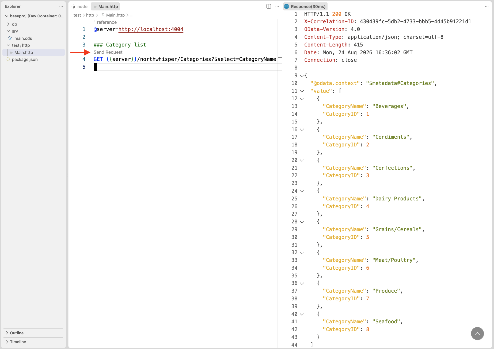

# Learn how to define constraints declaratively in your CDS model

<!-- description --> With a concise collection of annotations, we can add business and techncial constraints to our domain model cleanly and declaratively.

## You will learn

- How to model constraints
- What annotations exist for this
- How to use them

## Prerequisites

You will need a development environment for CAP Node.js. See the tutorial [Set
up a self-contained development environment for CAP
Node.js](https://developers.sap.com/tutorials/cap-self-contained-dev-env.html)
The assumptions in this tutorial are based on option 1 or option 2 in that
tutorial, in that you have a VS Code (or GitHub Codespace) environment based on
the foundation repository used in the setup described there, which also means
that your starting directory will be `/workspaces/cap-nodejs-dev-env`. If you
have your own CAP Node.js development environment setup, then please make the
appropriate adjustments where necessary.

## Intro

CDS is a great example of a declarative or "intent" based approach to defining
a solution - you declare what you want, and let the system (CAP) take care of
how that's implemented. With a combination of CDL and CXL, plus annotations, we
have a "solid state" language with which to define what the business and the
solution requires.

In this tutorial we'll gradually add constraints to a CDS model, to understand
what they can do and how they are applied.

---

### Start with a simple CAP project

To keep things simple, let's use an existing "base project" from an SAP CodeJam
on CAP. It's an extremely cut down version of the classic Northwind service, even
more reduced than Northbreeze in the [OData Deep Dive
Server](https://github.com/SAP-samples/odata-dd-server) repo.

It's called Northwhisper, with just a very small amount of product, category and
supplier data.

👉 Clone the repository:

```shell
git clone https://github.com/SAP-samples/cap-tour-hands-on
```

👉 Now open the `baseproj/` directory within the cloned repository in a new VS
Code / Codespace window:

```shell
code cap-tour-hands-on/baseproj/
```

This should present just the base project in the Explorer, at the root.

👉 Open up a terminal window and start a CAP server running with:

```shell
cds watch
```

### List the existing categories

We'll start exploring constraints with the categories data, and we'll be using
the [REST
Client](https://marketplace.visualstudio.com/items?itemName=humao.rest-client)
extension in VS Code to make HTTP calls (this is already available to you if
you've chosen option 1 or 2 in the prerequisites).

👉 Use the `http` facet to have a `.http` file created in a reasonable place
(within a new `test/` directory in the project):

```shell
cds add http
```

This will create the file `test/http/Main.http` with some content already in
there.

👉 Take a brief look at the content, just to get an idea of how HTTP calls are
defined and structured (we'll be building a similar set of calls in this file
throughout the rest of the tutorial) and then delete that content.

Once the file is empty, add this at the start:

```http
@server=http://localhost:4004

### List categories
GET {{server}}/northwhisper/Categories?$select=CategoryName
```

👉 A "Send Request" line should appear, which you should select. This will
cause the request to be sent, with a result should look something like this,
where the categories are listed:



So far, so good.

### Add a new category with an inappropriate name

Let's add a new category. This first attempt, we'll be rather "loose" with the
category name.

👉 Append this new request definition to `test/http/Main.http`:

```http
### Add new category with inappropriate name
POST {{server}}/northwhisper/Categories
Content-Type: application/json

{
  "CategoryID": 9,
  "CategoryName": "a new category"
}
```

👉 Send the request, which should be successful, showing a response something
like this:

```text
HTTP/1.1 201 Created
OData-Version: 4.0
location: Categories(9)
Content-Type: application/json; charset=utf-8
Content-Length: 115

{
  "@odata.context": "$metadata#Categories/$entity",
  "CategoryID": 9,
  "CategoryName": "a new category",
  "Description": null
}
```

However, there are two issues here:

- the category name doesn't conform to the naming pattern of categories that
  already exist
- we didn't supply a category description, leaving us with a `null` value for
  that property

We'll address them both by adding constraints.

### Make the category description mandatory

Let's deal with the second issue first, by making the description mandatory.
Following best practices, we'll put the annotations in a separate file.

👉 In a new file `srv/constraints.cds`, add this:

```cds
using Main from './main';

annotate Main.Categories with {

  Description @mandatory;

}
```

👉 Now retry the previous POST request, which should be rejected, emitting a
response like this:

```log
HTTP/1.1 400 Bad Request
OData-Version: 4.0
Content-Type: application/json; charset=utf-8
Content-Length: 127

{
  "error": {
    "message": "Provide the missing value.",
    "code": "ASSERT_MANDATORY",
    "target": "Description",
    "@Common.numericSeverity": 4
  }
}
```

Better!

> Here, and subsequently, because we're running the CAP server in "watch" mode,
> it should restart automatically when such CDS files are saved, meaning the
> data will be reset and ready for fresh POST requests like this.

### Get to know the general @assert annotation

Annotations such as `@readonly`, `@mandatory`, `@assert.range` and so on have
been around for a while. Introduced in the December 2025 CAP release is the
more general `@assert` annotation which goes nicely with expressions in CXL.

Let's get a taste of `@assert` by using it instead of `@mandatory`.

👉 Replace `Description @mandatory` in `srv/constraints.cds` so it looks like
this:

```cds
using Main from './main';

annotate Main.Categories with {

  Description @assert: (case
    when Description is null then 'Description must be supplied'
    when length(Description) < 3 then 'Description too short'
  end);

}
```

👉 Now retry the POST request again, using various combinations for the
`Description` property (none, one that is only a couple of characters long,
and one that is three or more characters long), and observe that the
appropriate responses are returned. Note that the error messages better
reflect the actual circumstances, too.

### Constrain the category name format

Now let's address the first issue from earlier. We want the names of new
categories to follow the pattern we have already, which is that each word in
the name is capitalized ("Condiments", "Dairy Products", "Meat/Poultry", etc).

👉 Add a new `@assert.format` annotation on the `CategoryName` element
with a regular expression, like this:

```cds
using Main from './main';

annotate Main.Categories with {

  Description  @assert: (case
    when Description is null then 'Description must be supplied'
    when length(Description) < 3 then 'Description too short'
  end);

  CategoryName @assert.format: '^[A-Z][a-z]+(?:\W[A-Z][a-z]+)*$';

}
```

👉 Ensure the POST request in the `test/http/Main.http` file has a valid
`Description` property in the payload, and retry the request again. This
time the request should be rejected, with a response like this:

```log
HTTP/1.1 400 Bad Request
OData-Version: 4.0
Content-Type: application/json; charset=utf-8
Content-Length: 167

{
  "error": {
    "message": "Enter a value matching the pattern ^[A-Z][a-z]+(?:\\W[A-Z][a-z]+)*$.",
    "code": "ASSERT_FORMAT",
    "target": "CategoryName",
    "@Common.numericSeverity": 4
  }
}
```

The category name that didn't comply with the pattern is caught. Good. But while
the message returned is accurate, it's a bit technical.

### Add a custom constraint message

So let's address that.

👉 Add a `@assert.format.message` annotation so that it appears in
`srv/constraints.cds` like this:

```cds
using Main from './main';

annotate Main.Categories with {

  Description  @assert: (case
    when Description is null then 'Description must be supplied'
    when length(Description) < 3 then 'Description too short'
  end);

  CategoryName @assert.format        : '^[A-Z][a-z]+(?:\W[A-Z][a-z]+)*$'
               @assert.format.message: 'Follow the category naming conventions';

}
```

### Make a second category creation request

👉 To the `test/http/Main.http` file, append a second POST request like this:

```http
### Add new category with valid name and description
POST {{server}}/northwhisper/Categories
Content-Type: application/json

{
  "CategoryID": 9,
  "CategoryName": "Pulses/Seeds",
  "Description": "Lentils, chickpeas, kidney beans, black gram and similar."
}
```

👉 Now use that request to attempt a new category creation. This should be
successful, as there's a description, and the name conforms to the
capitalization requirements:

```log
HTTP/1.1 201 Created
OData-Version: 4.0
location: Categories(9)
Content-Type: application/json; charset=utf-8
Content-Length: 168

{
  "@odata.context": "$metadata#Categories/$entity",
  "CategoryID": 9,
  "CategoryName": "Pulses/Seeds",
  "Description": "Lentils, chickpeas, kidney beans, black gram and similar."
}
```

Great!

### Wrap-up and further info

- There are more constraint assertions, enabling us to, for example, check for
  existing associated entities, using either `@assert.target` or the `exists`
  predicate within a more general `@assert` construct.
- The [Declarative
  Constraints](https://cap.cloud.sap/docs/guides/services/constraints) topic in
  Capire has a great overview, including some best practice tips.

After first making the category description mandatory with `Description
@mandatory;`, we retried the POST request, the payload for which didn't include
a `Description` property at all. The result was an HTTP 400 with an
`ASSERT_MANDATORY` code.
