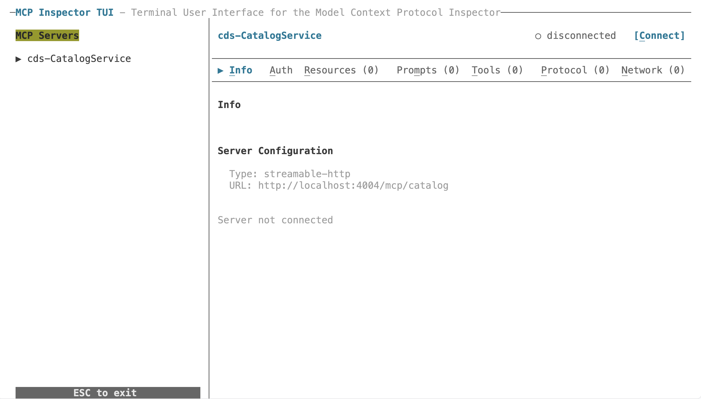
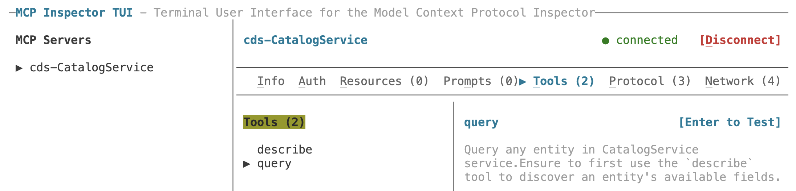
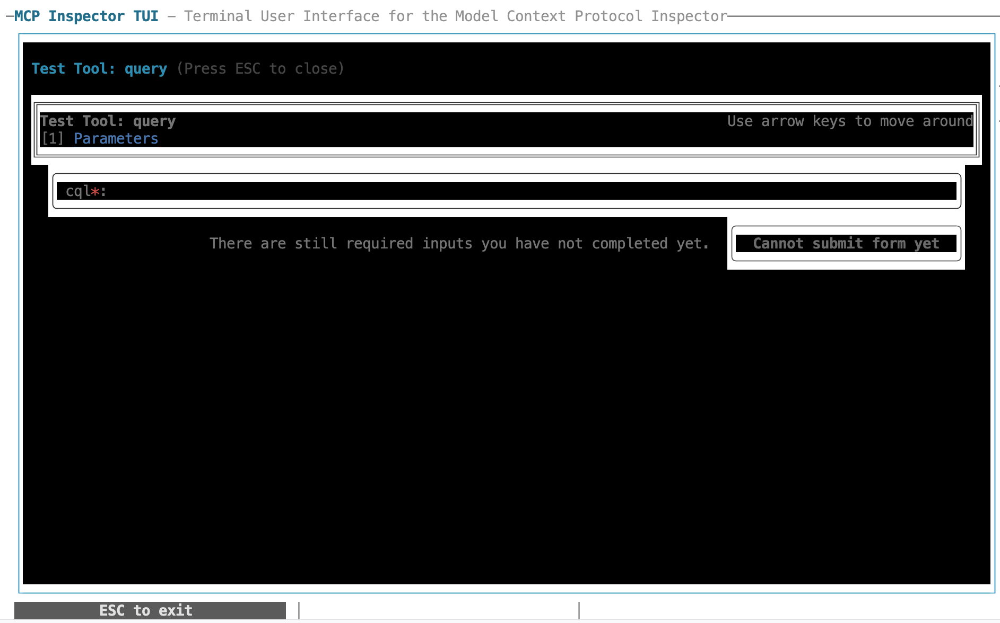
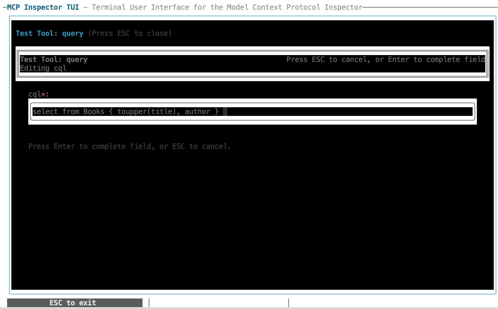
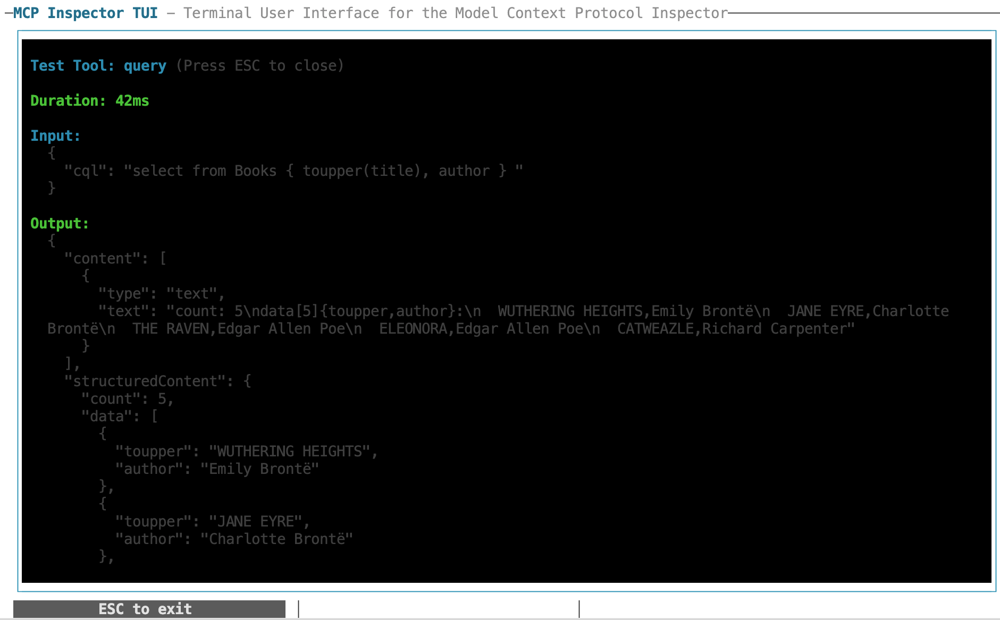

# Examine the details of the Model Context Protocol on startup

<!-- description --> By looking at what happens when we connect to an MCP adapter running in front of a CAP service, we learn more about the protocol and how we can improve our service annotations.

## You will learn

- How to use an MCP inspector
- What the startup of an MCP client-server interation looks like
- What the lowest common denominator set of tools are that are offered via
  CAP's MCP adapter

## Prerequisites

You will need a development environment for CAP Node.js. See the tutorial [Set
up a self-contained development environment for CAP
Node.js](https://developers.sap.com/tutorials/cap-self-contained-dev-env.html)
The assumptions in this tutorial are based on option 1 or option 2 in that
tutorial, in that you have a VS Code (or GitHub Codespace) environment based on
the foundation repository used in the setup described there, which also means
that your starting directory will be `/workspaces/cap-nodejs-dev-env`. If you
have your own CAP Node.js development environment setup, then please make the
appropriate adjustments where necessary.

This tutorial is based on and follows on from the [Add MCP capabilities to a
CAP
service](https://developers.sap.com/tutorials/cap-add-mcp-capabilities.html)
tutorial, so please first complete that one before starting.

## Intro

In CAP, MCP is "just another protocol". But like the other protocols (such as
[OData](https://developers.sap.com/tutorials/mission-odata-deep-dive) and
GraphQL) we should have some understanding of how MCP feels, what it looks
like, and how it's put to use.

---

### Start the CAP server

👉 To start, make sure you're in the `cap-add-mcp-capabilities/` project
directory from the previous tutorial (mentioned earlier in the prerequisites),
and start the CAP server up with `DEBUG=mcp cds watch`, which should emit log
records including these:

```log
[mcp] - Adapter initialized { service: 'CatalogService' }
[cds] - serving CatalogService {
  at: [ '/odata/v4/catalog', '/mcp/catalog' ],
  decl: 'srv/cat-service.cds:2'
}
[mcp] - registering MCP services: [ 'CatalogService' ]
[mcp] - Written OpenCode config to: /home/node/.config/opencode/opencode.json
[cds] - server listening on { url: 'http://localhost:4004' }
```

From this log output we can discern that the MCP adapter (server) endpoint is
at `http://localhost:4004/mcp/catalog`.

### Take a first look at the MCP inspector

In the GitHub organization related directly to the open Model Context Protocol
there's an [Inspector](https://github.com/modelcontextprotocol/inspector) repo
which defines "a developer tool for inspecting Model Context Protocol (MCP)
servers".

We will use the TUI version of the inspector in this tutorial.

Take a brief look at the documentation for the [MCP Inspector TUI
Client](https://github.com/modelcontextprotocol/inspector/blob/main/clients/tui/README.md),
where you will see that we can use a "catalog" file to store definitions of MCP
servers to which we want to connect. This file is a bit like the
`opencode.json` file we saw when learning about the MCP adapter's autowiring in
the previous tutorial.

### Create a catalog file

👉 Add the following content to a new `mcp-servers.json` file in the project
directory:

```json
{
  "mcpServers": {
    "cds-CatalogService": {
      "type": "streamable-http",
      "url": "http://localhost:4004/mcp/catalog"
    }
  }
}
```

This specifies an MCP entry that is for our MCP adapter at that URL.

We will refer to this file when starting up the inspector in the next step.

### Start up the inspector

👉 While keeping the CAP server running, start the inspector in a separate
terminal window, as follows:

```shell
npx @modelcontextprotocol/inspector --tui --catalog mcp-servers.json
```

A terminal user interface (TUI) should appear, looking something like this:



👉 Observe:

- the MCP server definition "cds-CatalogService" in the catalog is listed and
  pre-selected (with the ▶ symbol)
- the inspector is not yet connected to it

### Connect the inspector to the server

👉 Use `C` to connect the inspector to the server.

Immediately, things happen. For the "cds-CatalogService" server, the "Info"
tab shows:

```text
Name: CatalogService
Version: 1.0.0
Instructions:
  Always use the `describe` tool to explore the
  data model and available actions/functions.
  Only then use `query` to read data or `call`
  to invoke actions or functions.
```

These are default instructions built-in to and emitted by the adapter plugin
itself.

### Examine the network requests

👉 Jump to the "Network" tab, where you should see something similar to this.

```text
 Network (5)          │ POST http://localhost:4004/mcp/catalog
                      │
 ▶ MCP  POST 200 63ms │ Category: transport
   MCP  POST 202 12ms │
   MCP  GET  405 14ms │ Status: 200 OK
   MCP  POST 200 16ms │
                      │ 9:54:13 AM (63ms)
                      │
                      │ Request Headers:
                      │   accept: application/json, text/event-stream
                      │   content-type: application/json
                      │
                      │ Request Body:
                      │
                      │   {
                      │     "method": "initialize",
                      │     "params": {
                      │       "protocolVersion": "2025-11-25",
                      │       "capabilities": {
                      │         "sampling": {},
                      │         "elicitation": {
                      │           "form": {}
                      │         },
                      │         "roots": {
                      │           "listChanged": true
                      │         },
                      │         "extensions": {
                      │           "io.modelcontextprotocol/tasks": {},
                      │           "io.modelcontextprotocol/ui": {
                      │             "mimeTypes": [
                      │               "text/html;profile=mcp-app"
                      │             ]
                      │           }
                      │         }
                      │       },
                      │       "clientInfo": {
                      │         "name": "inspector-tui",
                      │         "version": "2.2.0"
                      │       }
                      │     },
                      │     "jsonrpc": "2.0",
                      │     "id": 0
                      │   }
                      │
                      │ Response Headers:
                      │   ...
                      │
                      │ Response Body:
                      │
                      │   event: message
                      │   data: {"result":{"protocolVersion":"2025-11-25","capabilities":{"tools":{"listChanged
                      │   ":false}},"serverInfo":{"name":"CatalogService","version":"1.0.0","description":"MCP 
                      │   server for CatalogService"},"instructions":"Always use the `describe` tool to explore
                      │    the data model and available actions/functions. Only then use `query` to read data 
                      │   or `call` to invoke actions or functions."},"jsonrpc":"2.0","id":0}
```

> To move to the individual entries in each tab, use the `Tab` key.

👉 Explore the details of each of the five HTTP requests, and observe,
especially from the detail of the first request which is shown:

- the protocol uses JSON-RPC to convey the request representations
- the first request in an MCP conversation lifecycle is "initialize"
- it's in the response to this "initialize" request that the instructions we
  saw earlier ("Always use the describe tool ...") are returned

### Examine the protocol details

👉 Jump to the "Protocol" tab, where you should see a list (with details for
each item) like this:

- initialize (request)
- notifications/initialized (notification)
- tools/list (request)

The "initialize" item corresponds exactly to what we saw in the previous step
at the "Network" level.

👉 Select the "tools/list" request and examine the detail, noting that the response
describes two tools:

- `describe`:

    Describe the data model of CatalogService service. Returns an
    overview of all entities and actions with descriptions. Specify 'entity' to
    get element details, or 'action' to get parameter details."

- `query`:

    CAP CQL statement to execute queries; only SELECT statements are allowed. CQL
    is a superset of SQL, that supports

    - path expressions to follow associations instead of JOINs, e.g. SELECT
      author.name from Books,
    - postfix projection syntax, with nested expands, e.g. SELECT from Authors {
      ID, name, books { ID, title }},
    - standard CAP/OData functions and aggregates (count, sum, avg, min, max,
      lower, upper, substring, year, month, day, etc.). Database functions
      (CURRENT_USER, SESSION_USER, SYSUUID, CURRENT_SCHEMA) are not supported.
      LIMIT is auto-injected to the service max.

These are two of the three tools that the MCP adapter plugin will make
available. The other tool `call` is not returned in this list here as the
"CatalogService" does not have any actions or functions.

### Examine the tool details

Our exploration started at the lowest layer, at the network, and has now reached
the details of the tools:

```text
 Tools
   ^
   |
Protocol
   ^
   |
Network
```

👉 Jump to the "Tools" tab, where you should see the two tools `describe` and
`query` listed. Explore the details for each of these two tools, and see how
the information returned in JSON-RPC format to the "tools/list" request is now
surfaced at this level.

### Try out the query tool

With the inspector, one can also make tool calls.



👉 While still in the "Tools" tab, select the "query" tool and following the
"Enter to Test" instruction (hit `Enter`) to jump to a form where you can send
some CQL using this query tool, as guided by the instructions.

This should present a simple form, where you can enter some CQL:



Follow the hints to move around the form and enter this query:

```sql
select from Books { toupper(title), author }
```

> To prove to ourselves that this really is CQL, this query uses a couple of
> CQL features, namely a postfix projection and a portable function.



👉 Continue to follow the hints to send the query, which should return and show
results like this:



👉 Observe that:

- the general output representation is in JSON
- the `content.text` property holds the results in compacted Token-Oriented
  Object Notation (TOON) format
- the `structuredContent` property holds the same results but in a more
  readable way

👉 Note also the corresponding entry in the CAP server log:

```log
[mcp] - query {
  service: 'CatalogService',
  cql: 'select from Books { toupper(title), author } '
}
```

### Wrap-up and further info

Well done!

👉 At this point, feel free to explore and examine more of the Model Context
Protocol through this inspector connection to the MCP adapter running as part
of the CAP server to present your CAP service.

The following resources may be of further interest:

- an [Intro to the Model Context Protocol](https://modelcontextprotocol.io/docs/2026-07-28/getting-started/intro)
- the Token-Oriented Object Notation format is described in the
  [toon](https://github.com/toon-format/toon) repo
- all about the [MCP
  inspector](https://github.com/modelcontextprotocol/inspector) tool
- the Wikipedia page on [JSON-RPC](https://en.wikipedia.org/wiki/JSON-RPC) has
  a good overview
