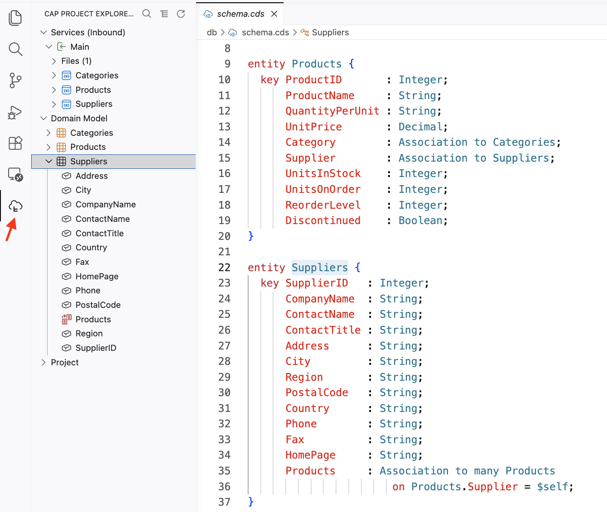

# Use mocking to embrace auth in your domain model from the outset

<!-- description --> With the mocked authentication strategy, we can embrace and work on the important aspect of securing our app or service right from the very start. CAP makes it easy to do the right things here.

## You will learn

- What the mocked authentication strategy is and how to use it

## Prerequisites

You will need a development environment for CAP Node.js. See the tutorial [Set up a self-contained development environment for CAP Node.js](https://developers.sap.com/tutorials/cap-self-contained-dev-env.html)  The assumptions in this tutorial are based on option 1 or option 2 in that tutorial, in that you have a VS Code (or GitHub Codespace) environment based on the foundation repository used in the setup described there, which also means that your starting directory will be `/workspaces/cap-nodejs-dev-env`. If you have your own CAP Node.js development environment setup, then please make the appropriate adjustments where necessary.

## Intro

The CAP framework offers various auth strategies, including ones that support JWT, XSUAA and IAS based solutions. It also offers the mock strategy where Basic Authentication is used in combination with a simple list of pre-defined users and roles, which you can add to to suit your domain and authentication & authorization modeling.

---

### Set up a simple Northwind-based service

The [OData Deep Dive](https://developers.sap.com/mission.odata-deep-dive.html) mission is based around a cut-down version of the classic Northwind service called "Northbreeze". That service is available in the repository <https://github.com/SAP-samples/odata-dd-server> and is a good basis for our exploration of the mocked authentication strategy in this tutorial.

👉 Clone the repository:

```shell
git clone https://github.com/SAP-samples/odata-dd-server
```

👉 Now open the `northbreeze/` directory within the cloned repository in a new VS Code / Codespace window:

```shell
code odata-dd-server/northbreeze/
```

This should present just the Northbreeze project in the Explorer, at the root. Use the CAP Project Explorer feature to get a feel for the project's service and entity definitions (you may need to use the Refresh button, in the form of a circular arrow, to get the explorer to re-read the project configuration):



### Examine the service context

Out of the box, the CDS model in this Northbreeze project comes with a single restriction on the `Categories` projection, in the form of a `@readonly` annotation - which exists as something to be examined in a different tutorial ([Learn how to read annotations in OData metadata documents](https://developers.sap.com/tutorials/odata-dd-6-annotations.html), part of the OData Deep Dive mission). We will ignore this for the purposes of this tutorial.

Talking of "out of the box", the CAP server by default, in local development mode, uses the mocked authentication strategy. 

👉 Check the detail of that, by looking at the effective configuration, specifically for the `auth` section:

```shell
cds env requires.auth
```

This should emit something like this:

```javascript
{
  restrict_all_services: false,
  kind: 'mocked',
  users: {
    alice: { tenant: 't1', roles: [ 'admin' ] },
    bob: { tenant: 't1', roles: [ 'cds.ExtensionDeveloper' ] },
    carol: { tenant: 't1', roles: [ 'admin', 'cds.ExtensionDeveloper' ] },
    dave: { tenant: 't1', roles: [ 'admin' ], features: [] },
    erin: { tenant: 't2', roles: [ 'admin', 'cds.ExtensionDeveloper' ] },
    fred: { tenant: 't2', features: [ 'isbn' ] },
    me: { tenant: 't1', features: [ '*' ] },
    yves: { roles: [ 'internal-user' ] },
    '*': true
  },
  tenants: { t1: { features: [ 'isbn' ] }, t2: { features: '*' } }
}
```

👉 Observe:

- in this mode, there are no built-in restrictions on any of the services by default (see the blog post "CAP service authentication at design time and in production" for more on this)
- the authentication strategy (`kind`) is indeed "mocked"
- there are some sample users, with various tenant and role assignments, that we can use

👉 Start up a CAP server for this project with `DEBUG=basic cds watch` and observe the output, which should include:

```log
[cds] - loaded model from 2 file(s):
 
  srv/main.cds
  db/schema.cds

[cds] - using bindings from: { registry: '~/.cds-services.json' }
[cds] - connect to db > sqlite { url: ':memory:' }
  > init from db/data/northbreeze-Suppliers.csv 
  > init from db/data/northbreeze-Products.csv 
  > init from db/data/northbreeze-Categories.csv 
/> successfully deployed to in-memory database. 

[cds] - using auth strategy { kind: 'mocked' }
[cds] - serving Main {
  at: [ '/northbreeze' ],
  decl: 'srv/main.cds:4'
}
[cds] - server listening on { url: 'http://localhost:4004' }
```

Note that use of the mocked authentication strategy is indeed announced.

> The `mocked` authentication strategy is more or less just the `basic` authentication strategy, with these sample users, so we ask for debug level output for the `basic` module here (as there isn't any specific `mocked` debug output).

### Explore the service as-is

In this step you'll explore a couple of auth related aspects of the service as it stands right now.

👉 First, create a file `Explore.http` in a new directory `test/` within the project root, with the following content:

```text
@server=http://localhost:4004

### List first three products
GET {{server}}/northbreeze/Products?$top=3&$select=ProductName

### Delete product 1 (Chai)
DELETE {{server}}/northbreeze/Products/1
```

These are HTTP requests in a format that can be understood and executed by the [REST Client](https://marketplace.visualstudio.com/items?itemName=humao.rest-client) extension for VS Code (and in Codespaces), an extension that is included in the set [defined for the Dev Container](https://github.com/SAP-samples/cap-nodejs-dev-env/blob/main/.devcontainer/devcontainer.json) that is in use here.

> You can generate such HTTP requests in this format with the `cds add http` command too.

👉 Ensure that the CAP server is still running, and execute first the `GET` request, then the `DELETE` request, via the selectable "Send Request" text that appears above each one in the editor.

The `GET` request should return a 200 response with three products Chai, Chang and Aniseed Syrup. The `DELETE` request should return a 204 response with no content. If you were to execute the same `GET` request again, you would get the products Chang, Aniseed Syrup and Chef Anton's Cajun Seasoning, as Chai (product with ID 1) is now gone.

Take a note of the implications here (again, ignoring the `@readonly` annotation for the `Categories` in `srv/main.cds`):

- we are able to access the service and resources within it without identifying ourselves (no authentication)
- we have full read-write access to the resources within the service (no authorization restrictions)

### Introduce an authentication requirement

Let's add a requirement for clients to identify themselves in the requests they send. In other words, add an authentication requirement.

Specify the pseudo-role `authenticated-user` as a requirement at the service level, by adding an annotation to `srv/main.cds` so it looks like this:

```cds
using northbreeze from '../db/schema';

@path    : '/northbreeze'
@requires: 'authenticated-user'
service Main {
  ...
}
```

👉 Once the CAP server restarts after this change, try the `GET` and `DELETE` requests again.

This time, the response code is 401, stating that the request has not been authenticated, i.e. no (valid) credentials have been provided. In fact, no credentials were provided at all, so this is the response we want.

> There is a debate about the HTTP status text that accompanies codes 401 and 403. Some argue (with good reason) that the text "Unauthorized" with 401 is misleading, as that really is the text that should accompany 403, and that "Unauthenticated" should be the text to accompany 401. Digging into that debate is an exercise left for you, dear reader.
>
> The debug log message that appears in the CAP server output is helpful here:
>
> ```log
> [basic] - 401 > login required
> ```

### Retry the requests with authentication

👉 Provide authentication details, using one of the sample users, by adding `@username` and `@password` references, and `Authentication` headers to both requests in `test/Explore.http`, as shown here:

```text
@server=http://localhost:4004
@username=alice
@password=

### Products
GET {{server}}/northbreeze/Products?$top=3&$select=ProductName
Authorization: Basic {{username}}:{{password}}

### Products
DELETE {{server}}/northbreeze/Products/1
Authorization: Basic {{username}}:{{password}}
```

> With the sample users, there is no password, as it wouldn't make much sense, as passwords are not what we're concerned about here, it's authentication and authorization.

👉 Retry each request again, and this time observe:

- the requests are successful
- the authentication provided in those requests is logged in the debug output:

   ```log
   [basic] - authenticated: { user: 'alice', tenant: undefined, features: undefined }
   ```

### Apply more granular authorization restrictions

Let's go deeper and more granular now, and introduce a further restriction where the authenticated user requires a specific role `productmanager`. Note that right now, the sample user `alice` only has a single role `admin`.

👉 Specify a `@restrict` annotation for the `Products` projection in the service in `srv/main.cds`, as shown here:

```cds
using northbreeze from '../db/schema';

@path    : '/northbreeze'
@requires: 'authenticated-user'
service Main {

  @restrict: [{
    grant: 'WRITE',
    to   : 'productmanager'
  }]
  entity Products   as projection on northbreeze.Products;
  ...

}
```

### Retry the DELETE request

👉 Once the CAP server has restarted again, try the `DELETE` request, and observe what happens, which is:

- a 403 response is returned, indicating insufficient authorization
- this in turn implies that authentication was indeed successfully provided

In other words, "_you've identified yourself, but you don't have the authorization for the request you wish to make_". The missing authorization in this case is the role `productmanager`.

### Retry the GET request

👉 Before adding the `productmanager` role to the sample user `alice`, have a go at the `GET` request too, and observe what happens here:

- a 403 response is also returned for this read-only request, which previously had been successful!

This is because a request is only allowed through "if at least one of the privileges is met" - and there are no privileges that allow for read operations.

### Include an explicit privilege block for read operations

👉 To remedy this, add a second privilege to the array for the `@restrict` annotation so it looks like this:

```cds
using northbreeze from '../db/schema';

@path    : '/northbreeze'
@requires: 'authenticated-user'
service Main {

  @restrict: [
    {
      grant: 'READ',
      to   : 'any'
    },
    {
      grant: 'WRITE',
      to   : 'productmanager'
    }
  ]
  entity Products   as projection on northbreeze.Products;
  ...

}
```

👉 After the CAP server restarts, retry the `GET` request, which should now succeed.

### Add the required role to the user

The sample users and roles that come with the mocked authentication strategy are not static, they can be built upon.

👉 Create a file `.cdsrc.yaml` in the project root, with the following content:

```yaml
cds:
  requires:
    auth:
      users:
        alice:
          roles:
            - admin
            - productmanager
```

> The `.cdsrc.yaml` file is one of many sources for the effective CDS configuration for the project.

👉 Stop the CAP server, and check the effective configuration, specifically the details for the user `alice`, like this:

```shell
cds env requires.auth.users.alice
```

This should show that the user now has both `admin` and `productmanager` roles:

```javascript
{ tenant: 't1', roles: [ 'admin', 'productmanager' ] }
```

### Retry the DELETE request once again

👉 Start the CAP server, again with `DEBUG=basic cds watch`, and retry the `DELETE` request from within the `test/Explore.http` file.

This time, observe:

- the request is successful, with a 204 No Content response, as expected
- there's a line in the CAP server's log output that confirms it was indeed `alice` that was authenticated:

   ```log
   [basic] - authenticated: { user: 'alice', tenant: undefined, features: undefined }
   ```

Well done!

### Wrap-up and further info

For further info, refer to these resources:

- Feature definition [FEA002 Mocking auth](https://github.com/qmacro/capref/blob/main/features/FEA002.md)
- Blog post [Local-first dev with CAP Node.js - mocking auth](https://qmacro.org/blog/posts/2026/05/12/local-first-dev-with-cap-node-js-mocking-auth/)
- Blog post [OData Deep Dive rewrite in the open](https://qmacro.org/blog/posts/2026/02/02/odata-deep-dive-rewrite-in-the-open/)
- The CAP Project Explorer [was released with cds 10 in June 2026](https://cap.cloud.sap/docs/releases/2026/jun26#new-cap-project-explorer)
- Blog post [CAP service authentication at design time and in production](https://qmacro.org/blog/posts/2026/06/19/cap-service-authentication-at-design-time-and-in-production/)
- Details for the [cds add http](https://cap.cloud.sap/docs/tools/cds-cli#http) command in Capire 
- Info on [Authentication Strategies](https://cap.cloud.sap/docs/node.js/authentication#strategies) and [Pseudo Roles](https://cap.cloud.sap/docs/guides/security/cap-users#pseudo-roles) in Capire
- A list of [sources for cds.env](https://cap.cloud.sap/docs/node.js/cds-env#sources-for-cdsenv) in Capire
