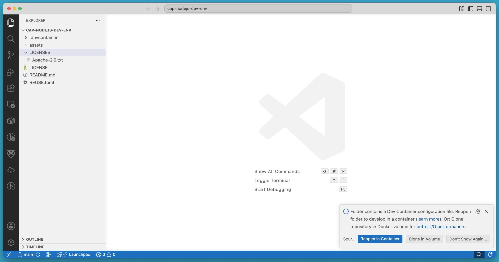
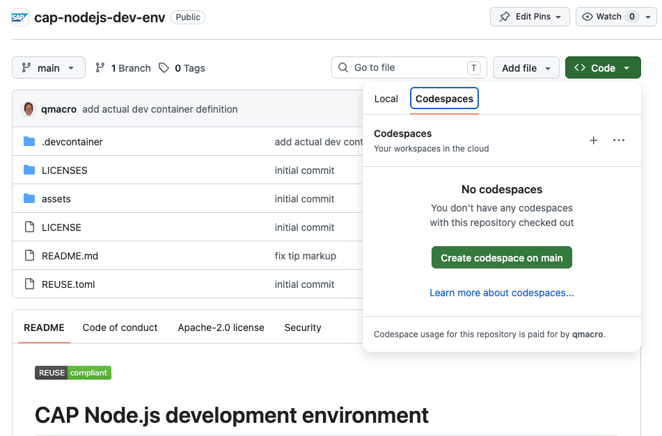
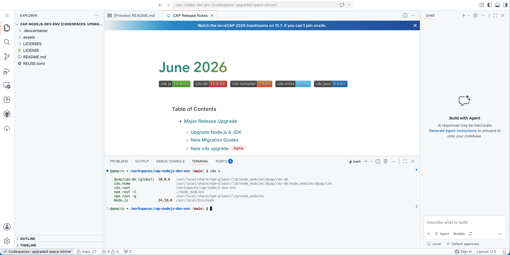

# Set up a self-contained development environment for CAP Node.js

<!-- description --> Use the power of containers and build a portable and abstracted development environment without committing to installing and maintaining tools directly on your own machine.

## You will learn

- How to use a development container in VS Code
- What GitHub Codespaces are and how they can be useful

## Prerequisites

- Either: VS Code installed, with the Dev Containers extension, and also a container manager installed, such as [Docker Desktop](https://docs.docker.com/desktop/) or [Podman](https://docs.docker.com/desktop/)
- Or: a free [GitHub](https://github.com) account (to use Codespaces), and a modern Web browser

## Intro

One thing that's consistent about software development over the recent decades ... is change. Different tools, editors and command line facilities come along with new approaches, frameworks and techniques. Today, the pace of that change is only increasing, and as developers we are required to work out what tools we need, install them, keep them up to date and prevent them from clashing with each other or with existing software we have on our machines.

One solution to all those challenges is development containers, and in this tutorial you'll use a development container definition to get the perfect setup for CAP Node.js development with no effort and no footprint left on your machine. All you need are some basic building blocks - VS Code and a container runtime such as Docker Desktop or Podman. We'll call that Option 1. What's more, you can even avoid installing anything on your machine, and just use GitHub's [Codespaces](https://github.com/features/codespaces) instead. We'll call that Option 2.

There's a bonus advantage of going with one of these container-based options: the command line environment you will have is the same as the environment that exists in pretty much all cloud scenarios - generally, a Unix style operating system with a Unix style shell, and specifically, a Linux distribution with a Bash shell.

Of course, if you prefer to continue to manage your own developer tools installation on your own machine at the native OS level, that's also perfectly fine. Let's call that Option 0 :-).

Regardless of which option you choose, we recommend you still read through all the steps in this tutorial, to answer to question at the end.

---

### Explore the CAP Node.js dev env repository

The repository at <https://github.com/SAP-samples/cap-nodejs-dev-env> contains a [dev container](https://containers.dev/) definition, which consists of two files:

- A container image definition in the form of a [Dockerfile](https://github.com/SAP-samples/cap-nodejs-dev-env/blob/main/.devcontainer/Dockerfile)
- A [dev container description](https://github.com/SAP-samples/cap-nodejs-dev-env/blob/main/.devcontainer/devcontainer.json), which points to the container image definition, and also specifies which extensions to add to VS Code (this includes the [SAP CDS Language Support](https://marketplace.visualstudio.com/items?itemName=SAPSE.vscode-cds) extension) plus which ports to publish from the container to the host 

### Option 1 - with VS Code and a container manager

Clone the repository to your machine or download the ZIP file and unpack it. Open the cloned or unpacked directory in VS Code, whereupon you should be presented with an option to "Reopen in container":



### Option 2 - with GitHub Codespaces

Head over to the repository directly on GitHub: <https://github.com/SAP-samples/cap-nodejs-dev-env>.

Use the "Code" button and within the "Codespaces" tab, choose to "Create codespace on main", as shown here:



This should open a new tab, and after the container image is built and a container instance created, you should see something like this:



> Remember to delete your Codespace when you're done with it. You can stop it, before deleting it, with "Codespaces: Stop Current Codespace" in the Command Palette. You can manage all your codespaces at <https://github.com/codespaces>.

### Check the CDS development kit version

Regardless of whether you went with option 0, 1 or 2, check the version of the CDS development kit by running the `cds` command line tool, specifying `version` (or `v`):

```shell
cds v
```

You should see output similar to this (the command has already been run in a terminal in the Codespace in the screenshot above):

```text
@sap/cds-dk (global)  10.0.6   /usr/local/share/npm-global/lib/node_modules/@sap/cds-dk
cds.home                       /usr/local/share/npm-global/lib/node_modules/@sap/cds-dk/node_modules/@sap/cds
cds.root                       /workspaces/cap-nodejs-dev-env
npm root -l                    ./node_modules
npm root -g                    /usr/local/share/npm-global/lib/node_modules
Node.js               24.18.0  /usr/local/bin/node
```

### Remove unwanted files

The only important files in the repository that we're using are those in the `.devcontainer/` directory. If you want a clean environment for your CAP project, you can remove the other files that are in there:

```shell
rm -rf assets/ LICENSE* README.md REUSE.toml
```

At this point, you're all set to develop with CAP Node.js!

### Wrap-up and further info

For further info, refer to these resources:

- The [Development Containers](https://containers.dev/) open specification
- Information on [GitHub Codespaces](https://github.com/features/codespaces)
- Capire, the official [CAP documentation](https://cap.cloud.sap/docs/)

You may want to refer to Capire if you need help answering the question.

