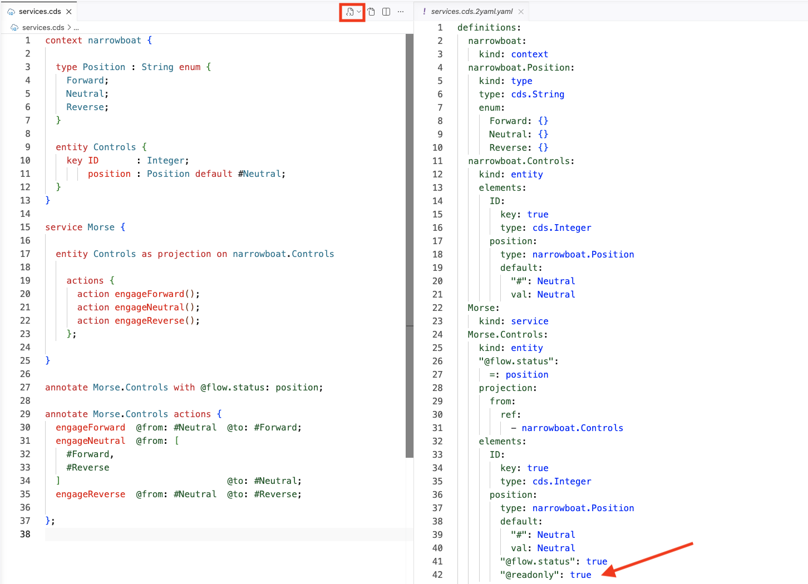

# Explore the declarative power of status-transition flows

<!-- description --> Learn what CAP's status-transition flows feature is, and how to use it.

## You will learn

- What the status-transition flows feature is
- Where it can be useful
- What facilities it provides
- How you can use it

## Prerequisites

You will need a development environment for CAP Node.js. See the tutorial [Set up a self-contained development environment for CAP Node.js](https://developers.sap.com/tutorials/cap-self-contained-dev-env.html)  The assumptions in this tutorial are based on option 1 or option 2 in that tutorial, in that you have a VS Code (or GitHub Codespace) environment based on the foundation repository used in the setup described there, which also means that your starting directory will be `/workspaces/cap-nodejs-dev-env`. If you have your own CAP Node.js development environment setup, then please make the appropriate adjustments where necessary.

## Intro

Released towards the end of 2025, status-transition flows moves us one step closer to declarative nirvana, and in the right direction with regards to LLM-based learning about CAP powered solutions, a smaller code surface area, and a shift left of logic and definitions.

In this tutorial we'll explore the feature with a simple model with different states and restrictions on transitions between them.

---

### Create a new CAP project and CDS model

👉 First, initialize a new CAP project, specifying that it will be a Node.js based one, and then open it up in a new IDE session:

```shell
cds init --add nodejs cap-status-transition-flows
code cap-status-transition-flows
```

This should place you and any new terminal session in the new `cap-status-transition-flows/` directory.

👉 Following the mantra of "the simplest thing that could possibly work", create a new `services.cds` file with the following contents:

```cds
context narrowboat {

  type Position : String enum {
    Forward;
    Neutral;
    Reverse;
  }

  entity Controls {
    key ID       : Integer;
        position : Position default #Neutral;
  }
}

service Morse {

  entity Controls as projection on narrowboat.Controls

    actions {
      action engageForward();
      action engageNeutral();
      action engageReverse();
    };

}
```

> If you wish, you can also remove extraneous project files to keep things clean and to a minimum to avoid distractions:
>
> ```shell
> rm -rf app/ db/ srv/ readme.md
> ```

### Examine the model details

This CDS model defines a simple service `Morse` that has a pass-through projection (an inferred signature) to a `Controls` entity, which has a `position` element that represents the control status at any given time. The projection defines three bound actions (`engage...`) each of which are for moving the control to a specific position.

Moving from the model to the physical world, the `Controls` entity represents a Morse control on a narrowboat, which has three positions, selectable by moving a lever. That lever controls the gearbox (and the throttle) and is how one selects forward gear, neutral, or reverse gear. With such controls, to get from forward to reverse, or vice versa, one must first go via neutral, so as not to damage the gearbox.

In other words:

- a control should start out in the neutral position
- can only be moved to forward, or reverse, from that neutral position
- can not be moved directly from forward to reverse, or from reverse to forward

This control state switching and limitation is what we will end up achieving, with help from the status-transition flow feature.

### Set up for cds test

In this tutorial we'll be testing the control state switching and limitations with unit tests, so we can cleanly describe them, run and re-run them as appropriate. We'll use the `cds test` based harness which comes as a separate package `@cds-js/cds-test`.

👉 Install that package as a development dependency:

```shell
npm add @cap-js/cds-test
```

### Add and run basic tests

Let's add some tests to check the basics of what we have defined, and also of what we expect, with regards to control state limitations.

👉 In a new `test/` directory, create a file `Basics.test.js` with the following content:

```javascript
import cds from '@sap/cds'

const { GET, POST, expect, defaults } = cds.test(import.meta.dirname + '/..')
defaults.path = '/odata/v4/morse'

describe('Basics', () => {

  it('allows the creation of new controls', async () => {
    const { status } = await POST('Controls', { ID: 1 })
    expect(status).to.equal(201)
  })

  it('gives new controls a Neutral default position', async () => {
    const { data } = await POST('Controls', { ID: 2 })
    expect(data.position).to.equal('Neutral')
  })

  it('prevents positions being specified on creation', async () => {
    const { data } = await POST('Controls', { ID: 3, position: "Reverse" })
    expect(data.position).to.equal('Neutral')
  })

})
```

There are three tests here, that check:

- the general creation of new controls
- that controls get a default position of Neutral
- that we cannot override that default and specify Forward or Reverse as the initial position for a new control

👉 Now put these tests to work:

```shell
cds test
```

You should see output that looks something like this:

```log
  Basics
    ✔ allows the creation of new controls 
    ✔ gives new controls a Neutral default position 
    X prevents positions being specified on creation 

    Error [AssertionError]: expected 'Reverse' to equal 'Neutral'
        at TestContext.<anonymous> (file:///workspaces/cap-nodejs-dev-env/cap-status-transition-flows/test/Basics.test.js:20:30)
      actual: 'Reverse',
      expected: 'Neutral',
      showDiff: true,
      operator: 'strictEqual'
    }


 2 passed 
 1 failed 
 0.680s
``` 

OK, so our first two tests pass, but we're not prevented from creating new controls with a non-Neutral position.

Let's hold that thought.

### Add transition related tests

Moving from creation to use of control instances, let's add another batch of tests relating to transition. We'll start with a single test.

👉 Create another new file `Transitions.test.js`, also in the `test/` directory, with the following content:

```javascript
import cds from '@sap/cds'

const { GET, POST, expect, defaults } = cds.test(import.meta.dirname + '/..')
defaults.path = '/odata/v4/morse'

describe('Transitions', () => {

  it('allows moving from Neutral to Forward', async () => {
    const { data } = await POST('Controls', { ID: 1 })
    const { status } = await POST(`Controls/1/engageForward`)
    expect(status).to.equal(204)
  })

})
```

Invoke this test with `cds test Transitions`, whereupon you should see something similar to this:

```log
  Transitions
    X allows moving from Neutral to Forward 

    Error: 501 - Service "Morse" has no handler for "engageForward Morse.Controls".
        at async TestContext.<anonymous> (file:///workspaces/cap-nodejs-dev-env/cap-status-transition-flows/test/Transitions.test.js:10:22)
      response: {
        data: {
          error: {
            message: 'Service "Morse" has no handler for "engageForward Morse.Controls".',
            code: '501',
            '@Common.numericSeverity': 4
          }
        }
      },
      status: 501,
      code: '501',
      '@Common.numericSeverity': 4
    }


 1 failed 
 4.780s
```

### Assess the status and current facilities of the model

If we take a step back we can see that:

- we can create new control instances
- new control instances by default have the Neutral position
- but we're not prevented from creating instances with other positions
- there are no implementations for the bound actions such as `engageForward`

### Add status-transition flow annotations

The status-transition flow feature can bring about what we want, and more. Even better, we can express our requirements purely declaratively, in the form of annotations.

👉 To the end of `services.cds`, add this:

```cds
annotate Morse.Controls with @flow.status: position;

annotate Morse.Controls actions {
  engageForward  @from: #Neutral  @to: #Forward;
  engageNeutral  @from: [
    #Forward,
    #Reverse
  ]                               @to: #Neutral;
  engageReverse  @from: #Neutral  @to: #Reverse;

};
```

> Often, we will find such annotations made together, like this (which is equivalent):
>
> ```cds
> annotate Morse.Controls with @flow.status: position actions {
>   engageForward  @from: #Neutral  @to: #Forward;
>   engageNeutral  @from: [
>     #Forward,
>     #Reverse
>   ]                               @to: #Neutral;
>   engageReverse  @from: #Neutral  @to: #Reverse;
> };
> ```
>
> However, for the purposes of learning and clarity, the annotations are made separately:
>
> - on the flow status element
> - on the bound actions

### Examine the annotations

The annotation detail here identifies the `position` element of the `Controls` entity as the element for which to establish a status-transition flow (i.e. the element that will represent the current status).

The element so identified will also receive the `@readonly` annotation to prevent unwanted external influence.

👉 Use the "Preview as YAML" feature of the CDS Language Support extension (indicated by the red box) to see the compiled (CSN) version of the model in `services.cds`, like this:



> Alternatively, just use `cds compile --to yaml services.cds` on the command line. You can even narrow the output down to what we're looking for, like this:
>
> ```shell
> cds compile --to yaml services.cds \
>   | yq -y '.definitions["Morse.Controls"].elements.position
> ```
>
> which should show something like this:
>
> ```yaml
> type: narrowboat.Position
> default:
>   '#': Neutral
>   val: Neutral
> '@flow.status': true
> '@readonly': true
> ```

👉 Note the `@readonly` annotation on the `position` element.

👉 Look also at the three bound actions `engageForward`, `engageNeutral` and `engageReverse`, which have also been annotated. Each has a pair of `@from` and `@to` annotations, describing the transition status limitations, reflecting the requirements of our Morse control model. For example, both `engageForward` and `engageReverse` are only "valid" when starting from a Neutral position.

### Retry the tests

We have added no code, only these annotations. Let's see the effect on our tests.

👉 Rerun all the tests we have so far, with `cds test` (this will run tests in all files that it finds, which will include `test/Basics.test.js` and `test/Transitions.test.js`).

You should see output similar to this:

```log
Running 2 test suites... 

  ✔  test/Transitions.test.js 
  ✔  test/Basics.test.js 

 4 in 2 suites passed 
 0.946s
```

The annotations alone have done the heavy lifting, not least providing automatic implementations for the bound actions that will perform the transitions as appropriate.

### Add more transition tests

To really get the feel for what the status-transition flow feature brings, let's add some more tests.

👉 Add four more tests to the "Transitions" test bundle, so that the `test/Transitions.test.js` file looks like this:

```javascript
import cds from '@sap/cds'

const { GET, POST, expect, defaults } = cds.test(import.meta.dirname + '/..')
defaults.path = '/odata/v4/morse'

describe('Transitions', () => {

  it('allows moving from Neutral to Forward', async () => {
    const { data } = await POST('Controls', { ID: 1 })
    const { status } = await POST(`Controls/1/engageForward`)
    expect(status).to.equal(204)
  })

  it('tracks the position after engagement', async () => {
    const { data } = await GET('Controls/1')
    expect(data.position).to.equal('Forward')
  })

  it('prevents moving from Forward directly to Reverse', async () => {
    const { data } = await POST(
      'Controls/1/engageReverse',
      null,
      { validateStatus: status => status == 409 }
    )
    expect(data.error.code).to.equal('INVALID_FLOW_TRANSITION_SINGLE')
  })

  it('allows moving from Forward to Neutral', async () => {
    const { status } = await POST('Controls/1/engageNeutral')
    expect(status).to.equal(204)
  })

  it('allows moving from Neutral to Reverse', async () => {
    const { status } = await POST('Controls/1/engageReverse')
    expect(status).to.equal(204)
  })

})
```

Together, this set of tests:

- creates a new control instance
- invokes `engageForward` on it
- checks the position is then set to Forward
- checks that we can't then move that control from Forward direct to Reverse
- checks that we can move it to Neutral, and then to Reverse

👉 Run all the tests like before, with `cds test`.

The output should also show success on all test counts:

```log
Running 2 test suites...

  ✔  test/Basics.test.js
  ✔  test/Transitions.test.js

 8 in 2 suites passed
 0.906s
```

Success!

### Wrap-up and further info

For further info, refer to these resources:

- [An interview with Ward Cunningham](https://creators.spotify.com/pod/profile/tech-aloud/episodes/The-Simplest-Thing-that-Could-Possibly-Work--A-conversation-with-Ward-Cunningham--Part-V---Bill-Venners-e5dpts), who popularized the phrase "the simplest thing that could possibly work"
- Blog post on [using services.cds in simple CDS model examples](https://qmacro.org/blog/posts/2026/01/02/why-i-use-services-cds-in-simple-cds-model-examples/)
- An overview of [Morse lever controls](https://www.thefitoutpontoon.co.uk/engines-drive-gear/controls/) on The Fitout Pontoon's website
- Blog post [A simple exploration of status-transition flows](https://qmacro.org/blog/posts/2025/12/08/a-simple-exploration-of-status-transition-flows-in-cap/)
- The Capire topic [Testing with cds.test](https://cap.cloud.sap/docs/node.js/cds-test) covers `cds test` and a whole lot more
