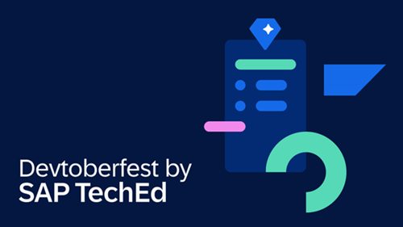

  
# 🔵 Devtoberfest 2025 - Week 1 - Data & AI sessions

<!-- description --> We appreciate you coming to our Devtoberfest session(s), and this tutorial will allow you to get credit for attending.

## You will learn

- A lot about technology – and yourself – during Devtoberfest

## Prerequisites

- Attend live or watch a recording of [🔵 Leveraging Calculation Views in SAP BAS: an Introduction](https://community.sap.com/t5/devtoberfest/leveraging-calculation-views-in-sap-bas-an-introduction/ev-p/14208844).
- Attend live or watch a recording of [🔵 Enrich Data Products with SAP Databricks](https://community.sap.com/t5/devtoberfest/deep-dive-into-sap-databricks/ev-p/14208928).
- Attend live or watch a recording of [🔵 Behind the Magic: How Cirque du Soleil Reimagined Invoice Management with SAP Business AI](https://community.sap.com/t5/devtoberfest/behind-the-magic-how-cirque-du-soleil-reimagined-invoice-management-with/ev-p/14227799).

## Intro

This validation tutorial is part of our yearly and wonderful **Devtoberfest**, a month-long event filled with learning, fun, challenges, and prizes -- for developers by developers.

 

The questions for October 2, 2025, will be published after that day’s sessions conclude. Stay tuned!