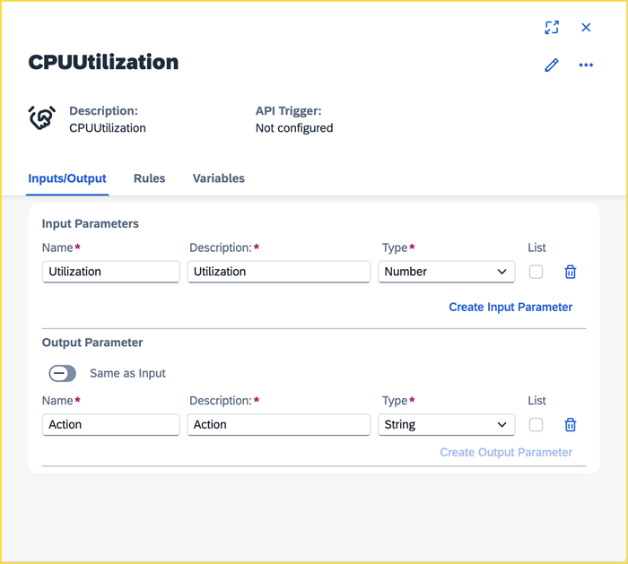

# 🟡 Devtoberfest 2025 - Coder's Challenge - SAP Build

<!-- description --> You don't have to code all day, even if it's without code. Let's have some fun with a little SAP Build challenge.

## You will learn

-   The latest news and interesting features of SAP Build and related tools

## Prerequisites

-   None

## Intro

This challenge tests your basic knowledge and understanding of SAP Build, including SAP Build Code, SAP Build Process Automation, SAP Build Work Zone and the SAP Build lobby.

Good luck!

<hr>

This challenge tutorial is part of our yearly and wonderful **Devtoberfest**, a month-long event filled with learning, fun, challenges, and prizes -- for developers by developers.


For more info on Devtoberfest, see our [Devtoberfest group page](https://community.sap.com/t5/devtoberfest/gh-p/Devtoberfest).

### Question 1

To enable integration scenarios with SAP Build Process Automation, you can create a step in your process that pauses the current process instance and waits to receive an API call. When you deploy the project that contains a **"Wait for an API Call"** step, what is created in your environment?

[Hint](https://help.sap.com/docs/build-process-automation/sap-build-process-automation/create-wait-event-for-api-call)

### Question 2

In SAP Build Process Automation, you may want to create forms that provide a choice field (dropdown) that is populated by an SAP backend. For example, you want the user to choose from a set of warehouses. To enable this, you can set up data sources for an input field. To set up a data source, what is required?

[Hint](https://help.sap.com/docs/build-process-automation/sap-build-process-automation/configure-data-sources-for-form-input-fields?locale=en-US)

### Question 3

SAP Build Work Zone is now integrated with Document Grounding, meaning that content uploaded to Work Zone can be used as a source for AI knowledge. What do you need to create to enable Document Grounding of Work Zone content?

[Hint](https://help.sap.com/docs/build-work-zone-advanced-edition/sap-build-work-zone-advanced-edition/integration-with-document-grounding?locale=en-US)

### Question 4

You created a BTP destination to an SAP backend from **BTP Cockpit > Connectivity > Destinations**. 

To enable and use the destination in SAP Build Process Automation, you would have to add the destination to the project from **SAP Build Lobby > Control Tower > Destinations**. 

After adding a destination, which button do you press to attach a destination to a specific environment?

[Hint](https://help.sap.com/docs/build/sap-build-core/manage-destinations)

### Question 5

Functions in SAP Build Process Automation can be used to model the rule expressions or decisions. Which function should we use if we want the output of `(54321.84, -3)` to be `54000`?

[Hint](https://help.sap.com/docs/build-process-automation/sap-build-process-automation/functions)

### Question 6

You are creating a process in an SAP Build Process Automation project. You can wait for a certain duration before you allow execution of subsequent steps using the **Wait for Duration** option. 

What is the default time (in minutes) that is added when you choose the "Wait for Duration" option?

>**HINT:** Create a new Business Process and add a **Wait for Duration** step from within the **Controls and Events** option.

[Hint](https://help.sap.com/docs/build-process-automation/sap-build-process-automation/add-timed-wait-to-process)

### Question 7

**Studio Home** is a simplified user interface that allows business users to access and manage specific artifacts within business process projects, such as decisions, without needing to navigate the full SAP Build Lobby. 

What role should one have in order to access the Studio Home application?

[Hint](https://help.sap.com/docs/build-process-automation/sap-build-process-automation/use-studio-home)

### Question 8

Application Frontend service lets you host and serve frontend applications. It serves as a single-entry point for hosting web-based UI applications to extend SAP's business solutions. The service provides tools for deploying and managing applications, serving static resources, routing backend calls to defined targets, and observability tools. Application Frontend service is included in SAP Build.

Application Frontend is perfect for customers building new standalone, single-tenant applications that don't connect to other applications. The Application Frontend service supports the same development model as the application router, so there's no need to learn new descriptors. The Application Frontend service is currently available only in the **US East (VA) - AWS region (cf-us10 region)** in the SAP BTP trial.

The Application Frontend service CLI offers access to the APIs exposed by the Application Frontend service. It provides a comprehensive tool set for deploying and managing applications in the Application Frontend service. To use the Application Frontend service CLI, you need to install a node package. Name the package.

Hint: The name of the package can also be found from npmjs.org.

[Hint](https://help.sap.com/docs/application-frontend-service/application-frontend-service/application-frontend-service-cli)


### Question 9

To extend your SAP Build Work Zone site, you can implement a custom visualization (tile) for an app in the SAP Build Work Zone. The tile visualizations that are provided out-of-the-box are **Static App Launcher** and **Dynamic App Launcher**. To display a custom tile for an app, you can implement custom visualization.

Which property should be added to the `manifest.json` to configure a custom visualization for an app?

>**Hint 1:** The value of this property must be the same as the value for the property `sap.app.id`.
>
>**Hint 2:** Type in the name of property, not the entire property's path.

[Hint](https://help.sap.com/docs/build-work-zone-standard-edition/sap-build-work-zone-standard-edition/implement-custom-visualization)


### Question 10

Create a decision artifact with "Utilization" as an input parameter of type **Number** and "Action" as an output parameter of type **String**, as shown in the image below.  



Use the Generative AI feature to generate a rule using natural language with the following prompt:

```Text
Create a decision table rule with the name “CPU Utilization” to determine the actions to take based on the % of cpu utilization such that if its below 50%, no action is needed, if its between 50 to 70%, send alert to the administrator and if it reaches 100%, raise exception.
```

Observe that the generated rule does not take care of all possible values of the **Utilization** input parameter. 

Which option would you choose to fix the missing condition to address all possible conditions for this rule?

[Hint](https://help.sap.com/docs/build-process-automation/sap-build-process-automation/create-decision)
