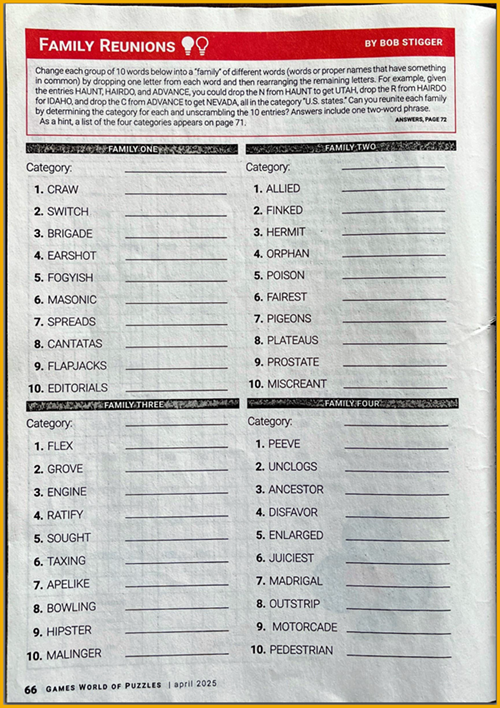
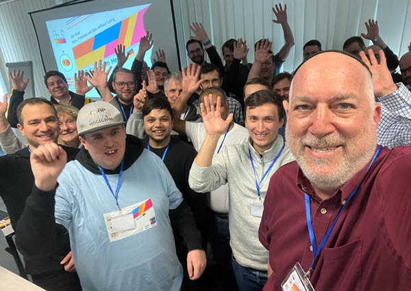

  
# 🟡 Devtoberfest 2025 - Scramble Challenge - Event-Based Processes CodeJam
<!-- description --> You don't have to code all day. Let's have some fun with a little puzzle.  
 
## You will learn
- A lot about technology – and yourself – during Devtoberfest

## Intro
This puzzle is based on the Family Reunions puzzles in Games magazine (I have been reading the magazine since high school). In these puzzles, a list of related but jumbled words are presented, with a bogus extra letter added to the jumble to make it more difficult to figure out.

You have to unjumble the words in the list and then figure out what is common among all the words.

&nbsp;

**INSTRUCTIONS**

To solve each word challenge, remove one letter from the given word and rearrange the remaining letters to get a word related to our topic.

For example, in the first word of Family One in the image above, you are given the word:

  CRAW

You could remove the letter `C`, and then rearrange the remaining words to get `WAR`.

If you did the same to the rest, you would find that all the hidden words were card games.

👉 For our puzzle, you do not have to figure out the family -- all the words in this puzzle are related to our [SAP Build: Event-Based Processes CodeJam](https://developers.sap.com/tutorials/codejam-events-process-introduction.html).

>If you are interested in attending a CodeJam, see the [list of planned SAP CodeJams](https://community.sap.com/t5/sap-codejam/eb-p/codejam-events).
>
>
>
>If you are interested in hosting this or any CodeJam, add a post in the [SAP CodeJam group](https://community.sap.com/t5/sap-codejam/gh-p/code-jam)

&nbsp;

 

&nbsp;

**DEVTOBERFEST**

This tutorial is part of our yearly and wonderful **Devtoberfest**, a month-long event filled with learning, fun, challenges, and prizes -- for developers by developers. 

 

&nbsp;

For more info on Devtoberfest, see our [Devtoberfest group page](https://community.sap.com/t5/devtoberfest/gh-p/Devtoberfest).  

  

### Maze

    
⇟ Hint 🔦

    <i>Initials for a key component that makes the CodeJam exercises run.</i>

### Shame

    
⇟ Hint 🔦

    <i>A way to put event brokers together.</i>

### Tissue

    
⇟ Hint 🔦

    <i>Put ERP, CRM, SRM, SCM, and PLM together and what do you have?</i>

### Poetic

    
⇟ Hint 🔦

    <i>Each event you publish has this.</i>

### Seventh

    
⇟ Hint 🔦

    <i>The basis of the entire CodeJam.</i>

### Contain

    
⇟ Hint 🔦

    <i>An artifact of SAP Build, this lets you call an API and get data from S/4HANA into our process.</i>

### Scoopers

    
⇟ Hint 🔦

    <i>A series of steps to get things done.</i>

### Vertices

    
⇟ Hint 🔦

    <i>Most BTP capabilities are delivered in this.</i>

### Lectures

    
⇟ Hint 🔦

    <i>Where brokers might live.</i>

### Restationing

    
⇟ Hint 🔦

    <i>Antonio Maradiaga's specialty.</i>

