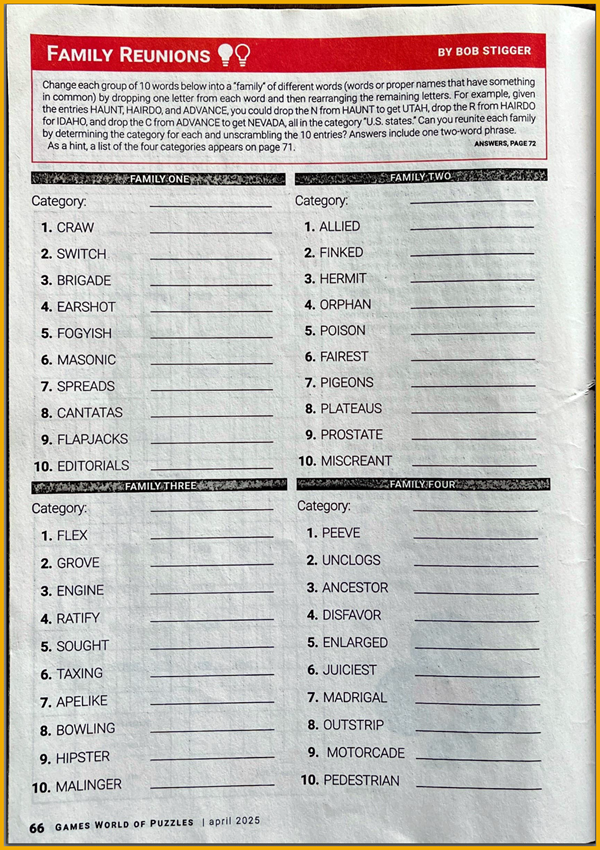

  
# 🟡 Devtoberfest 2025 - Scramble Challenge - Programming Languages
<!-- description --> You don't have to code all day. Let's have some fun with a little puzzle.  
 
## You will learn
- A lot about technology – and yourself – during Devtoberfest

## Intro
This puzzle is based on the Family Reunions puzzles in Games magazine (I have been reading the magazine since high school). In these puzzles, a list of related but jumbled words are presented, with a bogus extra letter added to the jumble to make it more difficult to figure out.

You have to unjumble the words in the list and then figure out what is common among all the words.

&nbsp; 

**INSTRUCTIONS**

To solve each word challenge, remove one letter from the given word and rearrange the remaining letters to get a word related to our topic.

For example, in the first word of Family One in the image above, you are given the word:

  CRAW

 
You could remove the letter `C`, and then rearrange the remaining words to get `WAR`.

If you did the same to the rest, you would find that all the hidden words were card games.

👉 For our puzzle, you do not have to figure out the family -- all the words in this puzzle are **programming languages or frameworks**.

>**IMPORTANT:** If the language has a special character in its name, like a slash (/), ampersand (&) or period (.), this is not shown in the scrambled letters nor should you include it in the answer.
 
&nbsp;

 

&nbsp;

**DEVTOBERFEST**

This tutorial is part of our yearly and wonderful **Devtoberfest**, a month-long event filled with learning, fun, challenges, and prizes -- for developers by developers. 

 

&nbsp;

For more info on Devtoberfest, see our [Devtoberfest group page](https://community.sap.com/t5/devtoberfest/gh-p/Devtoberfest).
  
 

 

### Dog

    
⇟ Hint 🔦

    <i>Created in 2007, it is syntactically similar to C, but also has garbage collection, structural typing, and CSP-style concurrency.</i>

### Pace

    
⇟ Hint 🔦

    <i>Enables a primary focus on the domain, with close collaboration of developers and domain experts, and rapid development at minimized costs.</i>

### Reply

    
⇟ Hint 🔦

    <i>A high-level, general-purpose, interpreted, dynamic programming language. The following is a valid line of code:</i>
    
&nbsp;

    print "Hello, World!\n";

### Buyer

    
⇟ Hint 🔦

    <i>Designed in the mid-1990s, a general-purpose programming language with an emphasis on programming productivity and simplicity.</i>

### Blahs

    
⇟ Hint 🔦

    <i>An interactive command-line interpreter and a scripting language” instead of “an interactive command interpreter and command programming language.</i>

### Cabins

    
⇟ Hint 🔦

    <i>A family of general-purpose, high-level programming languages designed for ease of use, with the original version created at Dartmouth College in 1964.</i>

### Jonesed

    
⇟ Hint 🔦

    <i>A cross-platform, open-source JavaScript runtime environment that can run on Windows, Linux, Unix, and macOS, and runs on the V8 JavaScript engine.</i>

### Typhoon

    
⇟ Hint 🔦

    <i>Designed as a successor to the ABC programming language, it was named after the British comedy group.</i>

### Inkblot

    
⇟ Hint 🔦

    <i>Like Java (named after the island in the Malay Archipelago), this language is also named after an island — this time in the Baltic Sea.</i>

