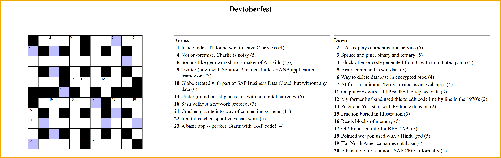

  
# 🟣 Devtoberfest 2025 - Bonus Points for SAP Cryptic Crossword
<!-- description --> Here's your chance to earn even more points for the Devtoberfest contest by entering the bonus answer from the SAP Cryptic Crossword puzzle.

## You will learn
- A lot about technology – and yourself – during Devtoberfest

## Prerequisites
- You must complete the [2025 SAP Cryptic Crossword puzzle](devtoberfest2025-sap-crossword)

## Intro

&nbsp;

After completing the [2025 SAP Cryptic Crossword puzzle](devtoberfest2025-sap-crossword), some of the letters are colored purple. Take those letters, and unscramble them to make the first names of 2 SAP Developer Advocates -- all the Developer Advocates are shown on this [page](https://developers.sap.com/developer-advocates.html).

Let's say the answer was `Joe` and `Beth`. You would enter them in the Step 1 answer form below as `Beth Joe`.

&nbsp;

 

&nbsp;
  
**DEVTOBERFEST**

This puzzle is part of our yearly and wonderful **Devtoberfest**, a month-long event filled with learning, fun, challenges, and prizes -- for developers by developers. 

 

&nbsp;

For more info on Devtoberfest, see our [Devtoberfest group page](https://community.sap.com/t5/devtoberfest/gh-p/Devtoberfest).

### SAP Cryptic Crossword Bonus Answer 
