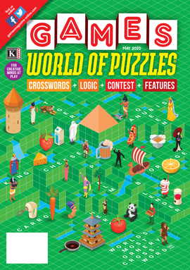

  
# 🟡 Devtoberfest 2025 - SAP Cryptic Crossword
<!-- description --> As has become tradition, we offer you a crossword with many SAP terms, but all are relevant to SAP developers. You will win lots of points if you can complete the whole thing.
 
## You will learn
- A lot about technology – and yourself – during Devtoberfest

## Prerequisites
- None 😺

## Intro

&nbsp;

We recommend printing out the grid and completing the puzzle, and then entering the individual answers in the step answers below.

>If you complete the grid, take the letters in the colored squares, rearrange them to get the first names of two of our [Developer Advocates](https://developers.sap.com/developer-advocates.html). 
>
>Go to the [Cryptic Bonus Tutorial](devtoberfest2025-sap-crossword-bonus) and enter those names (in alphabetical order and with a space between the names) into the bonus puzzle tutorial. 

#### What are Cryptic Crosswords?

Cryptics are the coolest crosswords there are, and apparent all the rage today. They have a grid like regular crosswords, though generally with fewer words. What sets them apart is the form of the clues.

Each clue is made to sound like a normal phrase, but they are divided into 2 parts: one part is a definition (like a regular crossword) and the second part is a riddle, a clue about the letters in the answer. Each clue comes with the number of letters in the answer, shown at the end. The beauty is to have the clue sound so much like a regular sentence that you cannot tell which half is which half.

Let's take an example (from the October 2025 Games magazine).

>Royally miserable allergy (7)

Like all clues, there are 2 parts of the clue:

**"Royally"** is the definition.

**"miserable allergy"** is the riddle, indicating how the answer is constructed. In this case, **"miserable"** is a word that indicates an anagram of the next word(s), **"allergy"**. You can rearrange the letters of **"allergy"** to create the word **"regally"**, which is the answer to clue. There are hundreds of words (e.g., "confused", "erratic", "twisted") that can indicate an anagram, and you can see a list of all such words [here](https://cryptics.fandom.com/wiki/List_of_anagram_indicators).

There are many other types of clues, like the answer is hidden in another word, or the word is a homophone of another word for which a clue is given. You can see examples in [this blog](http://www.sarahlolley.com/cryptic-crossword-riddles.html).

#### Why I love them? 

The main reason I love them is that they make you think.

When I get my games magazine, I go through the puzzle and maybe solve a third of the clues. At that point, I've had enough and cannot figure out the rest.

But then I pick it up a few days later, and somehow my brain is thinking differently, and I start to look at the clue differently. All of a sudden I can solve the clue.

I also love plays on words and interesting patterns, which you need to find to solve the clues. And I also like that almost every answer is a well-known, usually simple word, and the crossword does not rely on knowing esoteric words (looking at you NYT).

I hope you enjoy them, too.

P.S.: It was also fun to start to create the puzzles, using scrablle word finders, multi-word anagram creators, and cryptic dictionaries where you find the key words that indicate to the solver the clue is an anagram, or hidden word, or whatever.

&nbsp;

 

&nbsp;

**DEVTOBERFEST**
  
This puzzle is part of our yearly and wonderful **Devtoberfest**, a month-long event filled with learning, fun, challenges, and prizes -- for developers by developers. 

 

&nbsp;

For more info on Devtoberfest, see our [Devtoberfest group page](https://community.sap.com/t5/devtoberfest/gh-p/Devtoberfest).

### 1 Across

### 4 Across

### 8 Across

### 9 Across

### 10 Across

### 14 Across

### 18 Across

### 21 Across

### 22 Across

### 23 Across

### 2 Down

### 3 Down

### 4 Down

### 5 Down

### 6 Down

### 7 Down

### 11 Down

### 12 Down

### 13 Down

### 15 Down

### 16 Down

### 17 Down

### 18 Down

### 19 Down

### 20 Down

