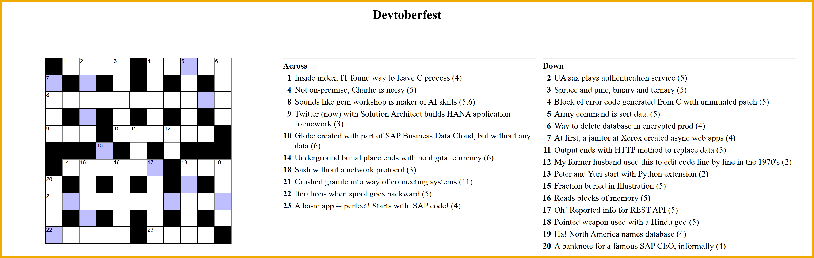

  
# 🟣 Devtoberfest 2025 - SAP Cryptic Crossword
<!-- description --> As has become tradition, we offer you a crossword with many SAP terms, but all are relevant to SAP developers. You will win lots of points if you can complete the whole thing.
 
## You will learn
- A lot about technology – and yourself – during Devtoberfest

## Prerequisites
- None 😺

## Intro

&nbsp;

We recommend printing out the grid and completing the puzzle, and then entering the individual answers in the step answers below.

>**TIP:** If you need any help, please post in the discussion [Friends helping friends solve the SAP Crossword Puzzle]().

>**BONUS:** If you complete the grid, take the letters in the colored squares, rearrange them to get the first names of two of our [Developer Advocates](https://developers.sap.com/developer-advocates.html). 
>
>Go to the [Cryptic Bonus Tutorial](devtoberfest2025-sap-crossword-bonus) and enter those names (in alphabetical order and with a space between the names) into the bonus puzzle tutorial. 

&nbsp;

 

&nbsp;

**DEVTOBERFEST**
  
This puzzle is part of our yearly and wonderful **Devtoberfest**, a month-long event filled with learning, fun, challenges, and prizes -- for developers by developers. 

 

&nbsp;

For more info on Devtoberfest, see our [Devtoberfest group page](https://community.sap.com/t5/devtoberfest/gh-p/Devtoberfest).

### 1 Across

### 4 Across

### 8 Across

### 9 Across

### 10 Across

### 14 Across

### 18 Across

### 21 Across

### 22 Across

### 23 Across

### 2 Down

### 3 Down

### 4 Down

### 5 Down

### 6 Down

### 7 Down

### 11 Down

### 12 Down

### 13 Down

### 15 Down

### 16 Down

### 17 Down

### 18 Down

### 19 Down

### 20 Down

