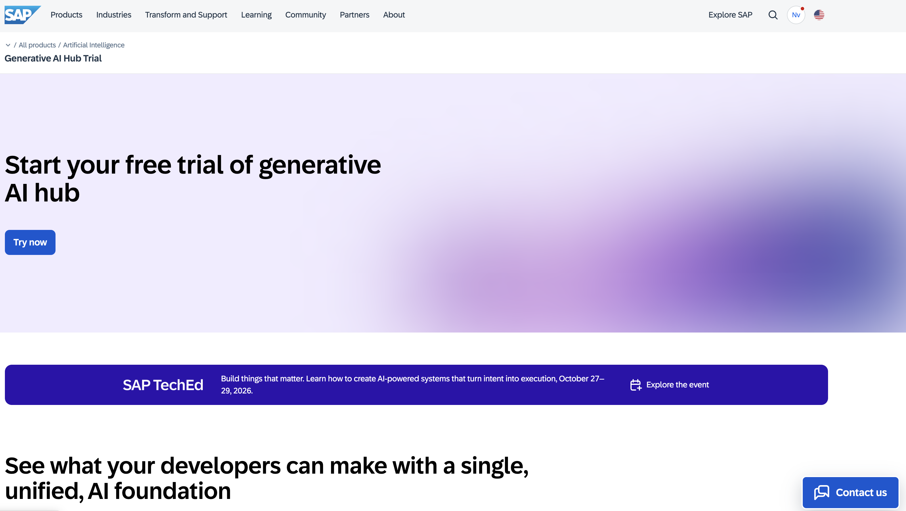

  
# 🟣 Devtoberfest 2026 - Week 1-4 - AI - Building code-based AI Agents on BAIP

<!-- description --> This is the validation tutorial so you can get Devtoberfest points for doing the Building code-based AI Agents on BAIP exercise.

## You will learn

- A lot about technology – and yourself – during Devtoberfest

## Intro

This tutorial is part of our yearly and wonderful **Devtoberfest**, a month-long event filled with learning, fun, challenges, and prizes -- for developers by developers. 

 

For more info on Devtoberfest, see our [Devtoberfest page](https://developers.sap.com/devtoberfest).

## Getting started
Go to the [Generative AI Hub - Trial](https://www.sap.com/products/artificial-intelligence/generative-ai-hub-trial.html) and click on **try now**. 

You will see a set of exercises belonging to the Generative AI Hub basic trial, feel free to do those as well. To get points for Devtoberfest, the ask is to do the exercises starting **UNIT 9**, which belong to the *Code-based AI Agents CodeJam*. You will be able to do a virtual version of it as part of Devtoberfest! Happy coding and good luck sovling the crime! You will find all the instructions in the workbook of the basic trial. Come back here for the knowledge check after you are done!

## Knowledge Check

### Question 1 - 🟣 About LiteLLM

### Question 2 - 🟣 LiteLLM Model Identifier Format

### Question 3 - 🟣 The Art Theft Scenario

### Question 4 - 🟣 The [PREDICT] Marker in RPT-1

### Question 5 - 🟣 Multi-Agent Graph in Exercise 06

### Question 6 - 🟣 Grounding Service Configuration

### Question 7 - 🟣 Solving the Art Theft
