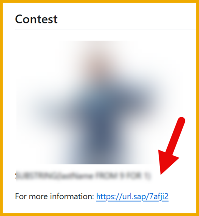

  
# 🟡 Devtoberfest 2026 - Week 1 - Scavenger Hunt - BONUS

<!-- description --> This is the tutorial for the extra bonus for the Scavenger Hunt.

## You will learn

- A lot about technology – and yourself – during Devtoberfest
- How to have fun

## Intro

We gave you a scavenger hunt which will earn you lots of points and is described in this blog post: [https://url.sap/7afji2](https://url.sap/7afji2).

To earn some bonus points, we added an extra assignment: tell us what language each of the code samples used in the scavenger hunt. Enter the name of the language in the order the clues were given in the scavenger.

So let's say we gave the following code when you found one of the Developer Advocates:

```
(defparameter secondLetter (char firstName 1))
```



Then the answer of that clue would be `lisp`, and you would type it into the space below.

>**IMPORTANT:** 
>
>- The answers are NOT case-sensitive.
>
>- We are sure that there could be multiple programming languages where a specific syntax would work. We are looking for the most common and obvious language that fits the syntax.

Finally, we are not naive to think that you likely will just shove the code into ChatGPT or Claude 🤖 and get the language it is written in. And if that's the way you want to earn your points, go ahead. But at least first take a guess in your head and see how well you do against AI. 

Like in the conclusion to the book ***1984*** when the totalitarian state defeats the pair of rebels, AI will eventually win, but let's at least briefly revel in our independence of the machine (or the state).

 

This tutorial is part of our yearly and wonderful **Devtoberfest**, a month-long event filled with learning, fun, challenges, and prizes -- for developers by developers. 

 

For more info on Devtoberfest, see our [Devtoberfest page](https://developers.sap.com/devtoberfest).

### Clue 1

### Clue 2

### Clue 3

This is the clue were you found DJ. For this, just click the **DONE** button.

### Clue 4


### Clue 5


### Clue 6


### Clue 7


### Clue 8


### Clue 9


 