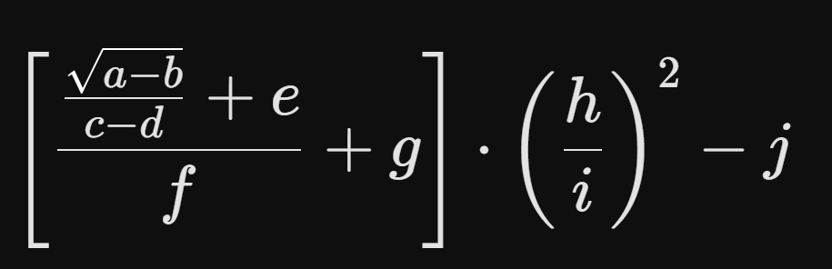

  
# 🟡 Devtoberfest 2026 - Week 2 - Equation Puzzle

<!-- description --> This is the equation puzzle for Week 2 of Devtoberfest.

## You will learn

- A lot about technology – and yourself – during Devtoberfest
- How to have fun

## Intro

>**PLEASE NOTE:** This tutorial will not be working until the start of Devtoberfest.

Here is an equation that you have to solve.

 

Here is the same equation written as a Python function.

```Python
import math

def calculate_expression(a, b, c, d, e, f, g, h, i, j):
    """
    Evaluates the nested expression:
    [ (((sqrt(a - b) / (c - d)) + e) / f) + g ] * (h / i)**2 - j
    """
    inner_fraction = math.sqrt(a - b) / (c - d)
    middle_term = (inner_fraction + e) / f
    outer_term = (middle_term + g) * (h / i) ** 2
    
    return outer_term - j   
```

Answer the following questions to get values for the 10 variables, plug them in, and enter the answer below.

* a = the year SAP was founded
* b = decimal ASCII code for the currency symbol for US dollar
* c = [CLUE TO COME]
* d = Second name of SAP's ERP product for small and medium-sized enterprises, developed by a company founded by the father of former SAP CTO Shai Agassi
* e = transaction code (numeric part only) of ABAP Editor
* f = official technical version number for SAP NetWeaver 2004s 
* g = number of digits in all client codes
* h = number of hex digits in a standard GUID
* i = [CLUE TO COME]
* j = the sum of the digits in the year when SAP announced the autonomous enterprise

>The final answer has something to do with Devtoberfest and SAP TechEd.

 

This tutorial is part of our yearly and wonderful **Devtoberfest**, a month-long event filled with learning, fun, challenges, and prizes -- for developers by developers. 

 

For more info on Devtoberfest, see our [Devtoberfest page](https://developers.sap.com/devtoberfest).

### Answer for equation puzzle

 


 