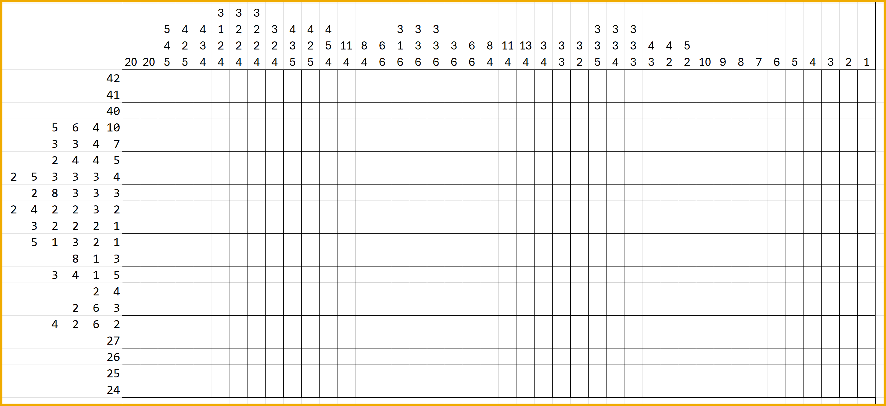

  
# 🟡 Devtoberfest 2026 - Week 2 - Paint By Numbers

<!-- description --> This is the paint by numbers puzzle for Week 2 of Devtoberfest.

## You will learn

- A lot about technology – and yourself – during Devtoberfest
- How to have fun

## Intro

The numbers are all you need to determine which squares should be filled in to form a picture. 

Here’s how it’s done:

The numbers outside each row and column tell you how many groups of black squares there are in that line and, in order, how many consecutive black squares there are in each group. For example, 4 5 9 2 tells you that there will be four groups that will contain, in order, 4, 5, 9, and 2 consecutive black squares. The fact that the numbers are separated tells you that there is at least one empty square between them. (There may also be empty squares at the ends of lines.) The trick is to figure out how many empty squares come between the black ones. 

If you successfully complete this paint by numbers, you will get a picture, which can be summed up in 2 words. Enter those 2 words below.

 

For example, if the picture is that of 2 dogs, and you think they are Gerhard Oswald’s, you might enter "golden retrievers" or simply "two dogs". Or if it shows SE38 you might enter "transaction code". Or if its that magic symbol we sometimes use for our AI assistant, you might enter "Joule Studio" or "AI assistant".

>The answer is case insensitive, but the space between the words must be entered.

 

This tutorial is part of our yearly and wonderful **Devtoberfest**, a month-long event filled with learning, fun, challenges, and prizes -- for developers by developers. 

 

For more info on Devtoberfest, see our [Devtoberfest page](https://developers.sap.com/devtoberfest).

### Answer for paint by numbers

 