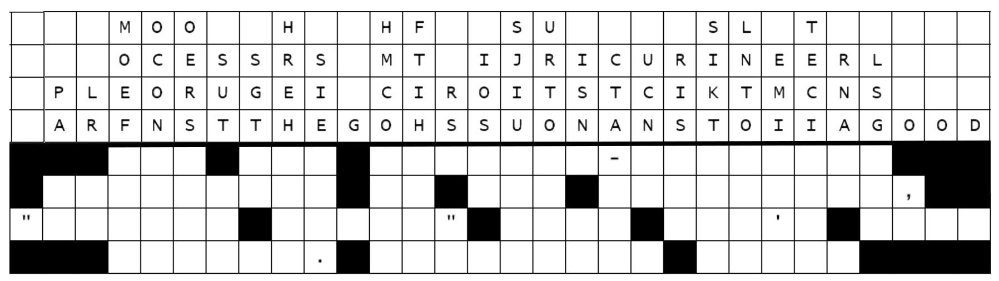

  
# 🟡 Devtoberfest 2026 - Week 2 - Quote Box Puzzle

<!-- description --> This is the quote box puzzle for Week 2 of Devtoberfest.
 
## You will learn

- A lot about technology – and yourself – during Devtoberfest
- How to have fun

## Intro

To solve Quote Boxes, drop the letters from each vertical column -- not necessarily in the order in which they appear -- into the empty squares below them to spell a quotation reading from left to right, line by line. Words may continue from one line to the next; black squares indicate ends of words. The author of each quote is given above its grid.

Both quotes are from senior SAP executives about recent products or technology trends.

Quote Box 1

 

Quote Box 2

 

Enter the complete quote, with punctuations and spaces between the words (no quotation marks at the beginning or end), ending in a period, followed by a space and the author of the quote.

So, for example, you might end up with this quote. Enter it just like this:

>Here's to the crazy ones. The misfits. The rebels. The troublemakers. The round pegs in the square holes. The ones who see things differently. Steve Jobs

If there are quotations marks inside the quote, use this character: "

The validation is NOT case sensitive, and if you put 2 or more spaces instead of 1, that is OK, too.

 

This tutorial is part of our yearly and wonderful **Devtoberfest**, a month-long event filled with learning, fun, challenges, and prizes -- for developers by developers. 

 

For more info on Devtoberfest, see our [Devtoberfest page](https://developers.sap.com/devtoberfest).

### Answer for quote #1

Enter the complete quote #1, with punctuations and spaces between the words, ending in a period, followed by a space and the author of the quote.

No need for quotation marks at the start or end (though there may be in the middle), and the answer is NOT case-sensitive.

### Answer for quote #2

Enter the complete quote #2, with punctuations and spaces between the words, ending in a period, followed by a space and the author of the quote.

No need for quotation marks at the start or end (though there may be in the middle), and the answer is NOT case-sensitive.

