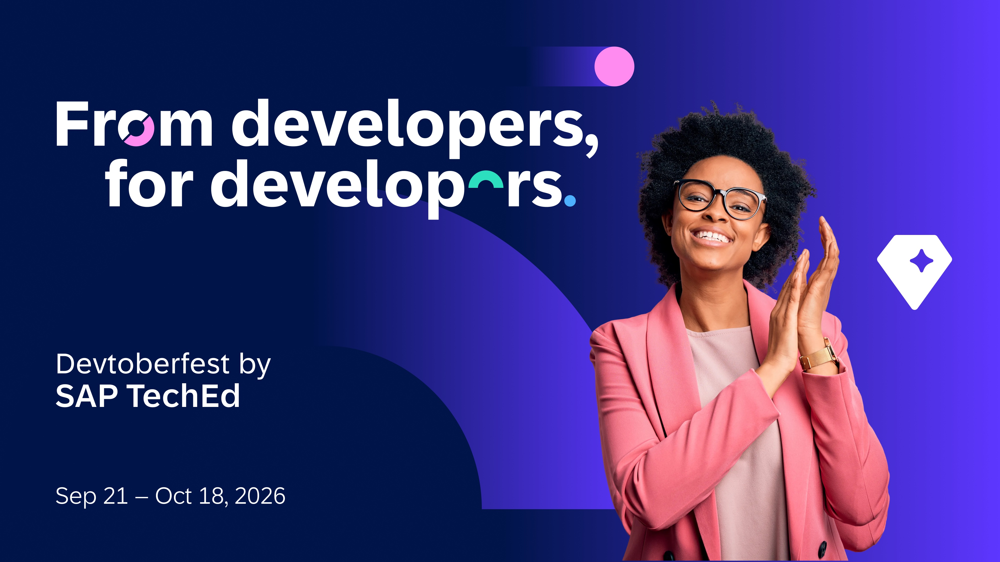

# 🔴 Devtoberfest 2026 - Week 3 - Validation Tutorial - Integration Week 3

<!-- description --> This is the validation tutorial so you can get Devtoberfest points for watching the 🔴 Integration sessions for week 3.

## You will learn

- A lot about technology and yourself during Devtoberfest

## Intro

This tutorial is part of our yearly and wonderful **Devtoberfest**, a month-long event filled with learning, fun, challenges, and prizes -- for developers by developers.

For more info on Devtoberfest, see our [Devtoberfest page](https://developers.sap.com/devtoberfest).

### Question 1 - 🔴 IntegrAItion: Event-Driven Intelligence

&nbsp;
<iframe width="560" height="315" src="https://www.youtube.com/embed/aUNHb-4qyDo" frameborder="0" allowfullscreen></iframe>

### Question 2 - 🔴 Powering Enterprise-Ready Agentic AI with SAP Integration Suite

&nbsp;
<iframe width="560" height="315" src="https://www.youtube.com/embed/yTC3zzPff-w" frameborder="0" allowfullscreen></iframe>

### Question 3 - 🔴 How has AI changed the integration space? (Roundtable)

&nbsp;
<iframe width="560" height="315" src="https://www.youtube.com/embed/M6dCex0iixM" frameborder="0" allowfullscreen></iframe>
