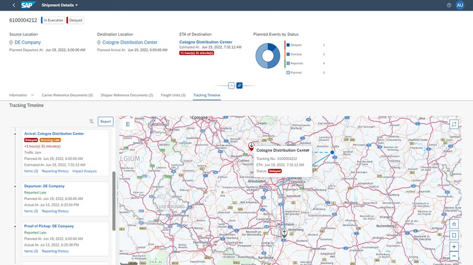
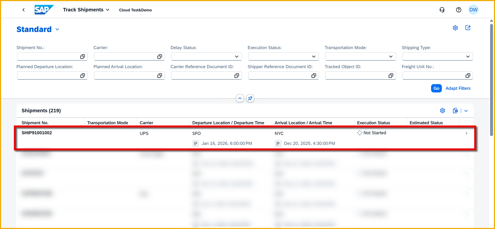
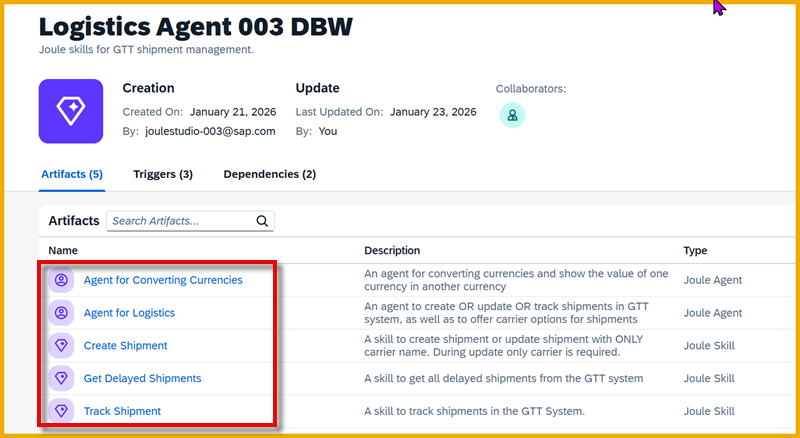

  
# Joule Studio CodeJam - Introduction
<!-- description --> This tutorial provides an overview of the Joule Studio CodeJam, what you will build plus some background on Joule Studio.
 
## You will learn
- About Joule
- About Joule Studio
- About this Joule Studio CodeJam

## Prerequisites
- None 😺

### What is Joule?
Joule is SAP's AI copilot. 

It runs in SAP BTP Cloud Foundry, and offers conversational interactions between humans and computers to simplify access to information and automate business processes, thus improving both the employee and customer satisfaction. 

Joule can direct you to the right application to complete your tasks, help you complete certain tasks, and find the information you're looking for quickly and easily  

Here is a fun video that gives an introduction to Joule within SAP applications.

<iframe width="560" height="315" src="https://www.youtube.com/embed/aj8VIHdGR0A" frameborder="0" allowfullscreen></iframe>

### What is Joule Studio?
Joule comes out of the box with prebuilt skills and agents designed to work with SAP apps. For example, here I can open SAP S/4HANA Cloud and use Joule to search for sales orders -- this interaction is built-in to Joule.

But what if you want to add capabilities to Joule, for example, to search third-party APIs, create Microsoft Teams posts, or read and write to your own CAP service?

You can extend Joule using Joule Studio, the no-code tool for creating your own custom skills and agents.

- **Skills** are Joule skills are task-specific components for conversational automation, designed to run predefined operations within a business context. 

    Each skill performs a single task, such as retrieving data, triggering transactions, or querying systems, based on structured inputs and deterministic logic. Their purpose is to streamline repetitive, rule-based activities by offering a fast, reliable, and reusable automation mechanism.

    Functioning within clearly defined parameters, Joule skills are a good option for low-complexity, high-frequency operations where consistency and precision are essential. 

- **Agents** are AI-driven systems that extend the capabilities of traditional LLMs by integrating the ability to take actions and interact with external tools. These agents are designed to perform tasks beyond simple text generation, such as:

    - Accessing APIs for real-time data retrieval.

    - Performing calculations or running scripts.

    - Searching the web for up-to-date information.

    - Interfacing with other software or systems.

    Agents are particularly useful in scenarios where tasks require more than just natural language understanding and generation, enabling automation and complex problem-solving. 

For more information on both skills and agents, see [Create AI Capabilities](https://help.sap.com/docs/Joule_Studio/45f9d2b8914b4f0ba731570ff9a85313/6ee21fccdf2c44aca11d46f672aaf9fe.html).

### What will you build?
You will build skills and agents so you can use Joule to interact with the SAP Business Network Global Track and Trace (GTT) system.

#### GTT

The aim of SAP Business Network Global Track and Trace (GTT) is to capture, process and store tracking information about tracked business processes. 

For this CodeJam, we will focus on the **Track Shipments** app, which allows you to monitor the real-time execution status of transportation shipments and freight documents from SAP S/4HANA and report events manually.

We will create and track shipments.

#### Skills and Agents
In order to interact with the GTT system, you will create a set of skills and agents.

- **Track Shimpent** (skill): When triggered, makes API call to GTT to get information about a specific shipment.

- **Get Delayed Shimpents** (skill): When triggered, makes API call to GTT to get list of delayed shipments, that is, with field `delayStatus` set to true.

- **Create Shimpent** (skill): When triggered, makes API call to GTT of type POST that either creates a new shipment (if the shipment ID does not exist) or updates an existing shipment (if the shipment ID exists).

- **Agent for Logistics** (agent): Orchestrates the calling of the skills, plus lets us call the document grounding to get carriers and their rates.

    When designing the agent, we will change the settings of the skills so it can only be called via the agent, not directly.

- **Agent for Converting Currencies** (agent): An agent that retrieves currency exchange rates, and will let the user display the carrier rates in any currency.

    This agent will be used as a subagent within our main agent, and this subagent will connect with an MCP server to import its tools inside the agent. 

In addition, you will learn how to test these skills/agents from within your design-time project, and then to create a shared environment to which you will deploy your project. 

The deployed project can be tested in the environment, or further sent to the production Joule.

### Prerequisites
For this CodeJam, we will provide you with an SAP BTP system to use for building Joule skills, and will give you:

- URL of Joule Studio

- Credentials

We have also set up the following to support your work in Joule Studio:

- Global Track and Trace (GTT) system

- SAP AI Core

- SAP AI Launchpad

- Object Store

- Destinations to the GTT system, to AI Core, and to the Object Store

- Actions for updating the GTT system

### Additional Resources

- [Getting Started with Joule Studio in SAP Build - Part 1: Provisioning Joule Studio](https://community.sap.com/t5/technology-blog-posts-by-sap/getting-started-with-joule-studio-in-sap-build-part-1-provisioning-joule/ba-p/14157407) (blog)

- [Set Up Joule Studio](https://help.sap.com/docs/Joule_Studio/45f9d2b8914b4f0ba731570ff9a85313/04b323352fa645238211ce017f634d34.html?locale=en-US) (documentation)

- [Setting Up Joule Studio for All Partner Flows and Entitlement Levels](https://community.sap.com/t5/technology-blog-posts-by-sap/setting-up-joule-studio-for-all-partner-flows-and-entitlement-levels/ba-p/14282498) (blog)

- [Setting Up Joule Studio for All Customer Flows and Entitlement Levels](https://community.sap.com/t5/technology-blog-posts-by-sap/setting-up-joule-studio-for-all-customer-flows-and-entitlement-levels/ba-p/14240537) (blog)

The last 2 blogs I really like because they give you directions no matter where you are starting from: whether you already have Joule, or SAP Build Process Automation, or both, or neither.

Here is [The Complete Joule Studio Resource Hub: Everything You Need to Get Started](https://community.sap.com/t5/technology-blog-posts-by-sap/the-complete-joule-studio-resource-hub-everything-you-need-to-get-started/ba-p/14183113) (blog), though a little old, from August, still has a lot of great

And finally a video on the latest features: [What's New in SAP BTP: Top New Features | Joule Studio Agent Builder | Q4 2025](https://www.youtube.com/watch?v=Bw6WGI_rc74&pp=ygUMam91bGUgc3R1ZGlv)

<iframe width="560" height="315" src="https://www.youtube.com/embed/Bw6WGI_rc74" frameborder="0" allowfullscreen></iframe>

