   
# 1 - Open and Explore the SAP Build Lobby 
<!-- description --> Open the SAP Build Lobby and explore how to create projects and the other tools available for developers and admins.
 
## You will learn
- What is SAP Build
- What are the different components of SAP Build
- What types of projects you can build with SAP Build

## Prerequisites
- You have completed the previous tutorial in the Joule Studio CodeJam Mission, [Joule Studio CodeJam - Introduction](joule-studio-codejam-0-overview).
- You have received credentials from your instructor.
- You are using either Google Chrome or Microsoft Edge browser.


## Intro
**SAP Build** is a comprehensive low-code/no-code development platform that enables users to create enterprise applications, automate business processes, and design digital workspaces without extensive programming knowledge. The platform empowers both citizen developers and professional developers to build solutions with drag-and-drop simplicity while maintaining enterprise-grade security and scalability.

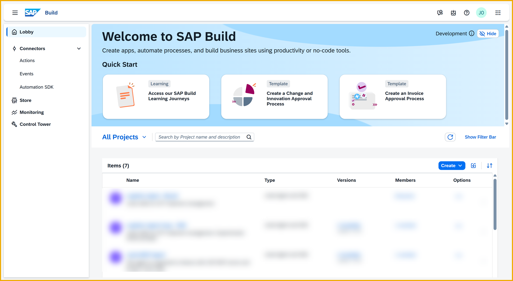

The core components are:

- **Joule Studio:** A capability within SAP Build that enables organizations to create and deploy custom Joule agents and skills that automate workflows and improve efficiency across SAP and non-SAP systems 

- **SAP Build Apps:** A visual development solution for creating custom web and mobile applications without writing code. Users can build intricate user interfaces using drag-and-drop functionality, create data models and business logic visually, and integrate seamlessly with SAP and non-SAP systems.

- **SAP Build Process Automation:** Enables users to automate business processes and tasks with drag-and-drop simplicity, incorporating AI capabilities and intelligent document processing. The solution provides workflow management, robotic process automation (RPA), and embedded AI to streamline business operations.

- **SAP Build Code:** An AI-powered cloud development environment tailored for professional developers working with the SAP Cloud Application Programming Model (CAP), SAP Fiori, and SAPUI5, supporting JavaScript and TypeScript.

- **SAP Build Work Zone:** A solution for creating and customizing digital workspaces and engaging business sites, available in standard and advanced editions. It serves as a centralized access point for applications and enables collaborative workspaces.


### Open the SAP Build lobby
Open the SAP Build Lobby for this CodeJam.

>Your instructor will provide the URL.

>Joule Studio supports Google Chrome or Microsoft Edge browsers only.

Enter the credentials you received from your instructor, and click **Continue**.

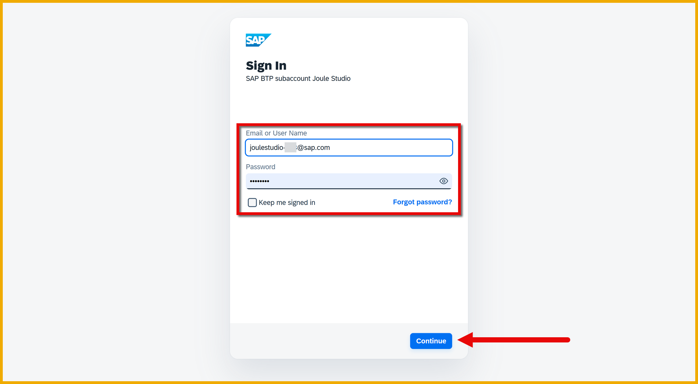

You will now see the SAP Build Lobby.

>The SAP Build Lobby is the list of SAP Build projects in this instance of SAP Build


### Explore SAP Build

The SAP Build home page shows a menu of different tools for use in building applications, Joule extensions, processes and more, generally low-code tools but not only.

Here is a quick tour.

#### Lobby
The **Lobby** shows a list of the existing SAP Build projects, and is where you can create new proejcts.

You can use the search and filter bars to filter the list of projects by different parameters, which helps when there are a lot of projects.

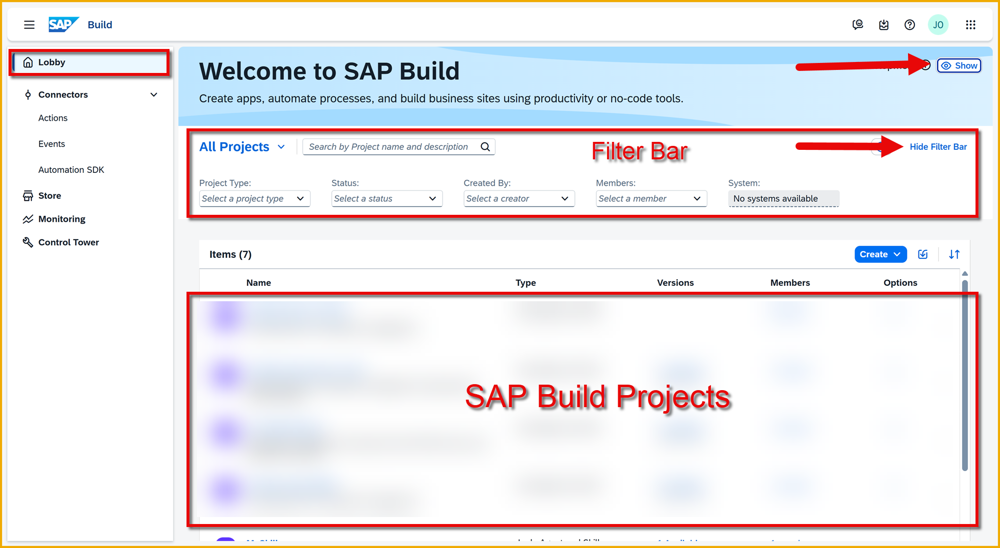

For each project, you can click the chevron on the right to manage the project.


You can manage the following:

- The metadata for the project

- The versions of the project, including editable, released, deployed and published versions

- The people who can view and work on the project.

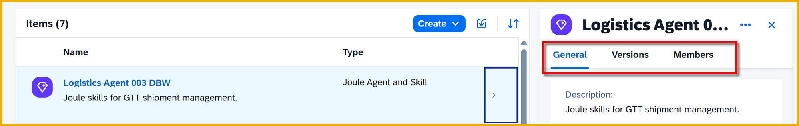


#### Connectors
**Connectors** is where you can define connections or interfaces to external systems. Most notably:

- **Actions**: Actions are projects that define API calls to external systems, for example, the Global Track and Trace (GTT) service we will use in this CodeJam. The advantage of actions is that you can simplify calls by exposing a subset of API requests, a subset of request and response parameters, and custom parameters -- all making it easier for developers to consume these services. 

- **Events**: Here you can define the events -- for example, those triggered by SAP S/4HANA activities -- that you want to receive in SAP Build and use to trigger processes.

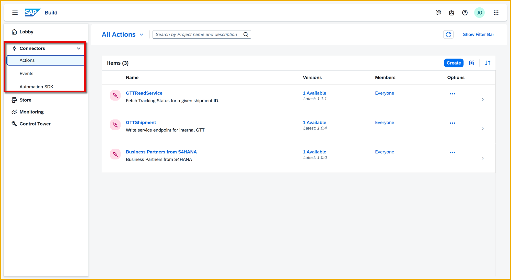

#### Store
The **Store** is a set of SAP Build templates -- mostly SAP Build Process Automation processes with the rest actions. The vast majority are free to use.

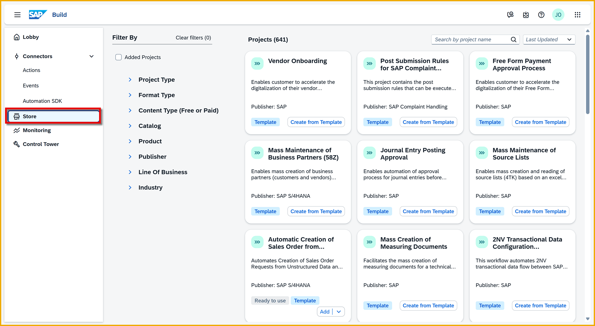

#### Monitoring
**Monitoring** lets you keep an eye on SAP Build Process Automation processes and automations -- instances that were triggered, who triggered them, their status, the data flowing through them, and more. You can also see events that were received by SAP Build Process Automation for triggering processes.

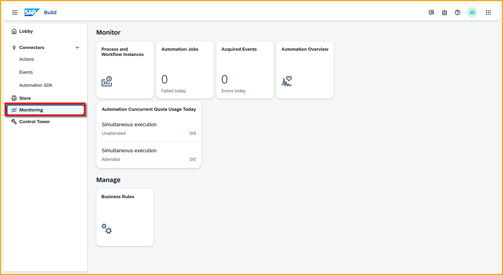

#### Control Tower
The **Control Tower** is a large set of tools for the administrator to set up SAP Build.

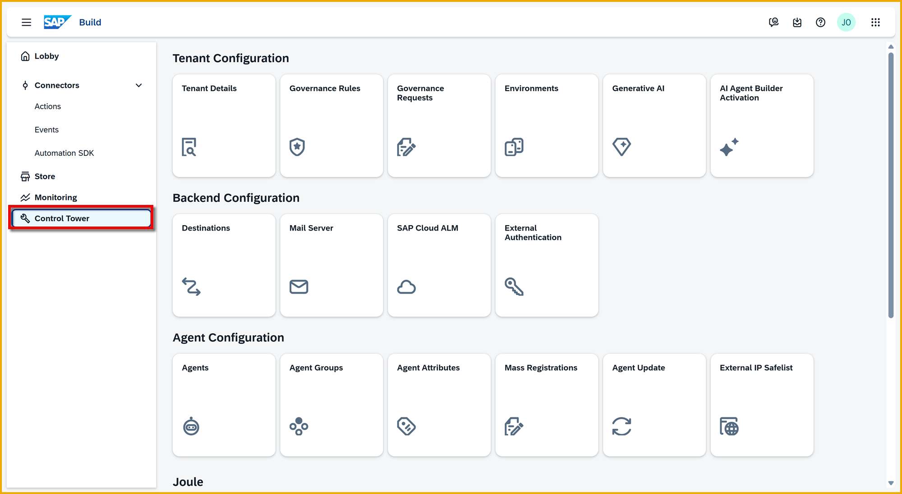

For example, the administrator can:

- Create separate environments for different LOBs

- Set up a mail server for sending emails from processes

- Enable Generative AI capabilities

- Determine which destinations can be used for calling backend services

This is just a short list of the capabilities. For more information, see [Use Control Tower](https://help.sap.com/docs/build/sap-build-core/managing-control-tower).


### Explore what you can build

Go back to the lobby, and click **Create**. 


You can now explore what types of projects you can build (and the tools for building them):

- **Application** (SAP Build Apps and SAP Build Code)

- **Automated Process** (SAP Build Process Automation)

- **Joule Agent and Skill** (Joule Studio)

- **Business Site** (SAP Build Work Zone)

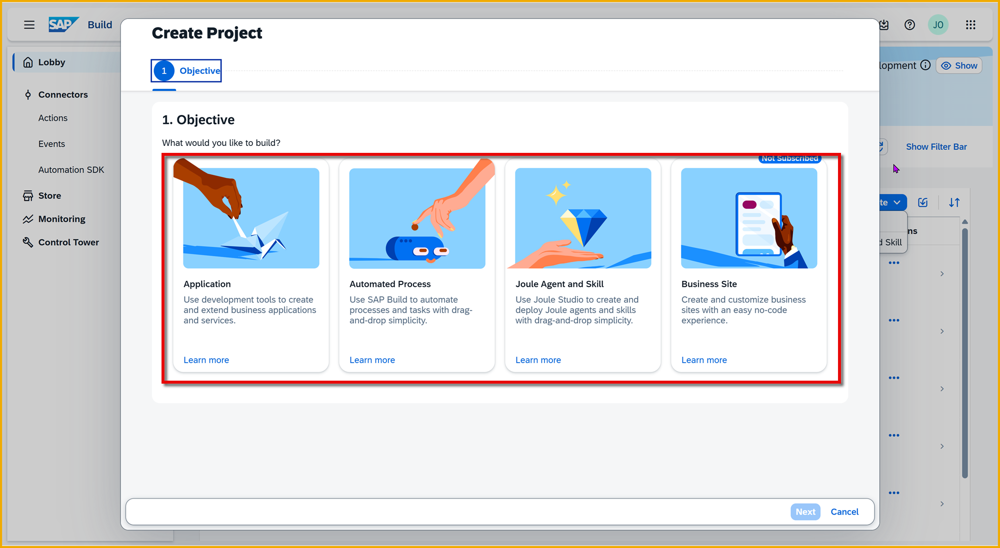

Many of the options might say **Not Subscribed**, meaning that on this SAP BTP instance this capability/service has not been installed, or you do not have permission to create such a project.


### Explore actions and APIs for this project

In this project you will enable users to interact with the Global Track and Trace (GTT) app via Joule.

To do this, you will need 2 APIs, one GET and one POST, to call the backend. To expose APIs to Joule Studio (and to other SAP Build tools), we created two actions. Let's explore the actions.

In the SAP Build Lobby, open **Connectors > Actions**.

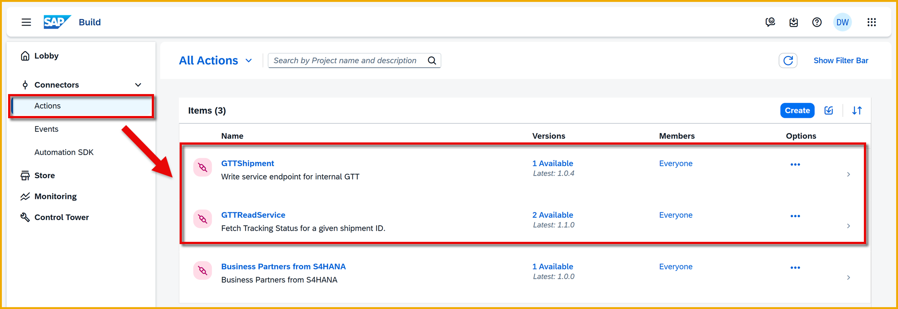

Open the action project **GTTReadService**, which will let us read shipments from GTT.

>An action project lets you take a complex API call and only expose the input and output parameters that are meaningful to your developers, and also set all types of parameters. This makes it easy for developers who need to incorporate these APIs into their projects.

Let's test the read action for the case where we want to track a shipment.

1. Select the **Test** tab.

2. Select the destination **gttGetService**.

3. In the field **trackingId eq** enter the following:

    ```Text
    trackingId eq '91001DBW'
    ```

4. Click the **Test** button.

    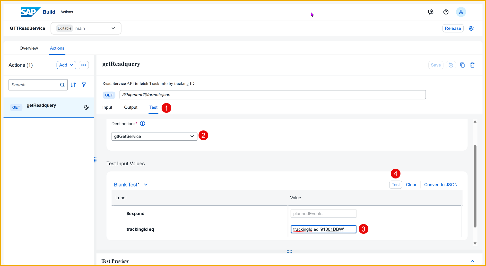

    You will now see a response from the backend with information about the shipment.

    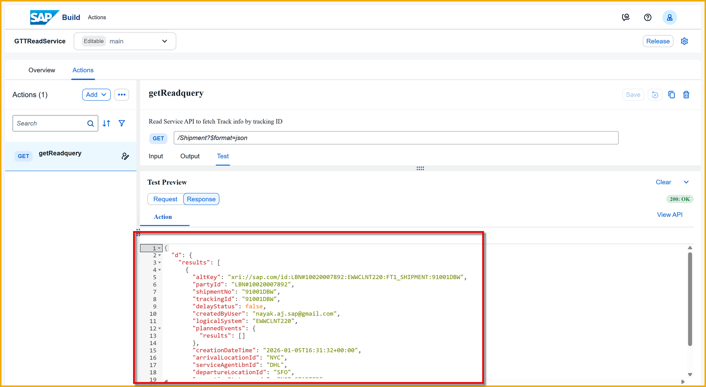


