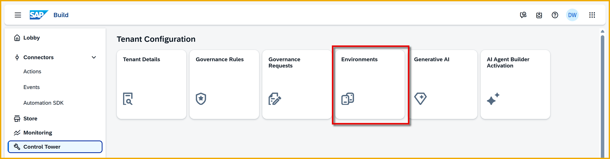
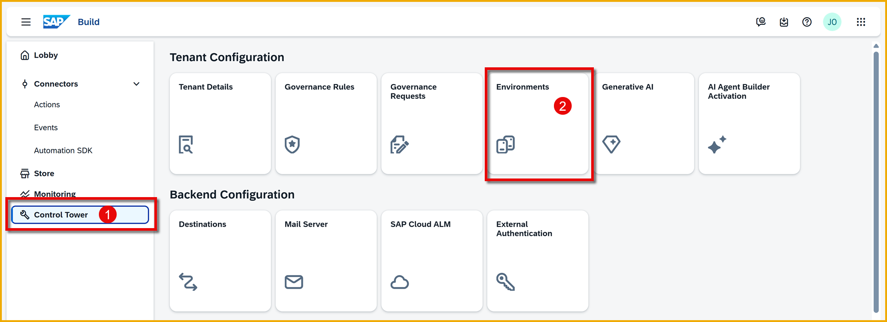
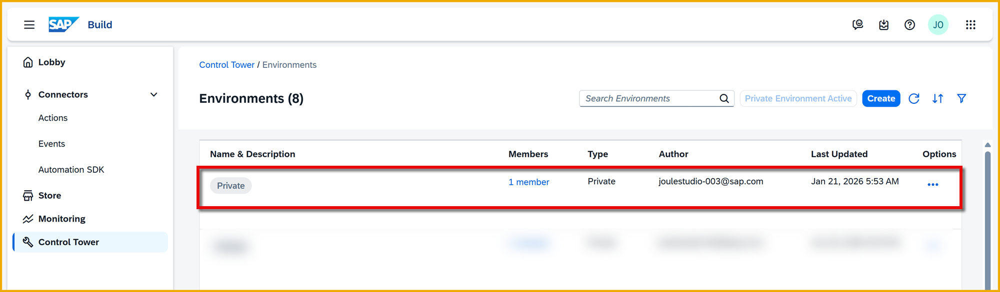
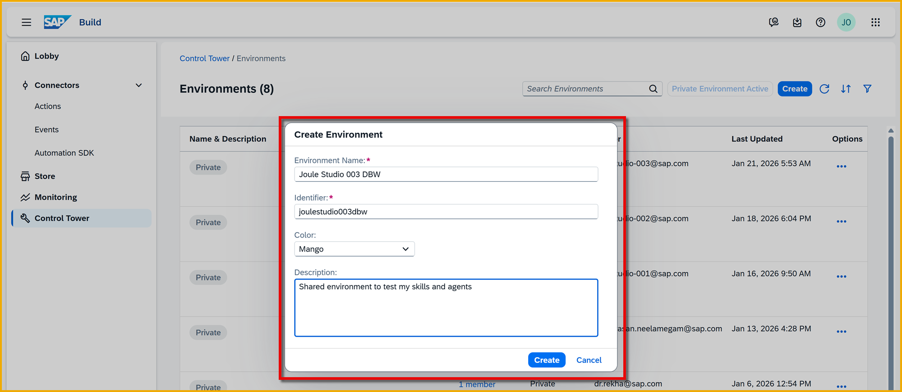
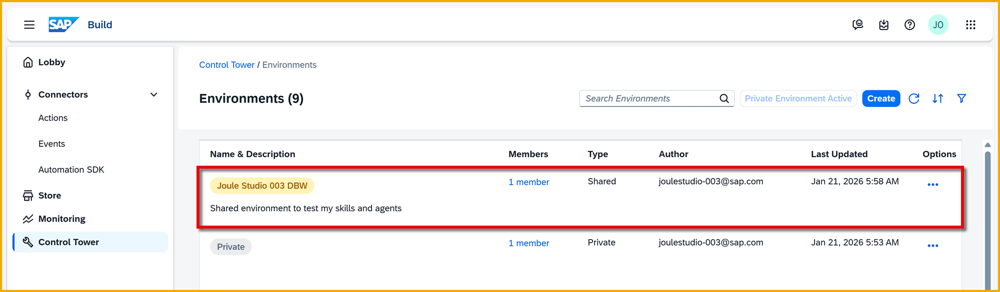

  
# 2- Create Environments for Testing
<!-- description --> Create SAP Build environments, which let you set aside different deployment areas for different lines of business, as well as private environments for individual testing. 
  
## You will learn
- How to create a private environment
- How to create a shared environment

## Prerequisites
- You have completed the previous tutorial in the Joule Studio CodeJam Mission, [Open and Explore the SAP Build Lobby](joule-studio-codejam-1-build-lobby).

## Intro
Joule studio has different types of environments to guide the development of your projects:

- **Private Environment:** Each developer can set up a private environment, which is designed to provide a "sandbox" or safe, isolated space for experimenting with your Joule Studio projects. It is used to run the current project without being influenced by other deployed projects. The key advantages are:

    - Safely experiment with new agent logic, skills, and actions. 

    - Test conversations **during design time (before deployment)**.

    - Test projects without needing to create new releases or deployments.

- **Shared Environment:** Allows different lines of business to deploy their projects to separate areas, each with specific permissions and different destinations and other settings.

- **Production Environment:** Agents and skills in the production environment are run in the central Joule instance along with all other built-in or custom skills and agents.

So the flow of development would be something like this:

1. You create a private environment.

2. You create 2 shared environments for any line of business: one for testing, and one for production.

3. You set the environment designated for production to expose to production any Joule Studio artifacts deployed to that environment (there is a toggle in each environment to do this).

4. You develop a Joule Studio project and test it inside your private environment.

5. You deploy it to your test shared environment for the LOB and test it there.

6. When ready, you deploy it to the production environment, which will automatically expose it to the production Joule.

### Create a private environment
First, you will create an environment for yourself.

>A private environment is for your user to test your Joule project in an isolated sandbox, unaffected by any other projects of yours or anybody else.

1.  In the SAP Build Lobby, click on the **Control Tower** tile.

2.  In the Control Tower, click on the **Environments** tile.

    

3.  Click the **Activate Private Environment** button.

    

    You will see a new environment labeled **Private** in the list of environments.

    

### Create a shared environment
Though you will not need a shared environment until we deploy the project toward the end of the CodeJam, you will create the environment now.

>A shared environment is a place to deploy your projects for your LOB that has its own settings and permissions. 
>
>- A shared test environment is a place for you to test your projects away from other projects of other LOBs, though with other projects from your LOB. 
>
>- A production shared environment is a place for you to deploy your LOB projects that should be placed into production. Though all projects in all production shared environments will go into the production Joule, only people given permission to your production shared environment will be able to make use of your projects.

1. In the same **environments** screen, click **Create**.

    

2. In the **Create Environment** form, fill in the following:

    | Field | Value |
    |-------|-------|
    | Environment Name | `Joule Studio XXX` replacing `XXX` with your user number and initials |
    | Color | Whatever color you like 😸 |
    | Description | `Shared environment to test my skills and agents` |

    

3. Click **Create**.

    You will see a new environment labeled **Joule Studio XXX XXX** in the list of environments, this time not gray but with the color you assigned to it.

    
