  
# 3 - Create Skill to Track Shipments
<!-- description --> Create a skill to enable the user to track a shipment, where the user specifies a shipment ID and the skill returns information on that shipment.
 
## You will learn
- How to create a Joule skill
- How to test a Joule skill inside the project (design time)

## Prerequisites
- You have completed the previous tutorial in the Joule Studio CodeJam Mission, [Create Environments for Testing](joule-studio-codejam-2-private-environment).


## Intro
**Joule skills** are modular components designed to execute **atomic, predefined operations** within a business context.

Each skill performs a single task — such as retrieving data, triggering transactions, or querying systems — based on structured inputs and deterministic logic. Their purpose is to streamline repetitive, rule-based activities by providing a **fast, reliable, and reusable automation mechanism**.


&nbsp;

Functioning within clearly defined parameters, Joule skills are ideal for **low-complexity, high-frequency operations** where consistency and precision are critical.

They are often tightly integrated with **SAP and third-party APIs** via **SAP Build actions**, enabling seamless execution of system-level commands.

While they can understand conversation context, their logic is **non-adaptive** — flows are static, and outcomes are predictable.


&nbsp;

>💡 **Note:** Joule skills can be triggered:
> 
>    - through SAP Joule’s conversational interface
>    - through another Joule skill
>    - through a Joule agent

 

### Create Joule Studio project
A Joule Studio project contains a set of custom skills, agents, and data types deployed together.

1. From the SAP Build Lobby, click **Create**.

    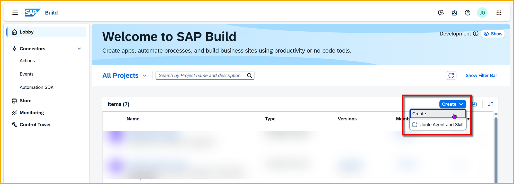

2. On the next screen, choose the **Joule Agent and Skill** tile, and click **Next**.
    
    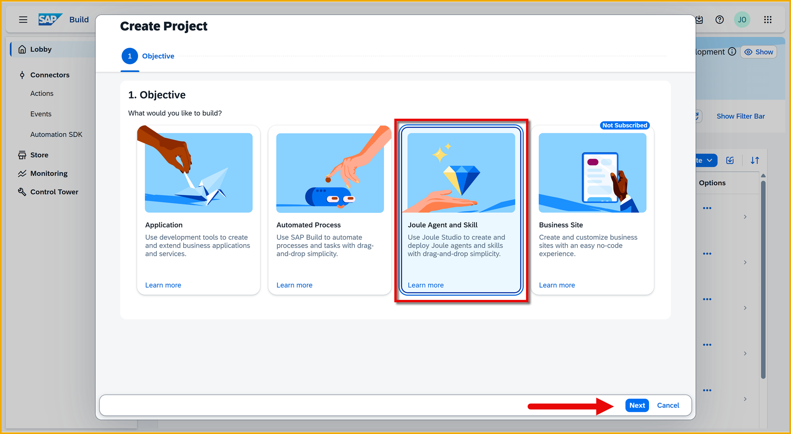

3. In the **Create Project** dialog, enter the following details.

    >**IMPORTANT:** In the project name, use your unique user number and your initials.
    >
    >So if your user is **003** and initials **DBW**, the name of the project should be **Logistics Agent 003 DBW**.

    | Field         | Value                                     |
    |---------------|-------------------------------------------|
    | **Name**        | `Logistics Agent <UserID> <INITIALS>`                  |
    | **Description** | `Joule skills for GTT shipment management.` |

    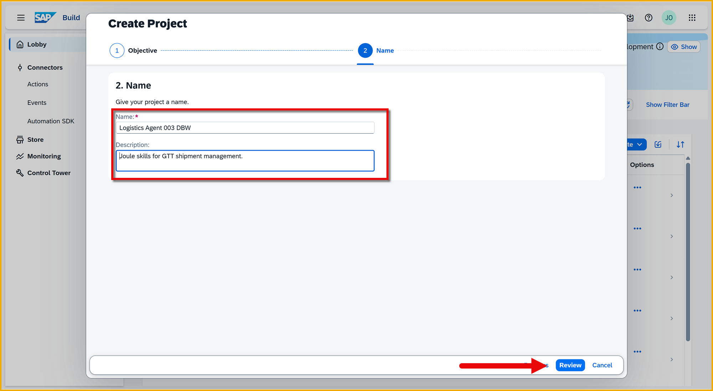

4.  After filling in the details, click **Review**, then click **Create**.

Your project will open to the **Overview** tab, where you can start adding skills and agents.

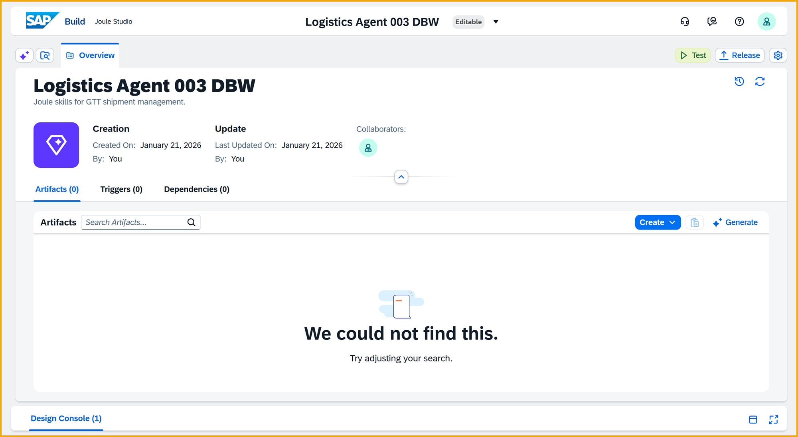


### Create empty skill
You will create a new artifact to the project, a skill.

1. Click **Create**, and then choose **Joule Skill**.

    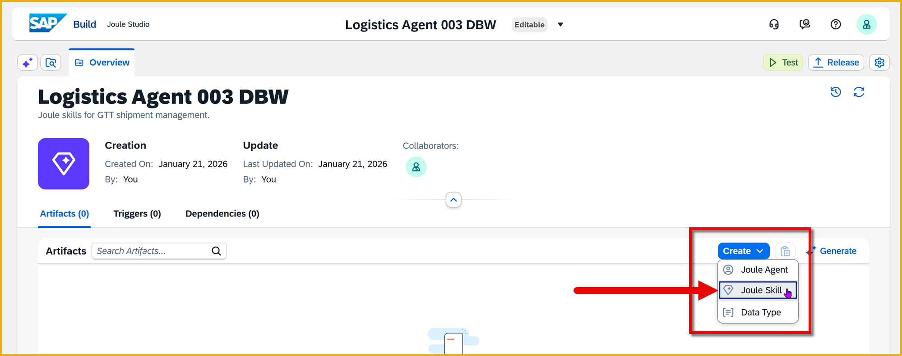

2. In the **Create Joule Skill** dialog, enter the following details. 

    | Field         | Value                                     |
    |---------------|-------------------------------------------|
    | **Name**        | `Track Shipment`                  |
    | **Description** | `A skill to track shipments in the GTT System.` |

    Click **Create**.

    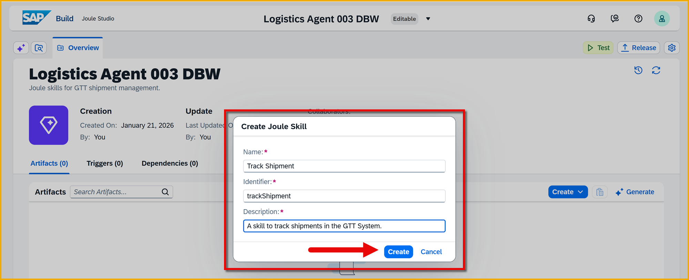

    >The identifier is autopopulated based on the skill name.

Once you create a new skill, the skill builder canvas opens for you to design the skill.

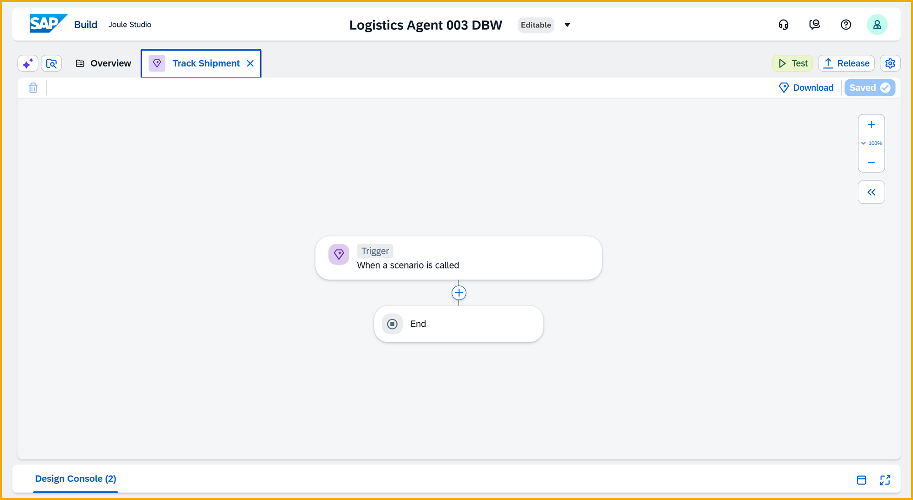

>If you have any experience with SAP Build Process Automation, you will be familiar with the layout, which is used for designing processes.
>
>To the flow, you click the plus icon and add steps, then configure each step.


### Add input parameters
You can define parameters that are required by the skill. 

Joule will try to understand the values from the context. If any required input parameters are missing Joule will automatically prompt the user to enter them (or sometimes derive them without input). In the parameter description, you can define rules for the parameter, such as format.

1. Click open the right-side panel, which is used to define the skill settings and parameters.

    >You can also open the panel by clicking the **Trigger** step.

    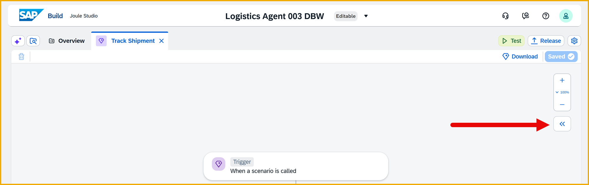

2. Click the **Parameters** tab.

    

3. Next to **Skill Inputs**, click **Configure**.

    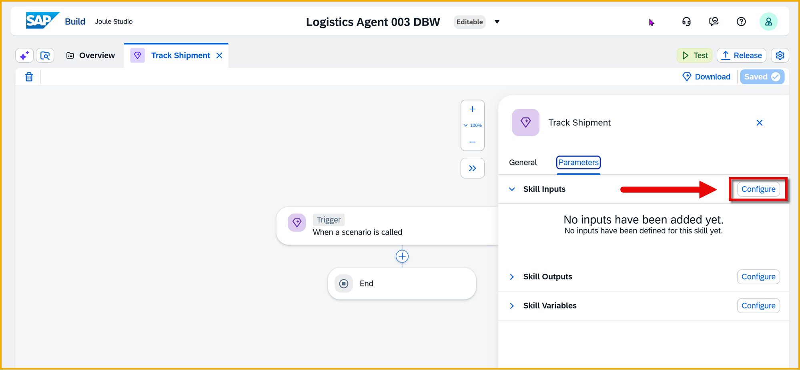

    >**Skill Inputs:** Data derived from the conversation.

    >**Skill Outputs:** Data sent into the conversation context.

    >**Skill Variables:** Temporary data stored during the skill execution, which can be set with a **Set Variable** step.

4. In the **Configure Skill Inputs** dialog, click **Add Input** and enter the following details:

    | **Name**       | **Identifier** (auto-populated) | **Description**         | **Required** |
    |----------------|----------------|--------------------------|:---------------:|
    | `trackingID`     | `trackingid` (autopopulated)     | `Tracking Number`              | ✅ |

    >The identifier is autopopulated based on the skill name.

    Click **Apply**.

    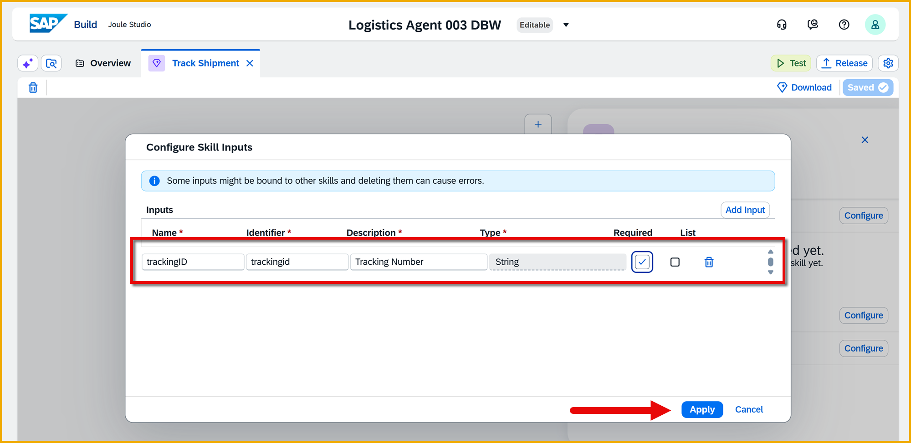

    You should now see the new input parameter in the side panel.

    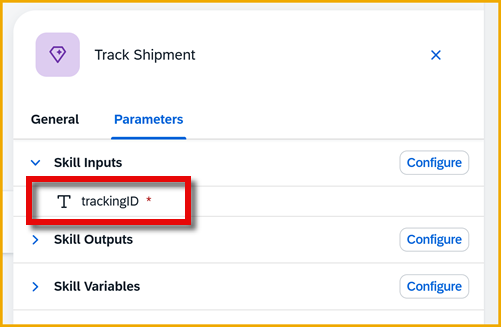

5. Click **Save** (upper right).


### Add action to skill
Actions let skills retrieve data from a backend. Here, we want to retrieve info about a particular shipment.

1. In the skill builder, click the **+** icon under the trigger step.

    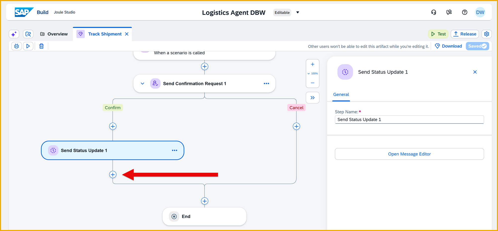

    Choose **Call Action**.

    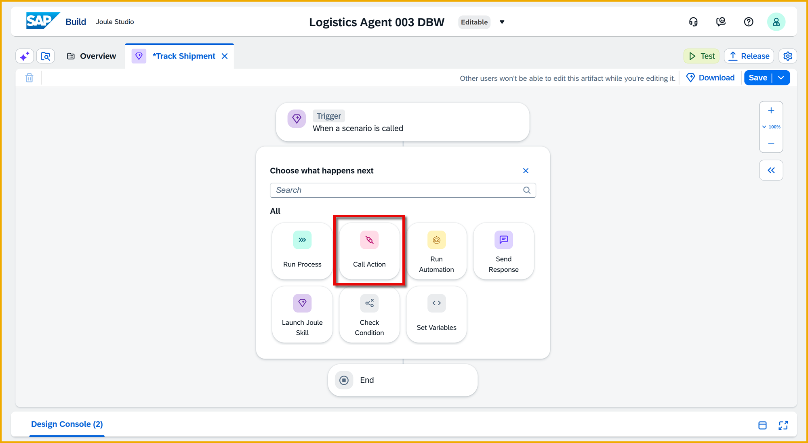

2. Click **Browse All Actions**.

    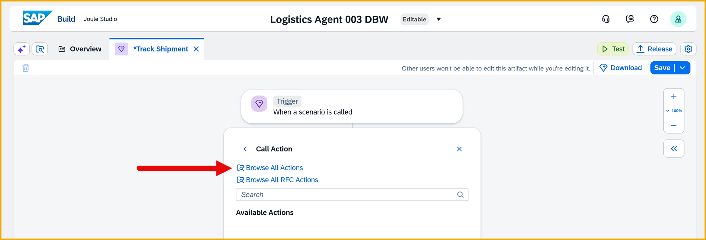

    Find the action **getReadquery**

    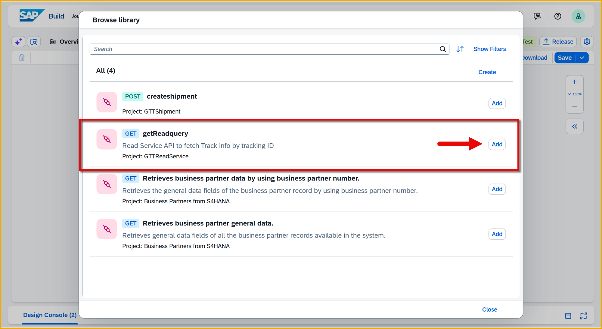

    >If there are a lot of actions, you can filter by **GTTReadService** (the name of the action project).

    Click **Add** to the right of the action.

    The action is added to the skill flow.

    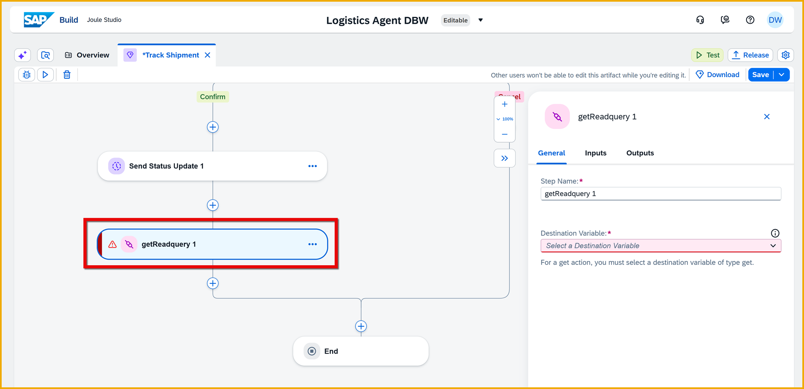

>By adding a skill, you automatically add to the project a dependency to the action project that contains the action.
>
>You can see this by opening up the project settings. Click the cog.
>
>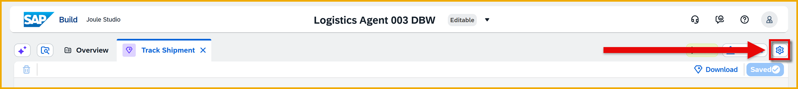
>
>Under **Dependencies**, you can see the action project you added.
>
>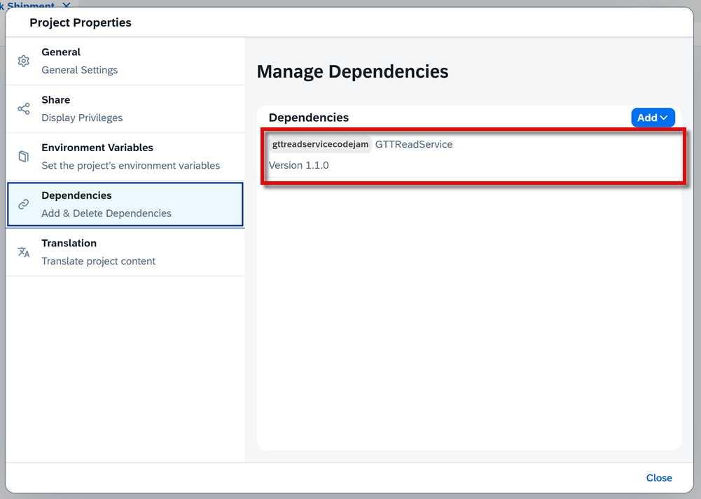


### Configure action
Actions define a specific API call. But each time you add the action you can provide different inputs and also specify different destinations so the call reaches different backends.

1. Make sure the action is selected.

2. In the first, **General** tab, click inside the **Destination Variable** field, and then click **Create Destination Variable**.

    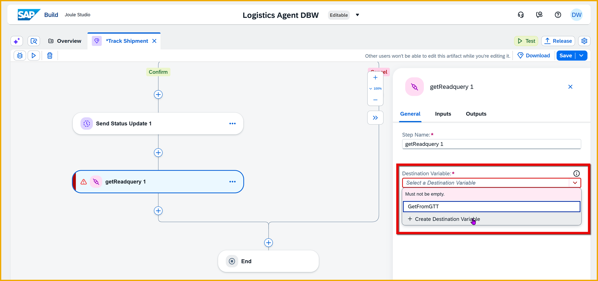


3. In the **Create Destination Variable** dialog, enter the following details. 

    | Field         | Value                                     |
    |---------------|-------------------------------------------|
    | **Identifier**        | `GetFromGTT`                  |
    | **Description** | `Destination to fetch data from the GTT System` |

    Click **Create**.

    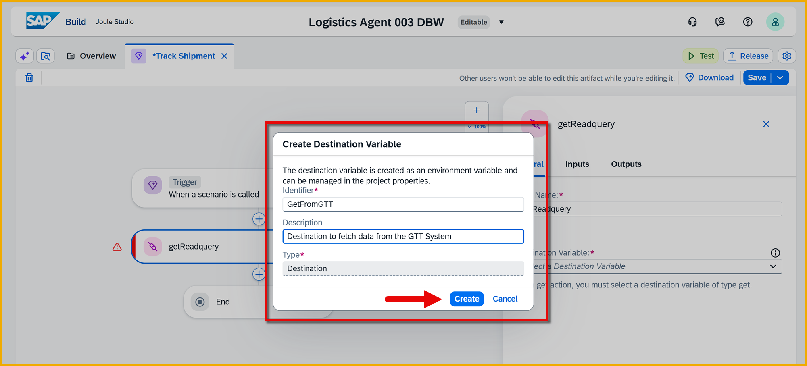

4. The variable is created but it likely will not be selected or even visible in the **Destination Variable** field.

    >**Important:** To see the destination, you may need to:
    >
    >1. Close the configuration panel.
    >
    >2. Click the action again, which will reopen the configuration panel, and now you will see the destination.
    >
    >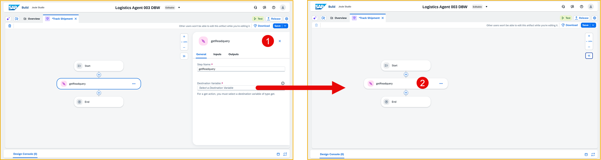
    >
    >You can also refresh the page and then navigate back to your skill and then action.

    Select the new **GetFromGTT** variable for the action.

    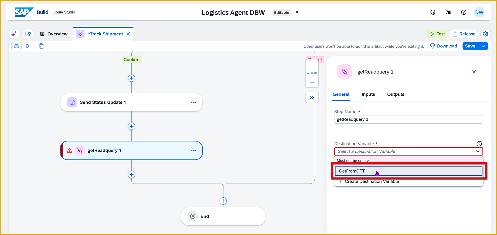

    The destination should then appear in the field.

    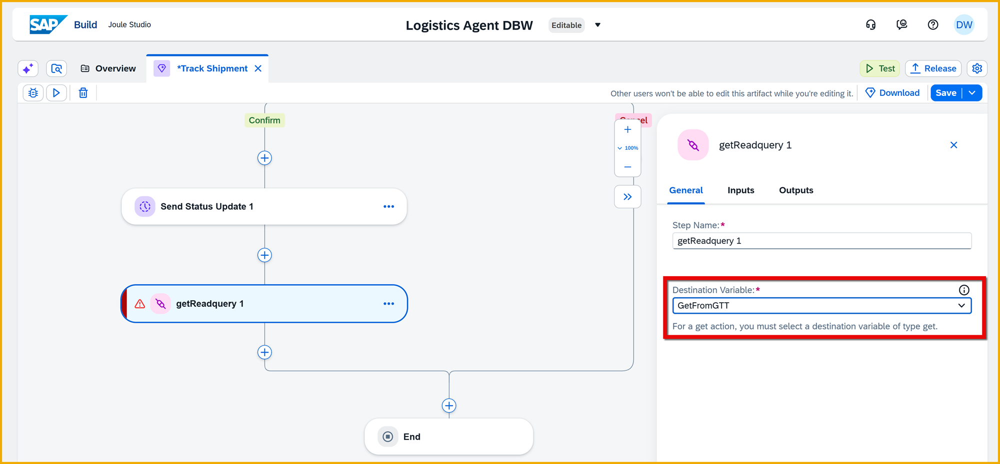

5. To specify the shipment to track, we will add some filter data to the action.

    With the action selected, select the **Input** tab on the right pane. 

    Click inside the **$filter** field, and select **Apply a Formula**. The formula editor opens.

    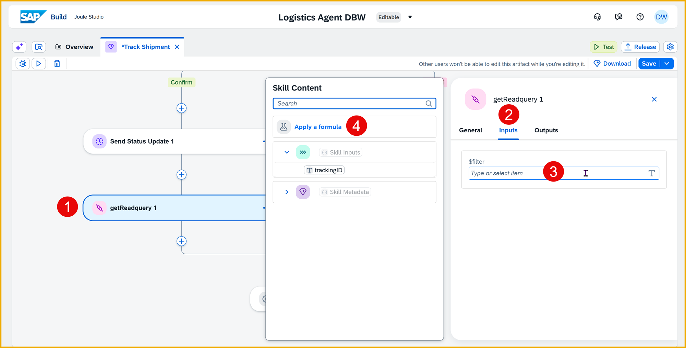

    Enter the following formula in the box:

    ```JavaScript
    ConcatenateStrings(["trackingId eq ", <Tracking ID>, ""], "'")
    ```

    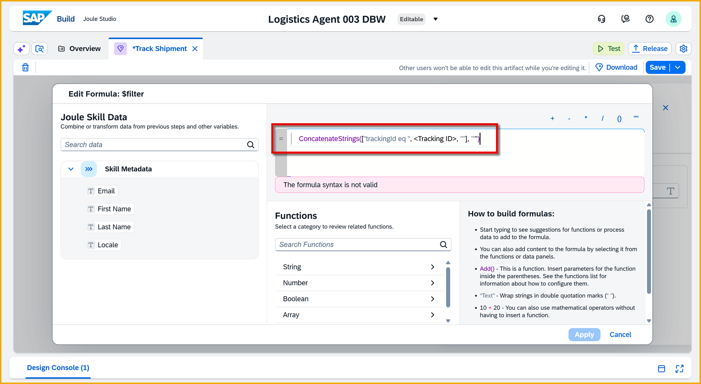

    The formula editor will show that the syntax is invalid.
    
    In the formula editor, you need to replace `<Tracking ID>` with a reference to the input paramter. Select `<Tracking ID>` and then double-click **Skill Inputs > trackingID** from the left side, so that the formula looks like this:

    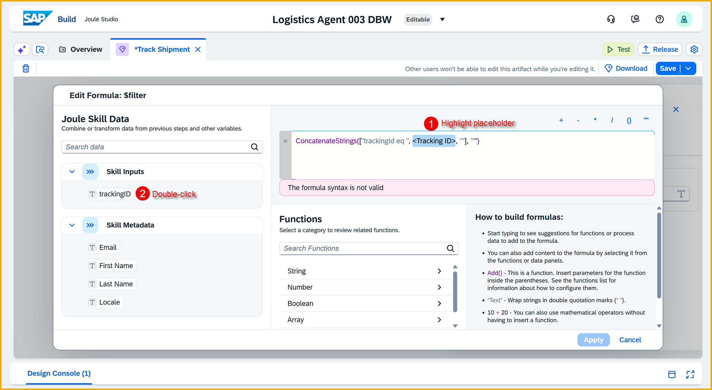

    Now the formula editor will show the syntax is valid (green).

    >This creates the same input value we used to test the action in the first tutorial, except now the shipment ID will be taken from the input parameter, which takes it from the conversation.

    Click **Apply**.

    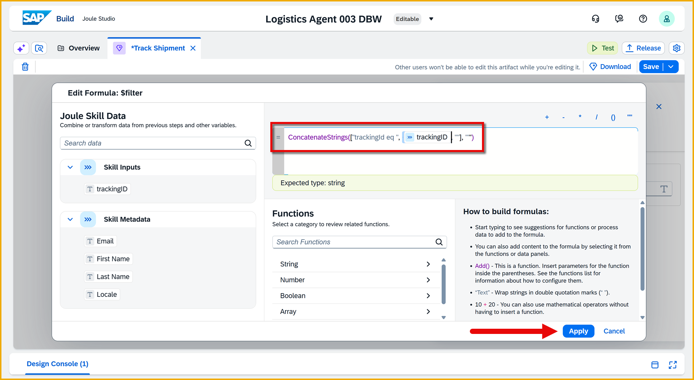


### Create output parameters
You need to create output parameters so that the skill returns data to Joule (or to an agent if it is inside an agent -- more on that later). Joule can then use this output parameter to determine the correct response to the user.


1. Click the **Trigger** step.

2. Click the **Parameters** tab, and the next to **Skill Outputs** click **Configure**.
  
    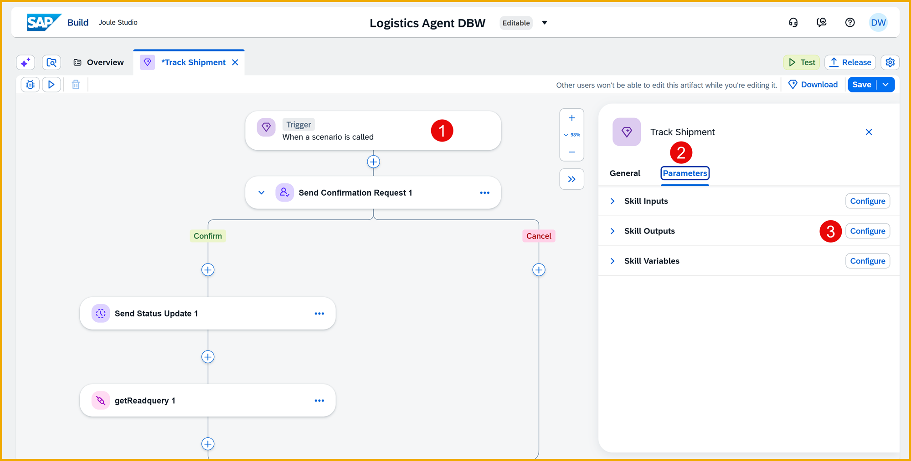

3. Click **Add Ouput** three times and add the following output parameters.

    | **Name**          | **Description**     | **Type** | **Required** | **List** |
    |--------------------|---------------------|-----------|---------------|-----------|
    | `gttstatus`        |  `Status`              | **String** | ⬜ Unchecked| ⬜ Unchecked|
    | `destinationcity`  | `Destination City`    | **String** | ⬜ Unchecked| ⬜ Unchecked|
    | `json`             |  `JSON`                | **Any**    | ⬜ Unchecked| ⬜ Unchecked|

    >The identifiers are autopopulated.

    Click **Apply**.

    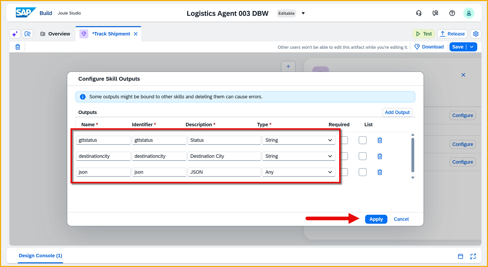

4. Click **Save** (upper right).


### Bind data to output parameters
You created the output parameters to send data back to Joule or the agent. Now we need to supply the data.

1. Click the **End** activity.

    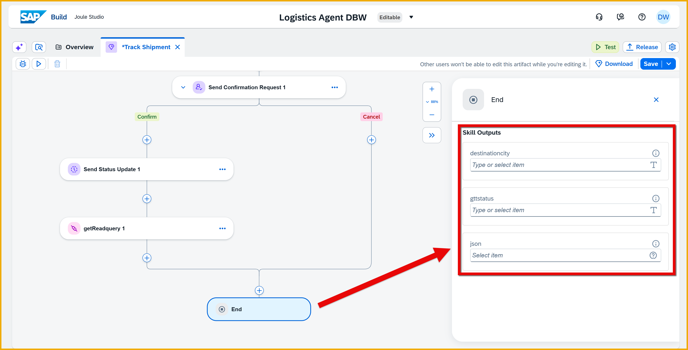

2. For each output parameter, bind the following by clicking inside the parameter field and selecting the corresponding mapping:

    | **Field Name**     | **Mapped Value**  |
    |--------------------|------------------|
    | **destinationcity**     | getReadquery > result > d > list - results > arrivalLocationId |
    | **gttstatus**      |  getReadquery > result > d > results > plannedEvents > list - results > eventStatus_code |
    | **json**             | getReadquery > result |

    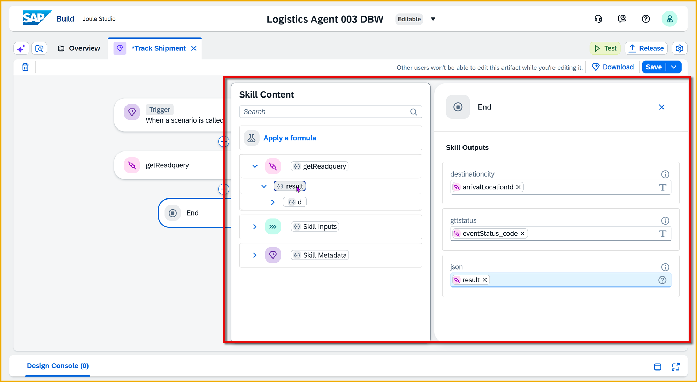

3. Click **Save** (upper right).


### Test the skill
A nice feature of Joule Studio is that you can test your project without having to release and deploy it, right from within the design-time project itself.

1. Click **Test** in the upper-right.

    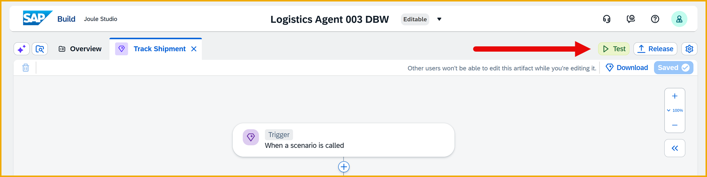

2. In the **Test Project** dialog, enter the following details.

    | Field         | Value                                     |
    |---------------|-------------------------------------------|
    | **Environment**        | Select the email address of your user                  |
    | **Environment variables > GetFromGTT** | Select **gttGetService** |

    Click **Continue**.

    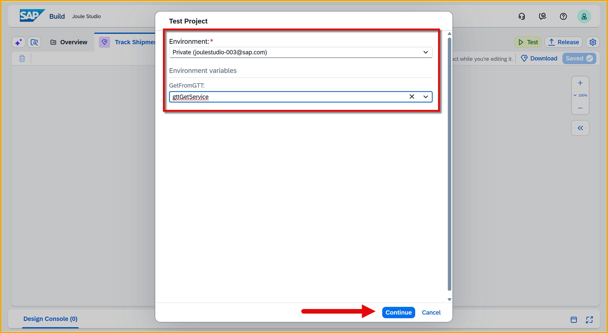

    A new browser tab opens with Joule. 

    >The first time you run the test, it might take a couple of minutes for the browser tab to open.

3. As a prompt, enter:

    ```Prompt
    I want to track the shipment 91001DBW.
    ```

    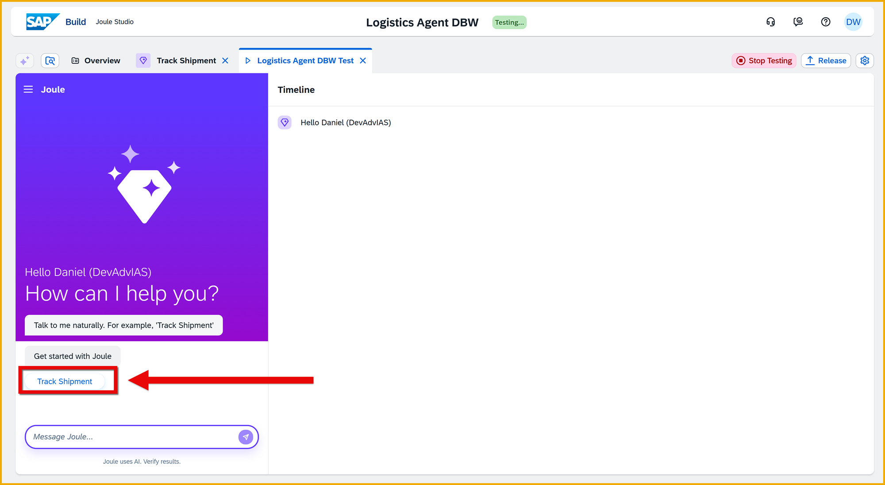

    Joule will output information from shipment **91001DBW**.

    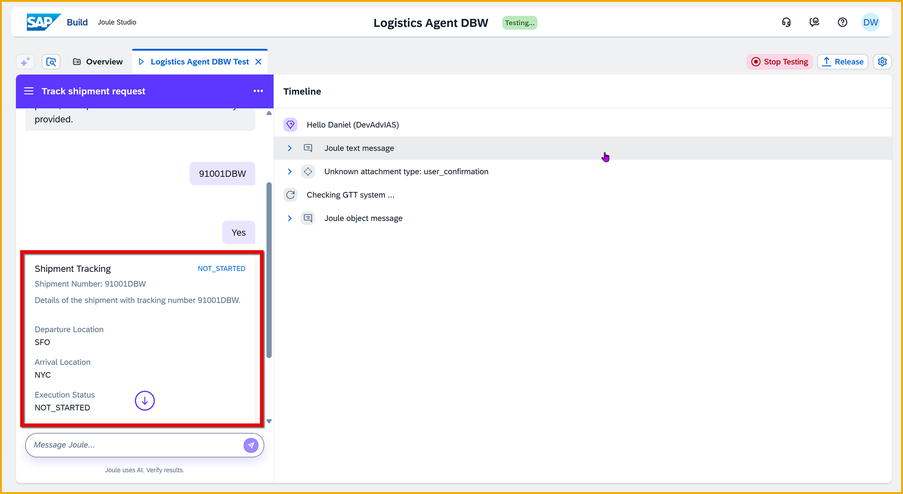

    The exact format varies, since the skill returns data back to Joule and specified that Joule design the output. If we wanted to control the output, we could have specified a **Send Response** step and designed the output more precisely.

4. Enter the prompt again.

    ```Prompt
    I want to track the shipment 91001DBW
    ```

    The response will likely be formatted differently.

    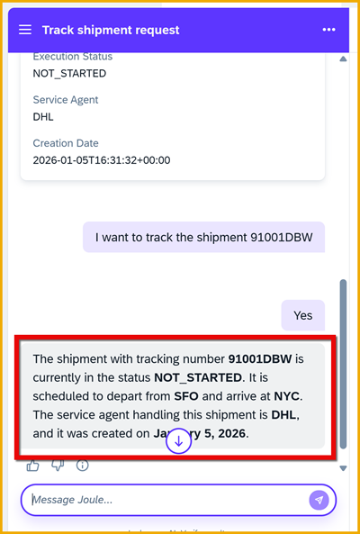

5. Notice that **Timeline** information on the right of the screen, which gives you information on how the response was derived.

    The response is connected to **Joule object message**. If you open this you will information about how Joule handled the prompt.
    
    For example, the first node **Joule selected a scenario to execute** shows which skill or agent was selected in response to the prompt.

    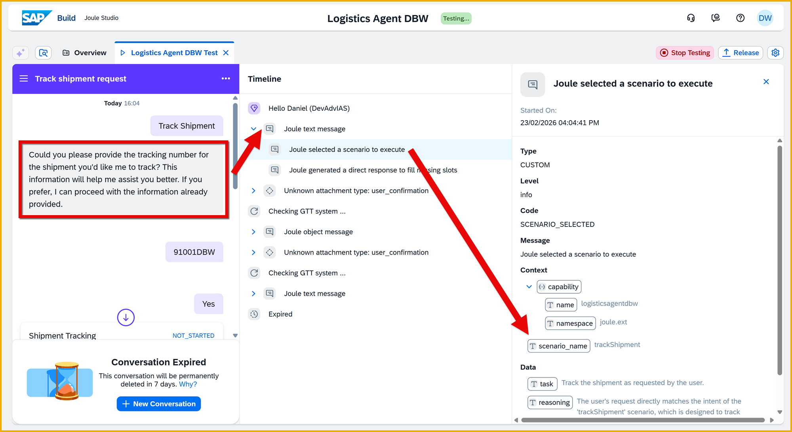

    **The scenario trackShipment is called with parameters** shows you which skill was triggered with what input parameters.

    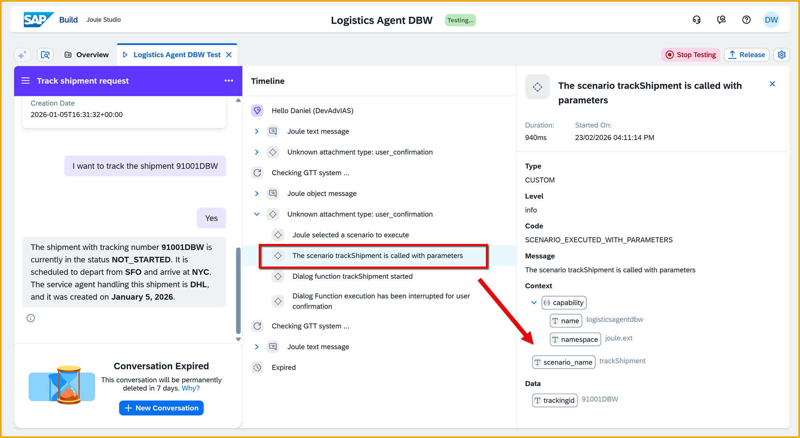

    And **Dialog function trackShipment finished** will show the actual data that was returned from the backend by the action.

    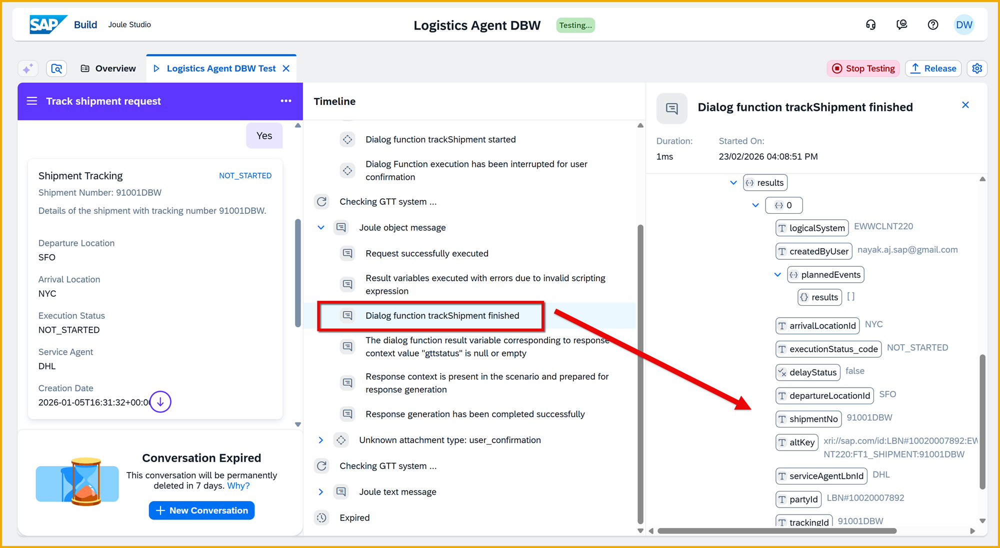
 
6. Once you are done testing, click **Stop Testing**.

    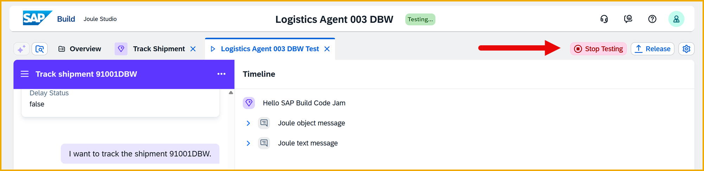


### Test the skill in your language
You can talk to Joule in your language, though the responses are still in English.

1. Start the testing again.

2. Enter a prompt in your language.

    For example, in Italian, type in:

    ```Prompt
    Voglio tracciare la spedizione 91001DBW
    ```

    You should get the same response as before.

    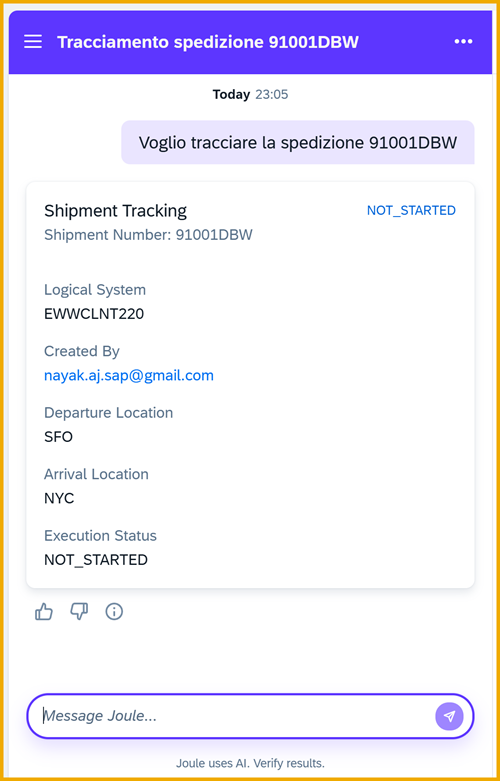


