  
# 4 - Create Skill to Show Delayed Shipments
<!-- description --> Create a skill to return all shipments that are delayed.
 
## You will learn
- How to create a Joule skill

## Prerequisites
- You have completed the previous tutorial in the Joule Studio CodeJam Mission, [Create Skill to Track Shipments](joule-studio-codejam-3-skill-track).


## Intro
In this skill, we will use the same API but provide different binding, specifically, a different filter so a list of all delayed shipments are returned.


### Create empty skill
1. In your project, select the **Overview** tab.

2. Click **Create**, and choose **Joule Skill**.

    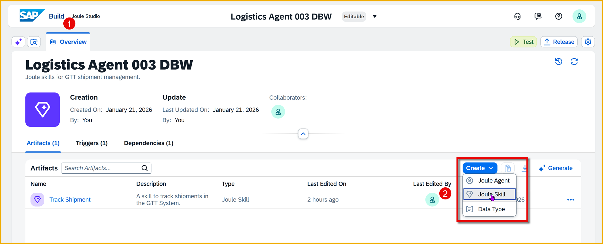

3. In the **Create Joule Skill** dialog, enter the following details:

    | Field         | Value                                     |
    |---------------|-------------------------------------------|
    | **Name**        | `Get Delayed Shipments`                  |
    | **Description** | `A skill to get all delayed shipments from the GTT system` |

    Click **Create**.

    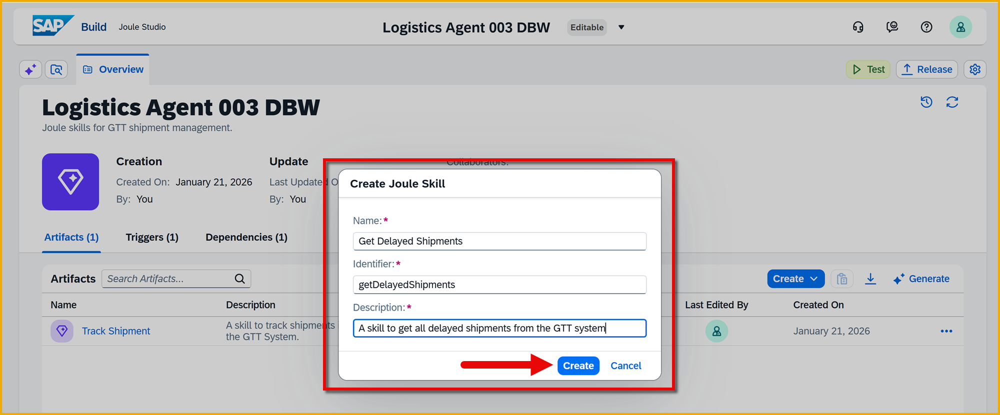

    Once the Joule skill is created, you are taken to the skill builder.


### Add action to skill
You will again add the action **getReadquery** to read data from the shipments app, but now you will change the filter to bring back only delayed shipments.

1. In the skill builder, click on the **+** button right under the trigger step.

    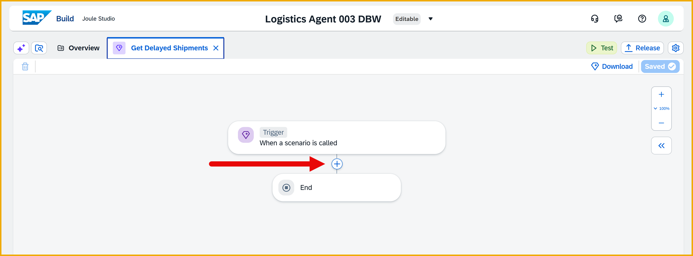

    Choose **Call Action**

    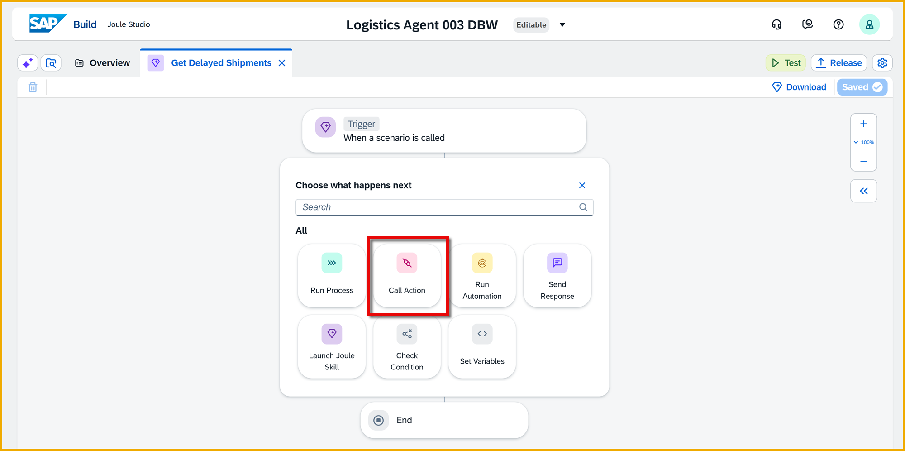

2. Since you previously used the **getReadquery** action, it now appears in the list of **Available Actions**.

    Click **getReadquery** to select it.

    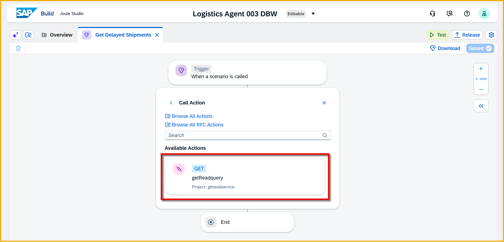

    The action is added to the skill flow.


### Configure action
Again, you need to map the action to a destination (that is, a specific backend), and also provided the filter for the API call.

1. Make sure the action is selected.

2. In the first, **General** tab, click inside the **Destination Variable** field. 

    This time we do not have to create a new destination variable since we can reuse the one we created in the previous skill, since we are using the same action with the same destination (but different configuration).
    
    Select **GetFromGTT**.

    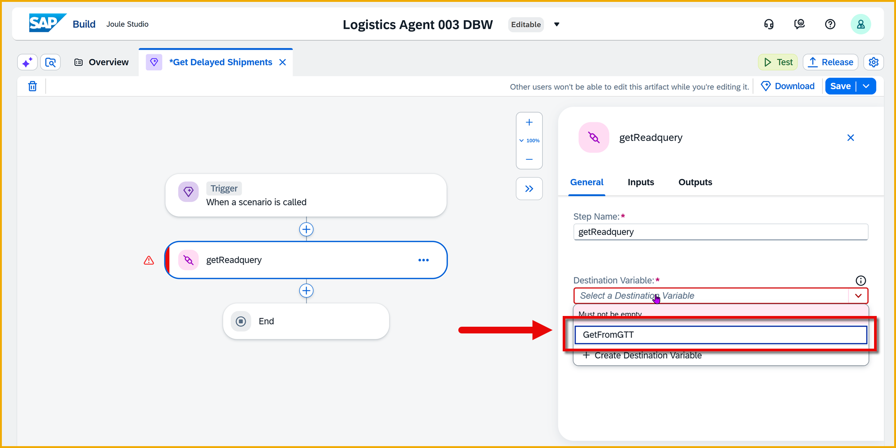

5. You will now specify a different filter, this time to retrieve the delayed shipments.

    With the action selected, select the **Input** tab on the right-side pane. 

    Click inside the **$filter** field, and select **Apply a Formula**. The formula editor opens.

    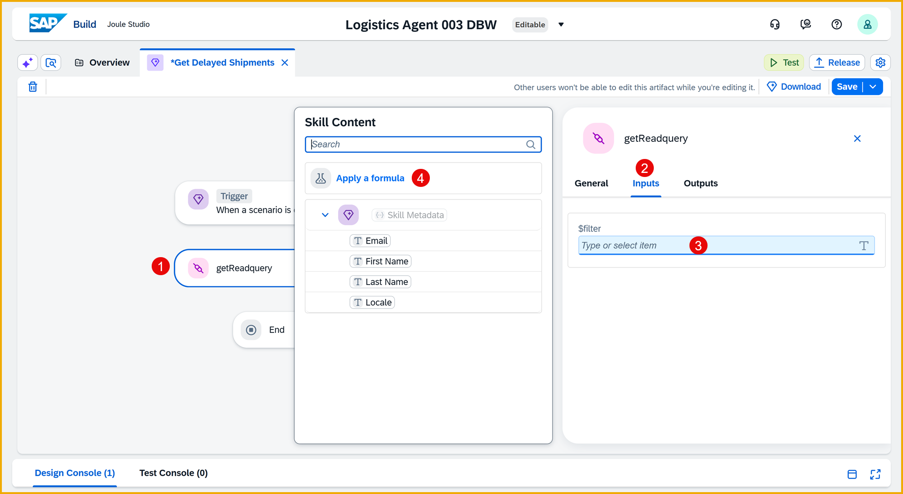

    Enter the following formula in the box:

    ```JavaScript
    ConcatenateStrings(["delayStatus eq ", true, ""], "")
    ```

    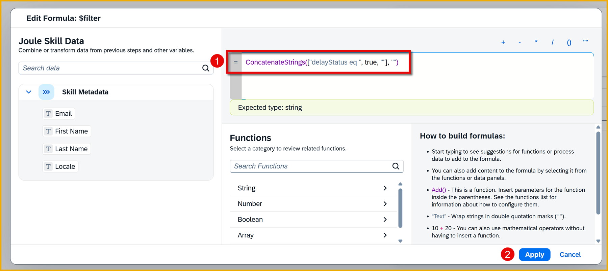

    Click **Apply**.


### Add output parameter
You need to create output parameters, so that the skill returns data to Joule (or to an agent), which can then use to determine the best response to the user.
    
1. Click the **Trigger** step.

2. Click the **Parameters** tab, and next to **Skill Outputs** click **Configure**.
  
    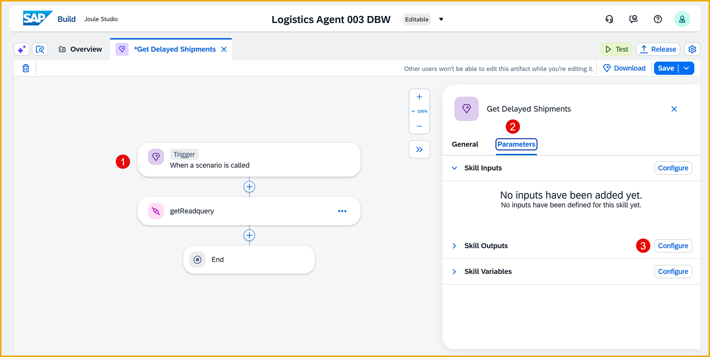

4. Click **Add Ouput** and add the following output parameter.

    | **Name**          |     **Description**     | **Type** | **Required** | **List** |
    |--------|------------|-----------|---------------|-----------|
    | `json`             |  `JSON`                | Any    | ✅ Checked| ✅ Checked |

    Click **Apply**.

    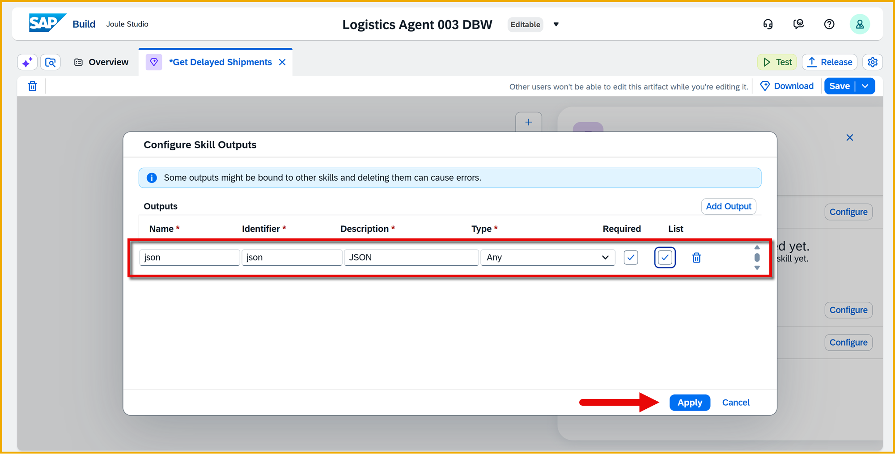

5. Click **Save** (upper right).
    
    


### Bind data to output parameters
You created the output parameters to send data back to Joule or the agent. Now you need to supply the data.

1. Click the **End** step.

    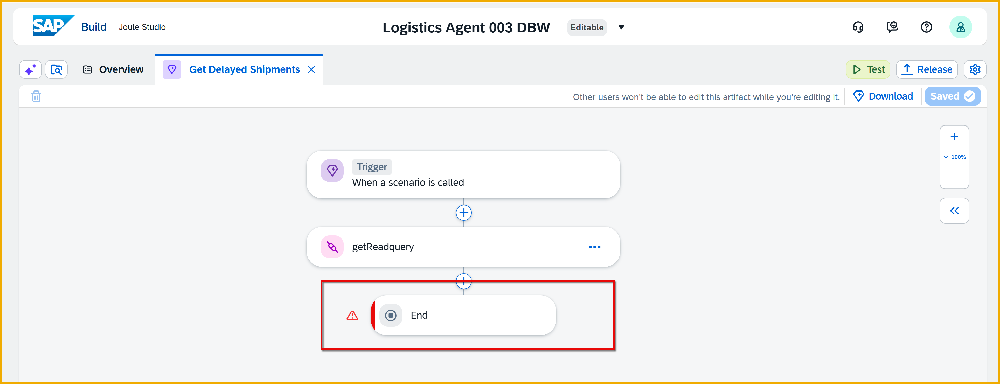

2. For **json** output parameter, map it to **getReadquery > result > d > results**.

    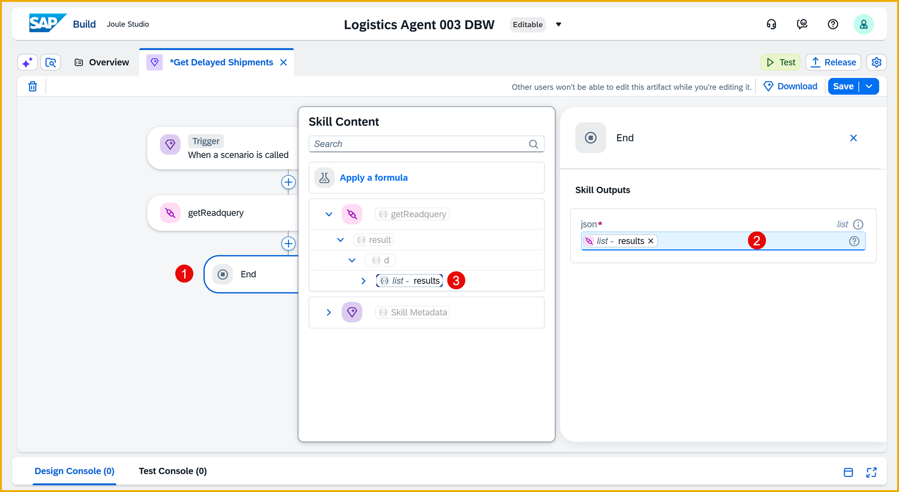

3. Click **Save** (upper-right).


### Test the skill
1. Click **Test** in the upper-right.

    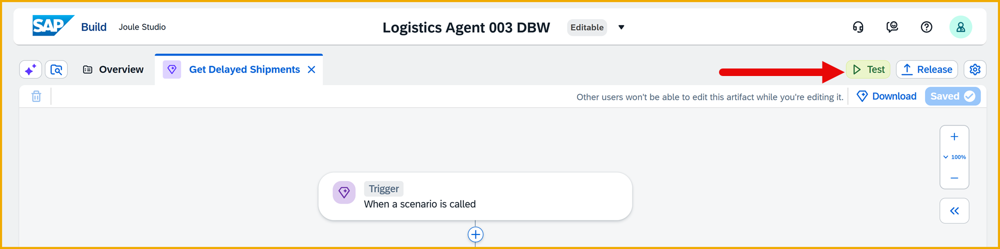

2. The **Test Project** dialog should already be populated with the correct details, since you already tested and specified values.

    | Field         | Value                                     |
    |---------------|-------------------------------------------|
    | **Environment**        | Select the email address of your user                  |
    | **Environment variables > GetFromGTT** | Select **gttGetService** |

    Click **Continue**.

    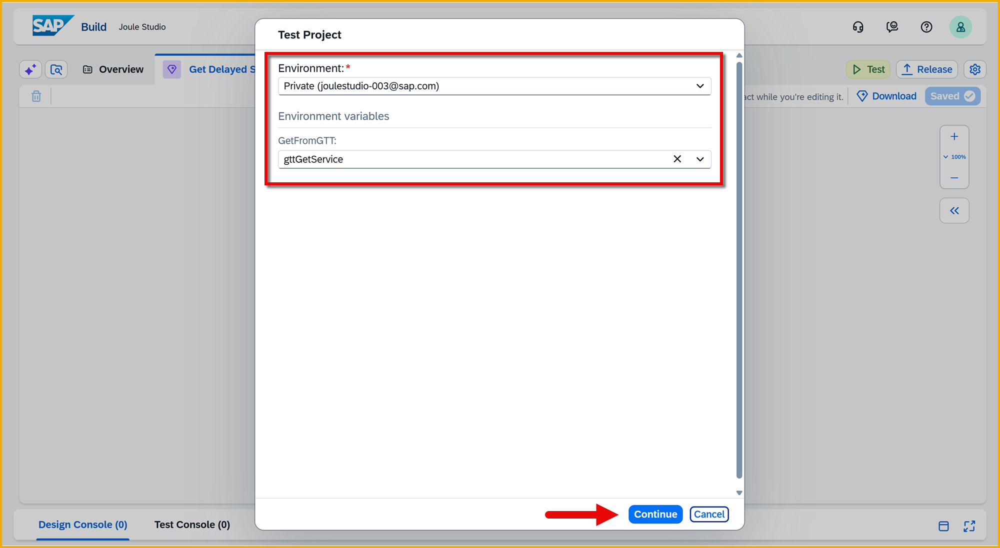

    A new browser tab opens with Joule.

3. As a prompt, enter the following:

    ```Prompt
    I would like to find all the delayed shipments
    ```

    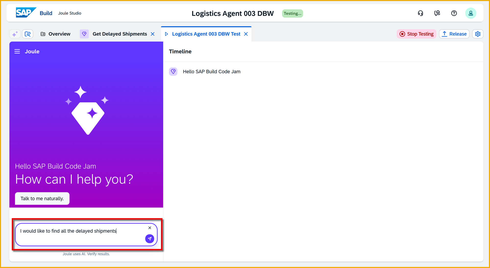

    Joule will output a list of delayed shipments.

    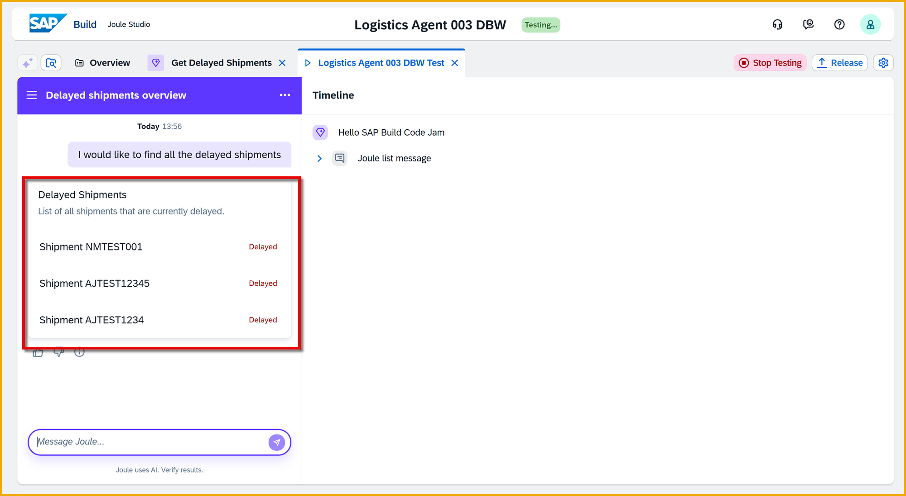

4. Once you are done testing, click **Stop Testing**.

    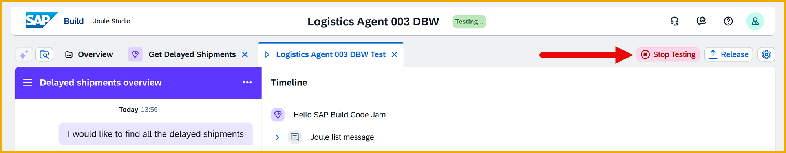
