  
# 5 - Create Skill to Create / Update Shipment
<!-- description --> Create a skill to enable the user to create a new shipment in the GTT system, or update an existing shipment.
 
## You will learn
- How to create a skill
- How to add a condition to a skill

## Prerequisites
- You have completed the previous tutorial in the Joule Studio CodeJam Mission, [Create Skill to Show Delayed Shipments](joule-studio-codejam-4-skill-delayed).


## Intro
The last skill creates or updates a shipment, and includes a few new things.

- You will use a different action and create a different destination variable

- You will use the **Check Condition** step to provide different messages based on whether you are adding or updating a shipment.

- You will define specific output using the **Send Response** step. 


### Create empty skill
1. In your project, select the **Overview** tab.

2. Click **Create**, and choose **Joule Skill**.

    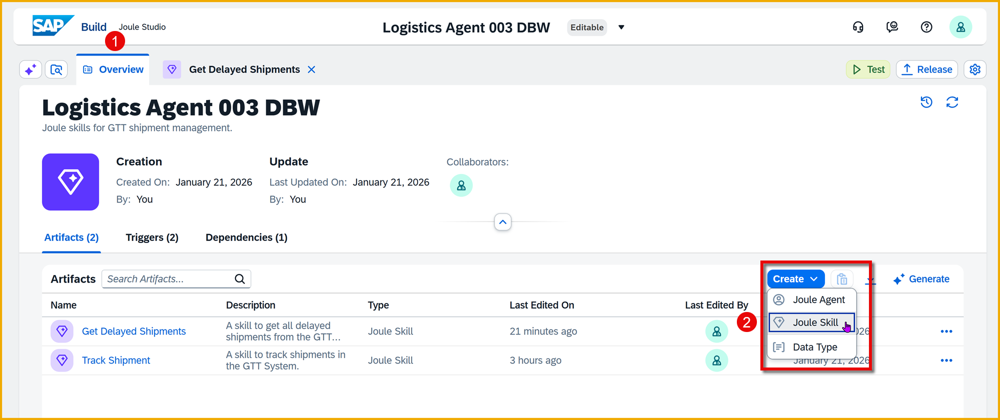

3. In the **Create Joule Skill** dialog, enter the following details:

    | Field         | Value                                     |
    |---------------|-------------------------------------------|
    | **Name**        | `Create Shipment`                  |
    | **Description** | `A skill to create shipment or update shipment with ONLY carrier name. During update only carrier is required.` |   

    Click **Create**.

    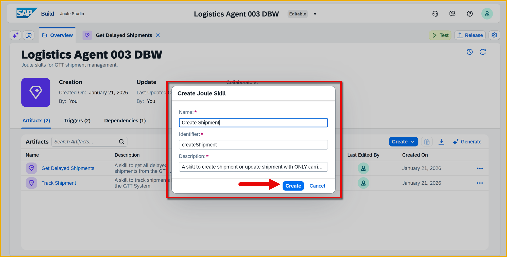

    Once the Joule skill is created, you are taken to the skill builder.


### Add input parameters
You need to tell Joule to ask the user for the details of the shipment to create, so you will create input parameters.

1. Click the **Trigger** step.

2. Click the **Parameters** tab, and next to **Skill Inputs** click **Configure**.

    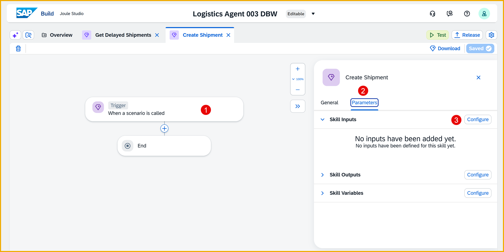

3. In the **Configure Skill Inputs** dialog, click **Add Input** five times and enter the following details:

    | **Name**       | **Identifier** | **Description**         | **Required** |
    |----------------|----------------|--------------------------|---------------|
    | ```shipmentid```     | shipmentid     | ```Shipment ID```              | ✅ Checked|
    | ```srclocation```    | srclocation    | ```Source Location```          | ✅ Checked|
    | ```destlocation```   | destlocation   | ```Destination Location```     | ✅ Checked|
    | ```datetime```       | datetime       | ```Pick up Date - Convert this into ISO 8601```             | ✅ Checked|
    | ```carrier```        | carrier        | ```Carrier Name```                | ⬜ Unchecked|

    >All identifiers are entered automatically and will be the same as the **Name** field.
    >
    >The parameter type is automatically a string.

    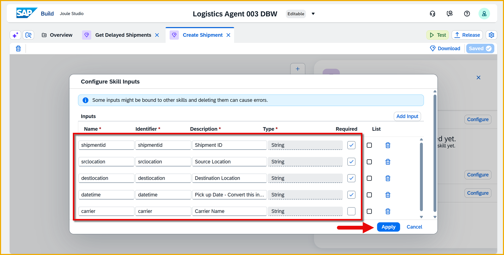

    Once all inputs are added, click **Apply**.


### Add output parameters
You need to create output an parameter so that the skill returns the shipment ID back to Joule or the agent.
    
1. Click the **Trigger** step.

2. Click the **Parameters** tab, and the next to **Skill Outputs** click **Configure**.
  
    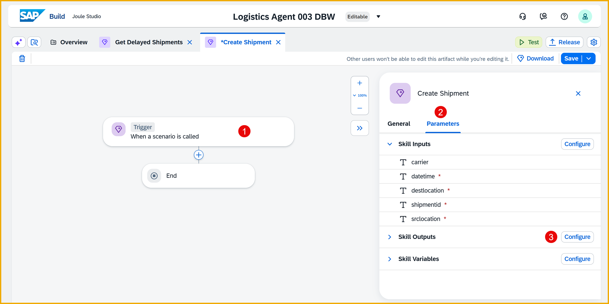

3. Click **Add Ouput** and add the following output parameter.

    | **Name**          |  **Description**     | **Type** | **Required** | **List** |
    |--------------------|-----------|---------------|-----------|-----------|
    | `Created Shipment Id`                        | `Created Shipment Id`                | String    | ✅ Checked| ⬜ Unchecked |

    Click **Apply**.

    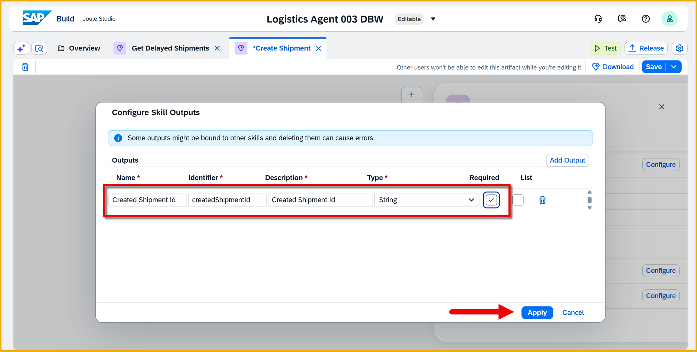

4. Click **Save** (upper right).


### Add action
Now you'll create the action that will call the API for adding or updating a shipment.

1. In the skill builder, click on the **+** button.

    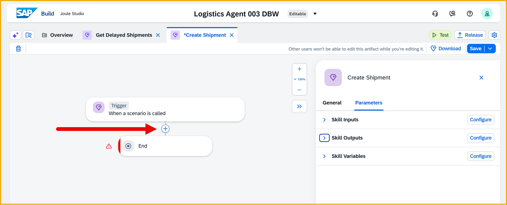

    Choose **Call Action**

    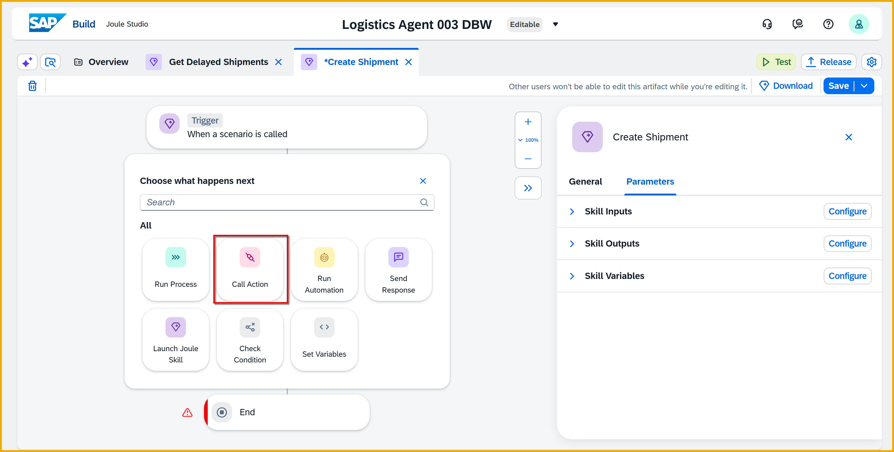

2. Click **Browse All Actions**, and find the action **createshipment**.

    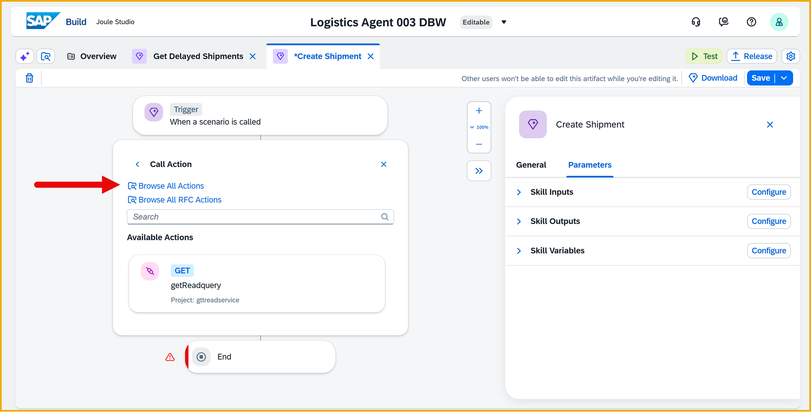

    >If there a lot of actions, you can filter by **GTTShipment** (the name of the action project).

    Click **Add** to the right of the action.

    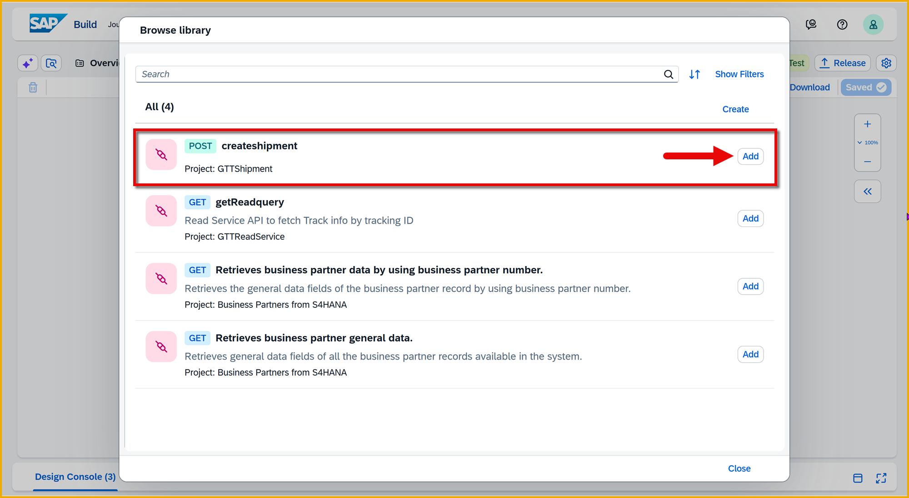

    The action is added to the skill flow.


### Add destination variable for action
In this action, we are creating a new shipment with a POST request, and using a different destination. So we need to create a new destination variable for this action.

1. Make sure the action is selected.

2. In the first, **General** tab, click inside the **Destination Variable** field, and then click **Create Destination Variable**.

    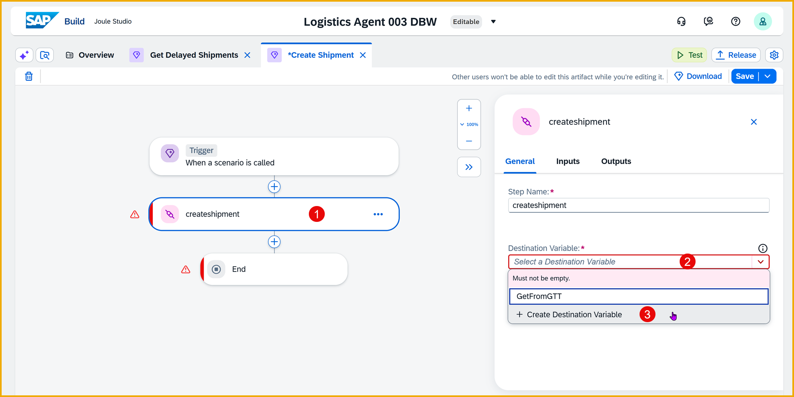

3. In the **Create Destination Variable** dialog, enter the following details. 

    | Field         | Value                                     |
    |---------------|-------------------------------------------|
    | **Identifier**        | `PostToGTT`                  |
    | **Description** | `Destination to create shipment in the GTT System` |

    Click **Create**.

    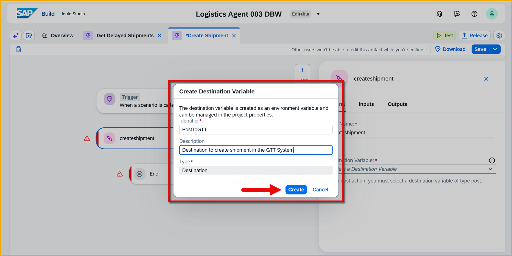

4. The variable is created but it likely will not be selected or even visible in the **Destination Variable** field.

    >**Important:** You may need to refresh the page, reopen the skill and reselect the action to see the new variable.

    Select the new **PostToGTT** variable for the action.

    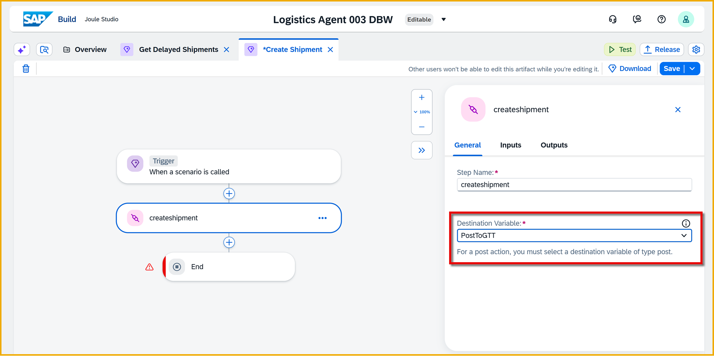


### Bind data to action inputs
You need to pass the input parameters into the input fields of the action.

1. Make sure the action is selected.

2. Select the **Inputs** tab.

    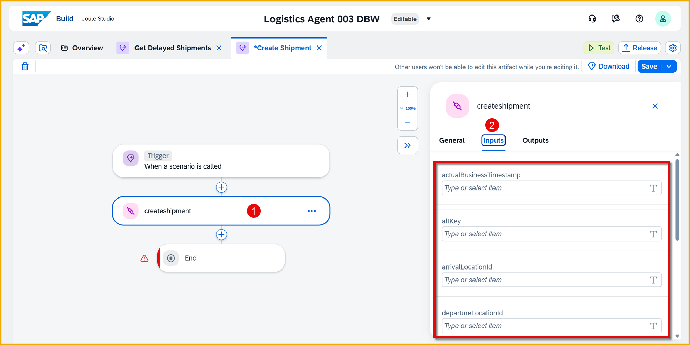

3. Bind the action inputs from the skill inputs.

    >As the skill inputs are of type **String** and some of the action inputs are of type **DateTime**, you will have to use a formula for those action inputs.

    | Field Name              | Mapped Path or Value                 |
    |--------------------------|-----------------------------|
    | **actualBusinessTimestamp**  | Skill Input > datetime    |  
    | **altKey**                   | Apply a Formula<div>&nbsp;</div>```ConcatenateStrings(["xri://sap.com/id:LBN#10020007892:EWWCLNT220:FT1_SHIPMENT:", <Skill Input-shipmentId>], "")```<div>&nbsp;</div>Replace the <> with the skill input binding for shipment ID. |
    | **arrivalLocationId**        | Skill Inputs > destlocation | 
    | **departureLocationId**      | Skill Inputs > srclocation  | 
    | **plannedArrivalDateTime**   | ```2026-03-31T16:30:00+02:00```  |  
    | **plannedDepartureDateTime** | Skill Input > datetime   |  
    | **serviceAgentLbnId**       | Skill Inputs > carrier      | 
    | **shipmentNo**               | Skill Inputs > shipmentid   | 

4. Click **Save** (upper right).


### Bind data to output parameters
You created the output parameters to send data back to Joule or the agent. Now we need to supply the data.

1. Click the **End** activity, and click in the **Created Shipment Id** field.

    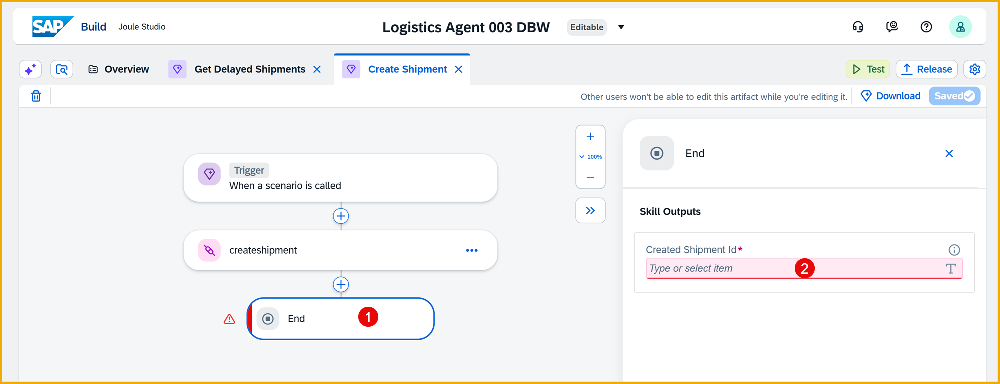

2. For **Created Shipment Id** output parameter, map it to **Skill Inputs > shipmentid**.

    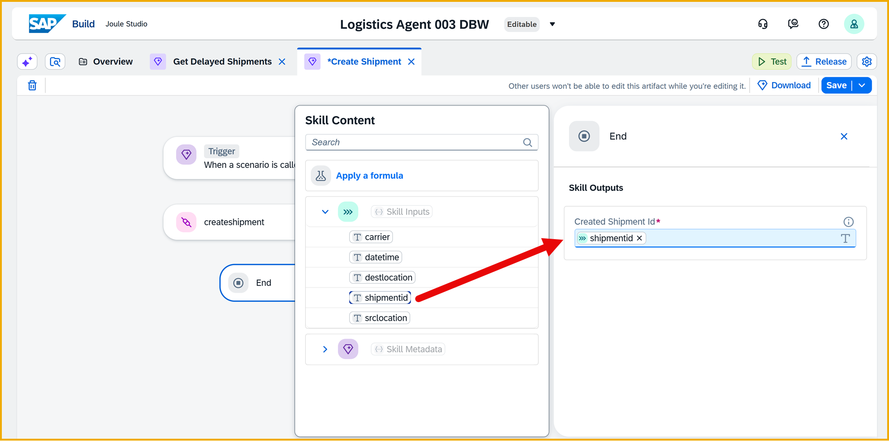

3. Click **Save** (upper-right).


### Create condition branch
You will now create a condition branch in the Skill builder to check if a carrier exists for the shipment (update) or you are creating a fresh shipment without a carrier. 


1. In the skill builder, click on the **+** button after the action.

    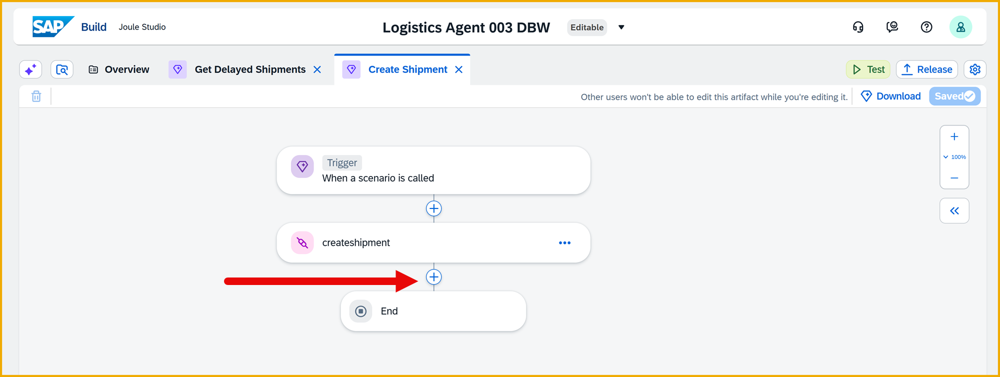

2. Choose **Check Condition**.

    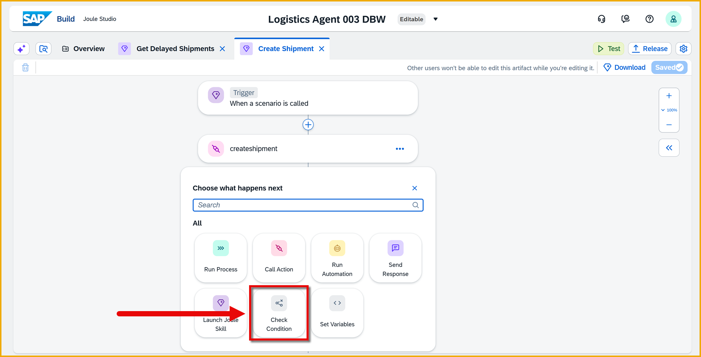

3. In the right-side panel for the condition activity, name the step **Is Carrier ID Empty?**.

    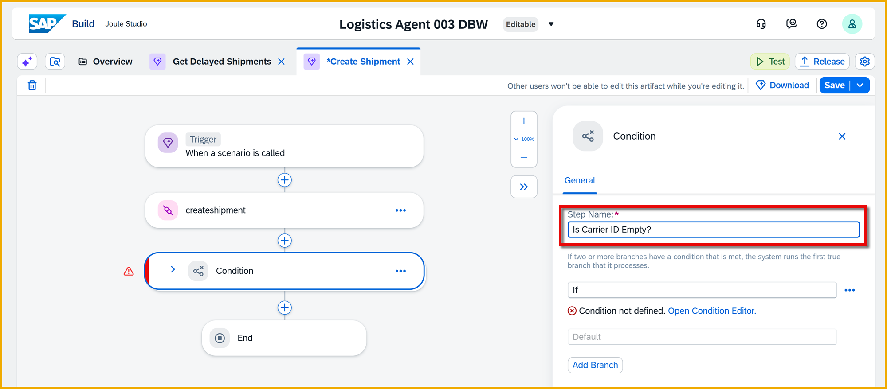

4. Click **Open Condition Editor**.

    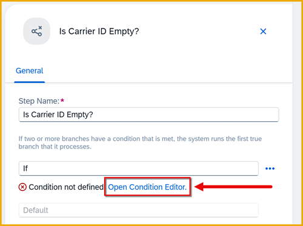

5. In the **Edit Branch Condition** dialog, do the following:

    - Click the first input field and select the skill input **carrier**.
    
    - Click the second field, a dropdown box of conditions, and select **is empty**.

    - Click **Apply**.

    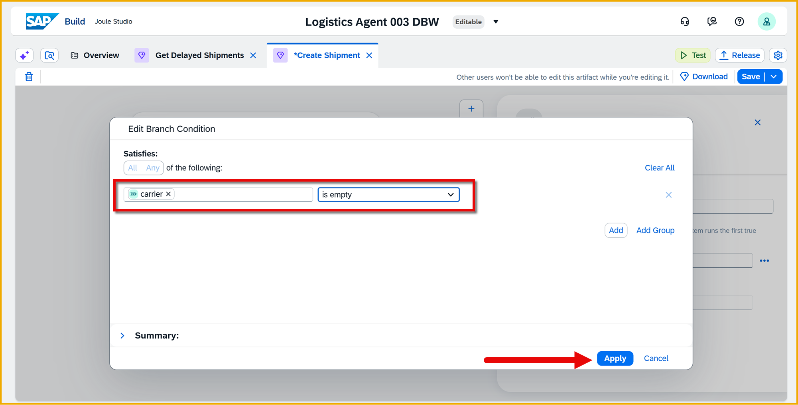

6. Open the condition activity, so you can see parallel paths.

    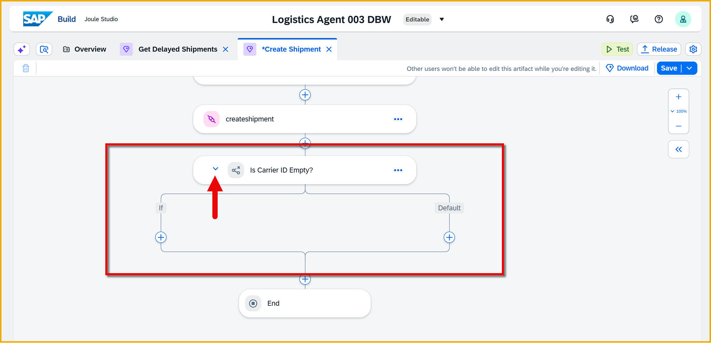


### Add Send Message for creating shipment
A **Send Message** step enables you to send a personalized and pre-defined message to the end user instead of letting Joule design the message as it sees fit.

You will create two **Send Message** steps, one for each of the condition branches created in the previous exercise. 

1. In the **If** branch (left), click the **+** button.

    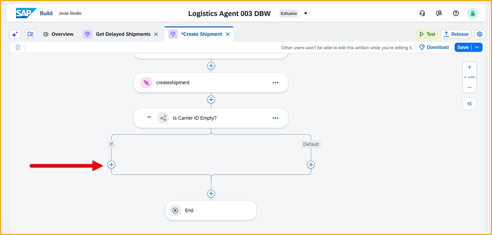

2. Select **Send Response**.

    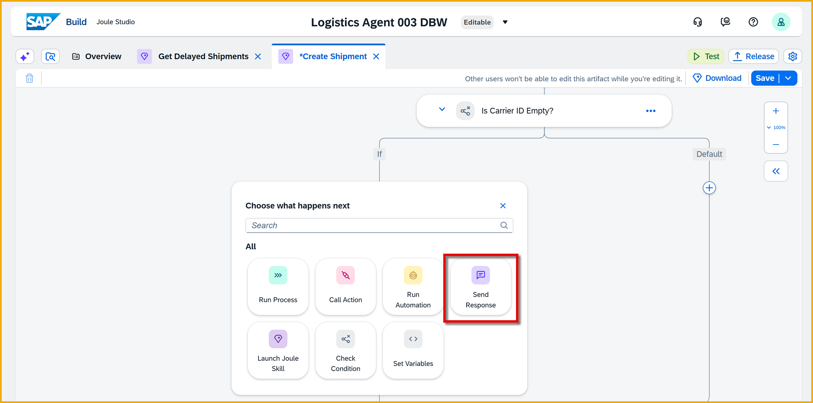

    Click **Send Message**

    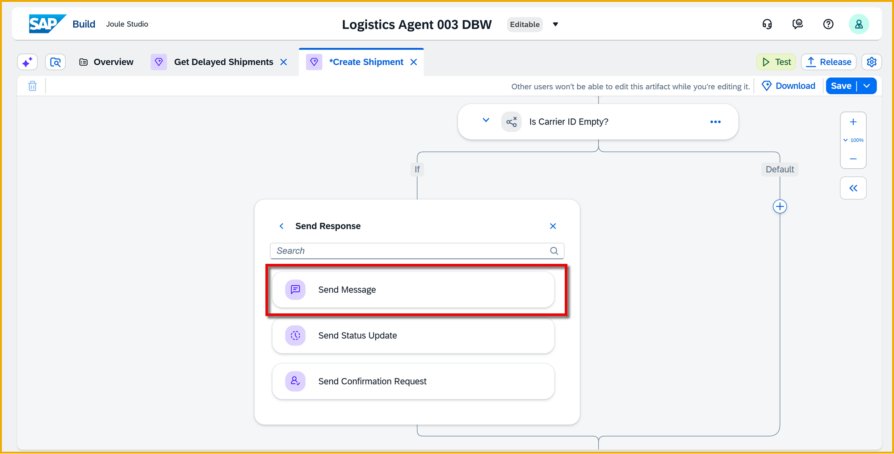

3. Select the **Send Message** on the **If** branch, and name it **Create Shipment Message** (i.e., set the in the **Step Name** field).

4. **Open Message Editor** on the right-side panel.

    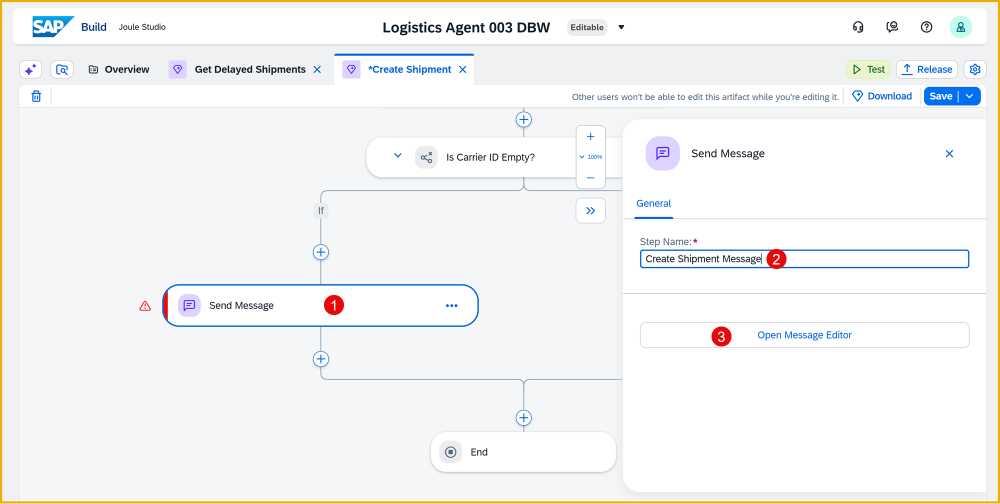

    Set the following configuration:

    | Field Name              | Value                |
    |--------------------------|-----------------------------|
    | **Message Type** | Illustrated Message    |
    | **Title**                   | `Success`|
    | **Text**        | ```Shipment Id ${context.startEvent.shipmentid} created successfully in GTT```  |
    | **Illustration**      | Success High Five  |

    For the **Action Button** section, click **Add Button** and enter the following details:
  
    | Field Name              | Value                |
    |--------------------------|-----------------------------|
    | **Title**                   | `View Shipment`|
    | **url**        | ```https://store-content-dev.gtt-flp-lbnplatform.cfapps.eu10.hana.ondemand.com/cp.portal/site?sap-language=en#Shipment-track?sap-ui-app-id-hint=com.sap.gtt.app.sts```  |

    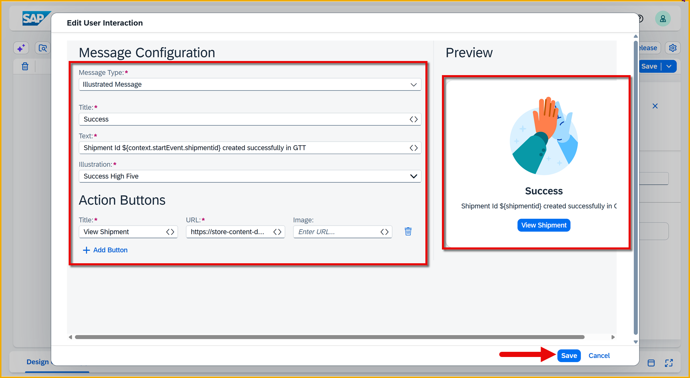

    >**IMPORTANT:** You will not be able to directly access the GTT system due to restricted authorization. Ask your instructor to show you the created shipment in the GTT system, or run the track shipment skill/agent. 

    In the **Preview** area on the right, you can see how the message will look.

    Click **Save**.


### Add Send Message for updating shipment
1. In the **Default** branch (right), click the **+** button.

    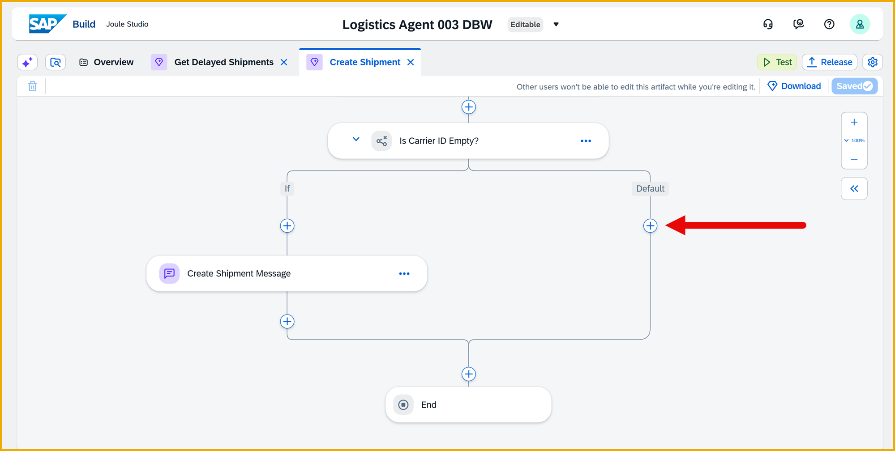

2. Select **Send Response**, and then **Send Message**.

3. Select the **Send Message** on the **Default** branch, and name it **Update Shipment Message** (i.e., set the in the **Step Name** field).

3. **Open Message Editor** on the right-side panel.

    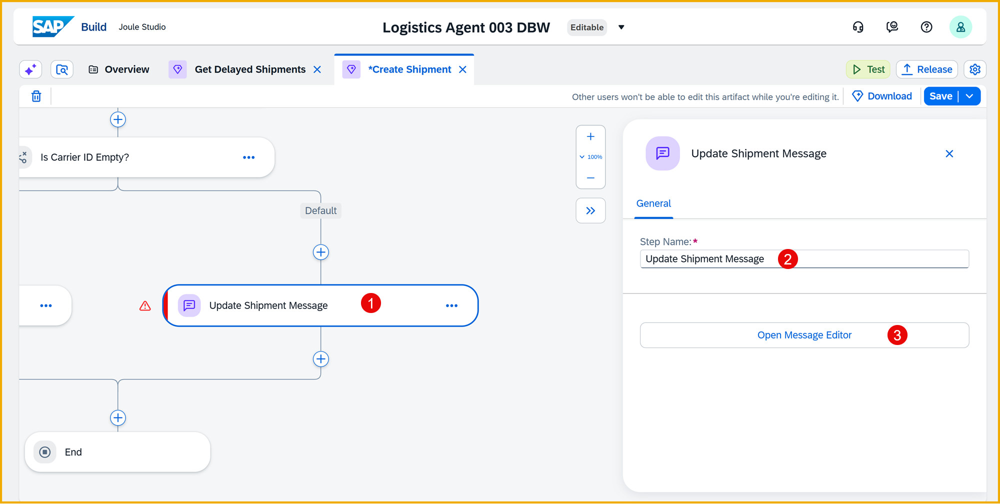

    Set the following configuration:

    | Field Name              | Value                |
    |--------------------------|-----------------------------|
    | **Message Type** | Illustrated Message    |
    | **Title**                   | `Success`|
    | **Text**        | ```Carrier ${context.startEvent.carrier} has been updated for Shipment ${context.startEvent.shipmentid}```  |
    | **Illustration**      | Success Check Mark  |

    For the **Action Button** section, click **Add Button** and enter the following details:
  
    | Field Name              | Value                |
    |--------------------------|-----------------------------|
    | **Title**                   | `View Shipment`|
    | **url**        | ```https://store-content-dev.gtt-flp-lbnplatform.cfapps.eu10.hana.ondemand.com/cp.portal/site?sap-language=en#Shipment-track?sap-ui-app-id-hint=com.sap.gtt.app.sts```  |

    

    >**IMPORTANT:** You will not be able to directly access the GTT system due to restricted Authorization. Ask your instructor to show you the created shipment in the GTT system. 

    Click **Save**.

  4. Click **Save** (upper right).


### Test the skill
1. Click **Test** in the upper-right.

    

2. The **Test Project** dialog should now require an additional environmental variable, while the others should already be populated with the correct details.

    Set the following values:

    | Field         | Value                                     |
    |---------------|-------------------------------------------|
    | **Environment**        | Select the email address of your user                  |
    | **Environment variables > GetFromGTT** | Select **gttGetService** |
    | **Environment variables > PostToGTT** | Select **gttwriteservice** |

    Click **Continue**.

    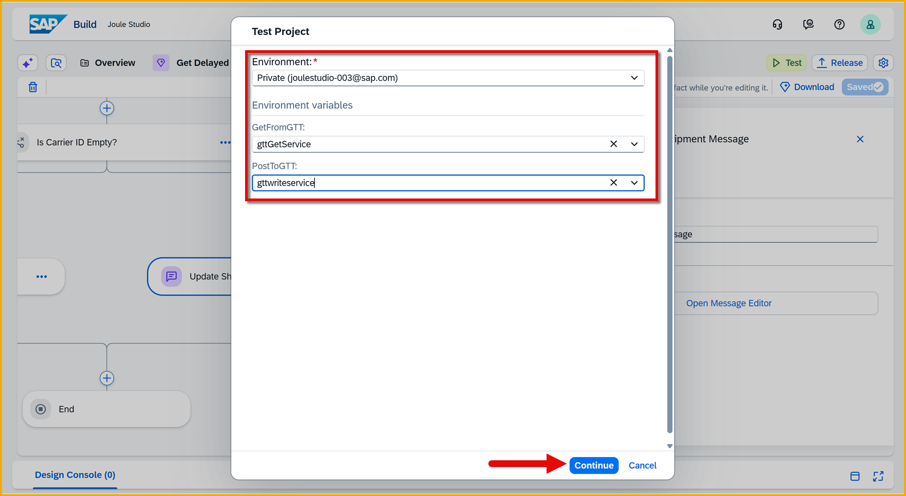

    A new browser tab opens with Joule.

3. As a prompt, enter:

    ```Prompt
    Hello Joule, Could you please assist me in creating a Shipment?
    ```


    Joule will trigger your Create Shipment skill but required parameters will be missing. Joule will prompt you for them.

    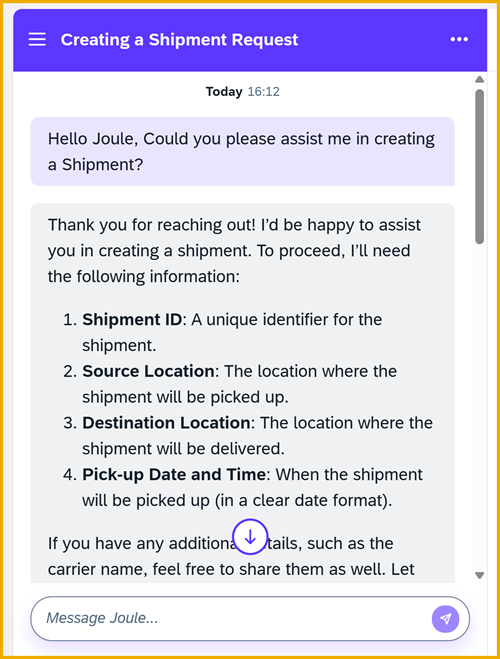

4. Enter the following prompt, changing the shipment ID to 91001<user number><your initials>, for example, `91001002DBW` (or any unique string):

    ```Prompt
    Shipment ID: 91001<User number><your initials>
    Source Location: SFO
    Destination Location: NYC
    Pick-up Date and Time: December 15, 2025 5:00:00 PM CET
    ```

    Joule will create a new shipment in the GTT system.

    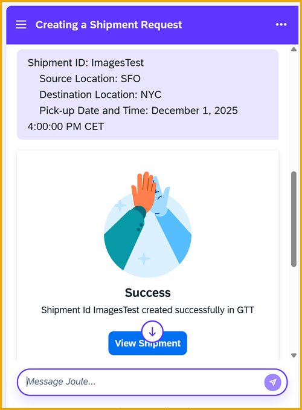

5. You can check if it was created by entering a prompt to track the shipment (change the shipment ID to the one you created).

    ```Prompt
    Track the shipment 91001<User number><your initials>
    ```

    Joule will respond with the shipment you created.

    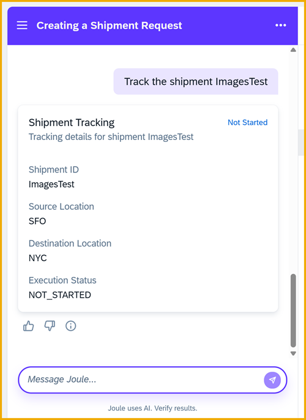

    >If no such shipment exists, Joule would tell you that it cannot help you.

6. Update the shipment by typing the following prompt.

    ```Prompt
    Update the Shipment ID: 91001<User number><your initials> with the carrier Fly By Night.
    All other values remain the same.
    ```

    Joule will respond with the update message you created.

    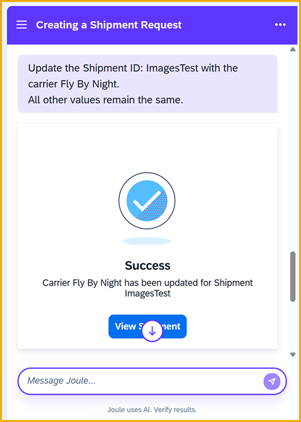

    Feel free to track the shipment again.

7. Once you are done testing, click **Stop Testing**.

    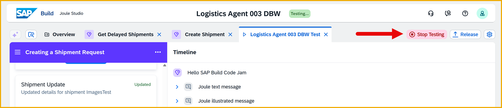
