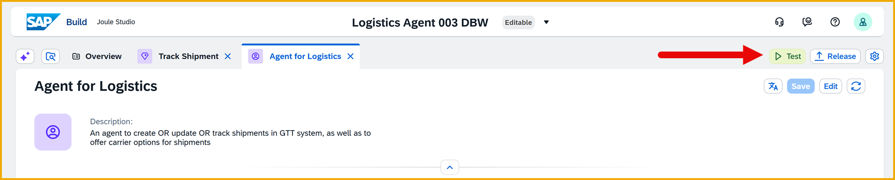
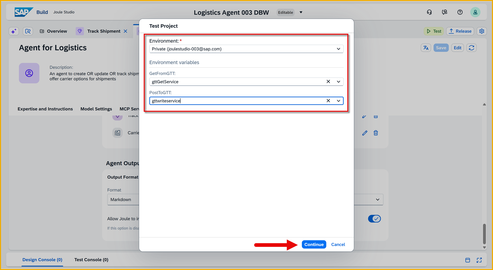
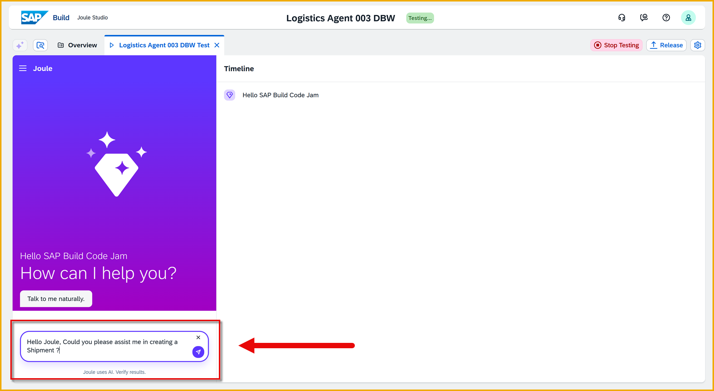
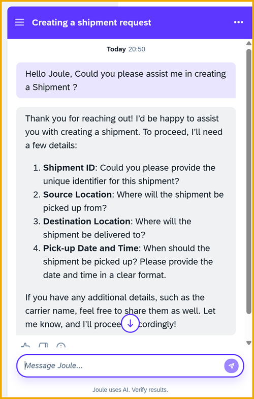
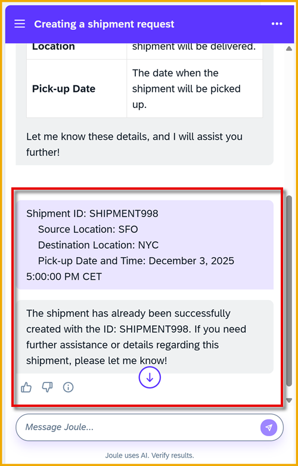
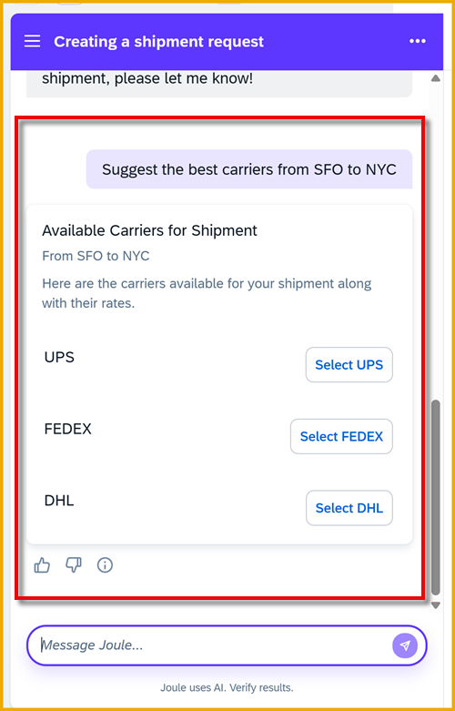
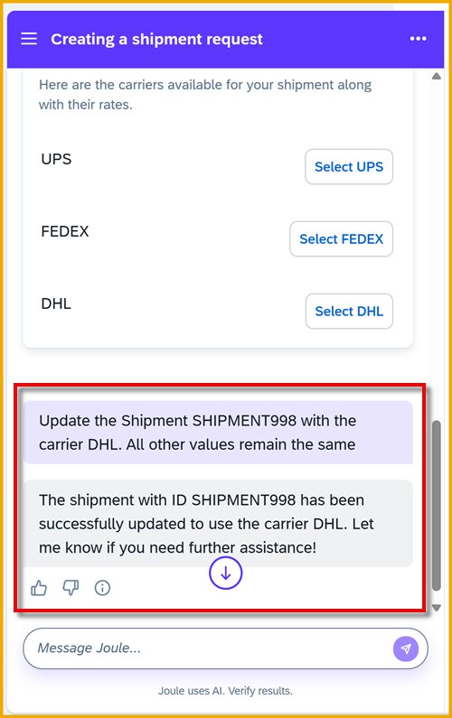
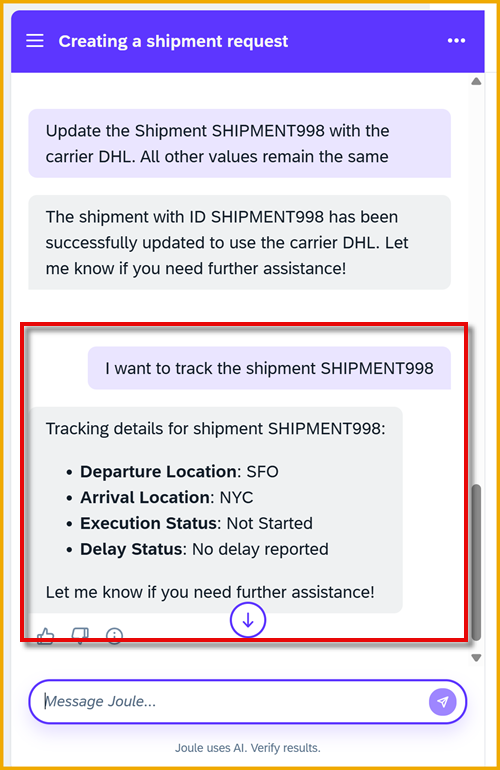
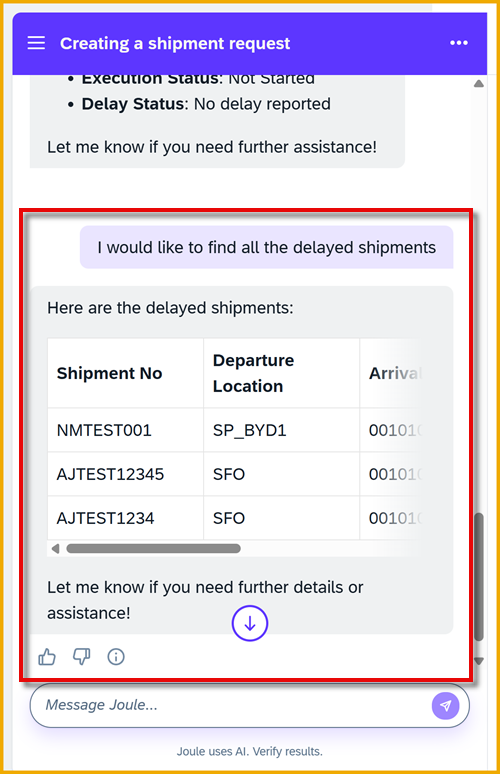

  
# 7 - Test the Shipping Agent
<!-- description --> Use the private environment to test the shipping agent.
 
## You will learn
- How to test an agent

## Prerequisites
- You have completed the previous tutorial in the Joule Studio CodeJam Mission, [Create Agent to Coordinate Skills](joule-studio-codejam-6-agent).


### Start the testing
Open your project, and make sure it is saved.

1. Click **Test**.

    

2. In the **Test Project** dialog, enter the following:

    | Field         | Value                                     |
    |---------------|-------------------------------------------|
    | **Environment** | Select the private environment for your user's email address                  |
    | **PostToGTT** | Select **gttwriteservice** |
    | **GetFromGTT** | Select **gttGetService** |

    Click **Continue**.

    

A test Joule interface will open up, letting you talk with your skills and agents in the project.


### Enter prompts
1. In Joule, enter the following:

    ```Prompt
    Hello Joule, Could you please assist me in creating a Shipment ?
    ```

    

    **Result**: Joule Requests shipment details: Shipment ID, Source Location, Destination Location, Pick-up Date. 

    

2. Provide the requested inputs by entering something like the following -- change the shipment ID: 

    >**Important:** Replace `<UserID>` and `<Initials>` with your user number and your initials.

    ```Prompt
    Shipment ID: 91001<UserID><Initials>
    Source Location: SFO
    Destination Location: NYC
    Pick-up Date and Time: December 15, 2025 5:00:00 PM CET
    ```

    **Result**: Joule will report that it created the shipment, something like this:

    

    
3. Ask Joule for suggested carriers and prices by entering the following:

    ```Prompt
    Suggest the best carriers from SFO to NYC
    ```

    **Result**: Joule proposes the carriers based on the carrier rates document from our document grounding.

    

4. Ask Joule to update the shipment by entering the following:

    >**Important:** Change `<Shipment ID>` with the your shipment ID.  

    ```Prompt
    Update the Shipment ID <Shipment ID> with the carrier DHL. All other values remain the same
    ```

    **Result**: Joule responds with the success message you created earlier for updating shipments.

    

5. Ask Joule to track your shipment by entering the following:

    >**Important:** Change `<Shipment ID>` with the your shipment ID.  

    ```Prompt
    I want to track the shipment <Shipment ID>
    ```

    **Result**: Joule responds with tracking info of the shipment in the GTT system.

    


6. Ask Joule for a list of delayed shipments by entering the following:

    ```Prompt
    I would like to find all the delayed shipments
    ```

    **Result**: Joule responds with a list of shipments with delayed status in the GTT system.

    

7. Click **Stop Testing**.


### Questions to ponder
- What is the disadvantage of the current way document grounding is made accessible in Joule Studio?

- Responses can be constant for skills. How do we do that?

- Responses are not constant for agents. Why?


