  
# 8 - Add Subagent to Convert Currency Using MCP Server
<!-- description --> Create a subagent that connects to an MCP server with currency conversion tool, and then add that agent to our shipment agent. 
 
## You will learn
- How to create a subagent
- How to connect to an MCP server

## Prerequisites
- You have completed the previous tutorial in the Joule Studio CodeJam Mission, [Test the shipping agent](joule-studio-codejam-7-test-agent).


## Intro
In this tutorial we will explore two additional features of agents:

- You can create **subagents** to be called from another agent, so you can better structure your projects. A subagent is built the same way as any other agent, just that it is added as a tool in another agent. For now, once an agent is used as a tool in another agent, it cannot be called directly.

- You can connect your agent to an **MCP server** and use its tools as part of that agent.

You will create an agent that uses an MCP server for converting currencies, and then use that agent within your logistics agent.

>We probably could have just added the MCP server to the first agent, but we wanted to show the subagent feature as well 😊.


### Create empty agent
1. Select the **Overview** tab.

2. Click **Create**, and choose **Joule Agent**.

    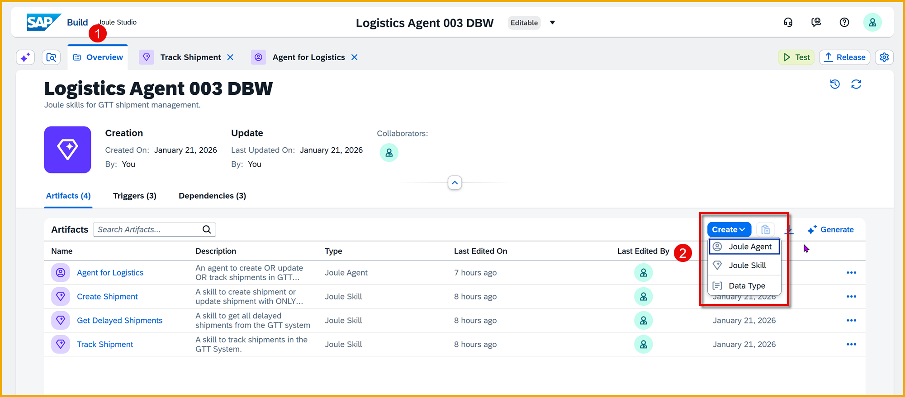

3. In the **Create Joule Agent** dialog, enter the following details:

    | Field         | Value                                     |
    |---------------|-------------------------------------------|
    | **Name**        | `Agent for Converting Currencies`                  |
    | **Description** | `An agent for converting currencies and show the value of one currency in another currency` |   

    Click **Create**.

    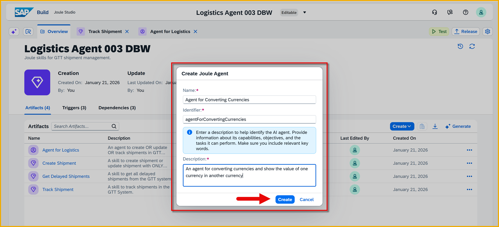

    Once the Joule skill is created, you are taken to the skill builder.


### Add expertise, instructions and context
1. In the agent builder, enter the following for the **Expertise** section:

    ```Text
    Converts currency amount to a different currency, and takes precedence over any other way to convert currencies
    ```

2. Enter the following for the **Instructions** section:

    ```Text
    When asked to convert currency, use the get_latest_base_currency skill from the MCP server
    ```

3. Enter the following for the **Additional Context** section:

    ```Text
    Please show the currency conversion in a table, with the column headers with the currency abbreviations and the row values the currency amounts.
    ```

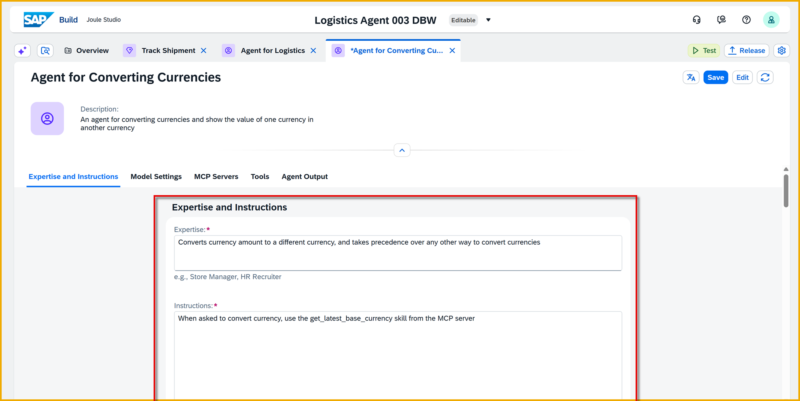


### Add MCP server
We have created an MCP server for converting currencies, and created a destination so the MCP server is available to Joule Studio and to be added to agents.


1. In your agent, click **Add MCP Server**.

    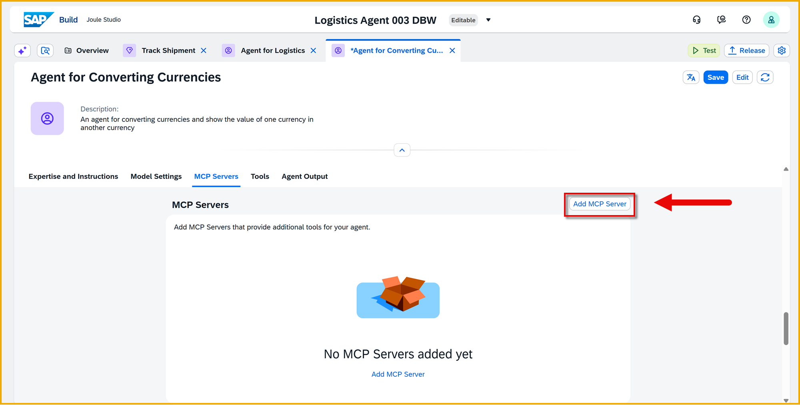

2. In the **Add MCP Server** dialog, enter the following details:


    | Field         | Value                                     |
    |---------------|-------------------------------------------|
    | **Name**        | `Currency Conversions`                  |
    | **Description for Agent** | `Use this MCP server for converting currencies` |   
    | **Destination** | Select **MCP-currency-antonio** | 

    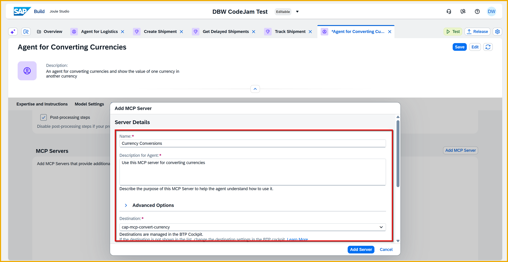

    Once you select the destination, scroll down and you should see a list of tools in that MCP server. Here you will seen one tool called **get_latest_base_currency**.

    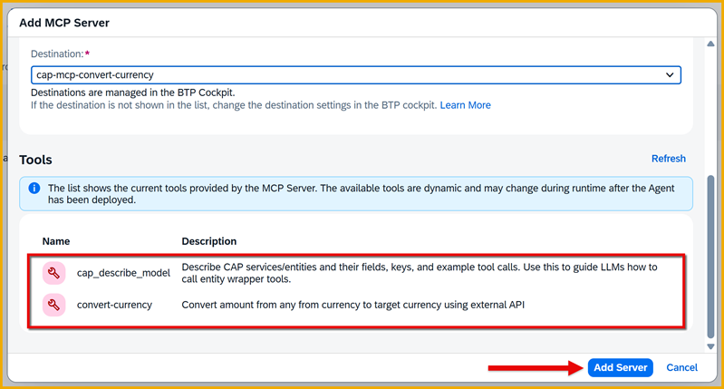

    Click **Add Server**.

    You will see the MCP server added, plus an indication of how many tools are exposed through that server.

    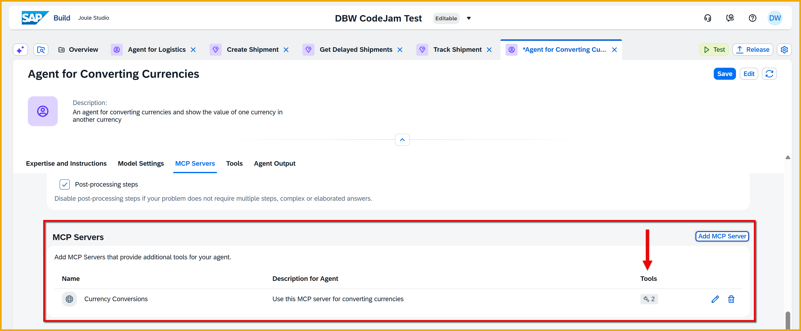

3. Click **Save** (upper right).


### Add currency agent as subagent
1. Open your **Agent for Logistics** agent.

    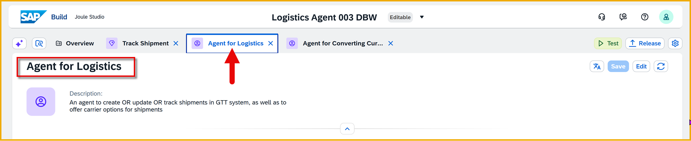

2. Click **Add Tool > Joule Agent**.

    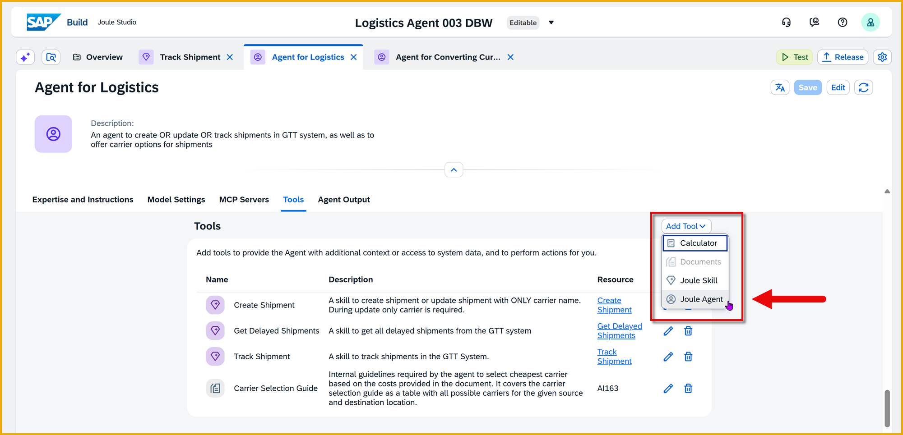

    Select **Agent for Converting Currencies** agent.

    Click **Add**.

    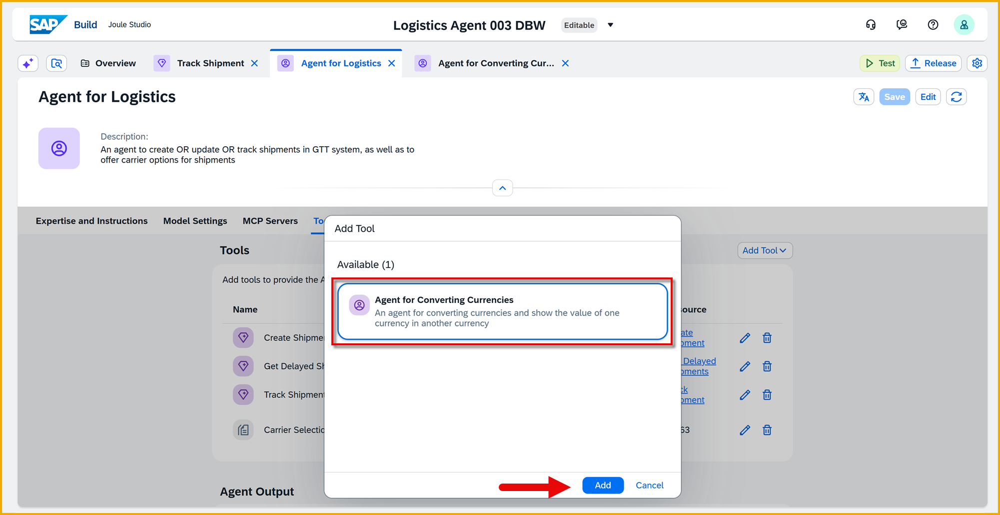

3. Click **Save** (upper right).


### Change instructions
Now we have to instuct the agent to use the tool when someone asks for currency conversion.

In the instructions of the **Agent for Logistics** agent, replace the first paragraph under **Suggest Carrier Options** with this one.

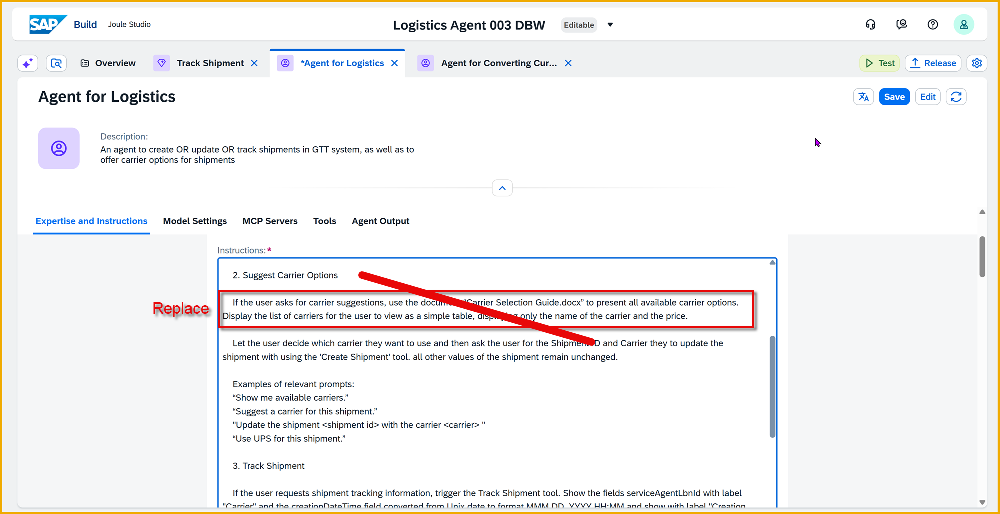

```Text
If the user asks for carrier suggestions, use the document “Carrier Selection Guide.docx” to present all 
available carrier options. Display the list of carriers for the user to view as a simple table, displaying only 
the name of the carrier and the price. If the user asks for the prices in a currency not USD, use the "Convert  
currencies" agent tool to get the currency conversions and show 2 columns, one for USD and one for the 
converted currency.
```

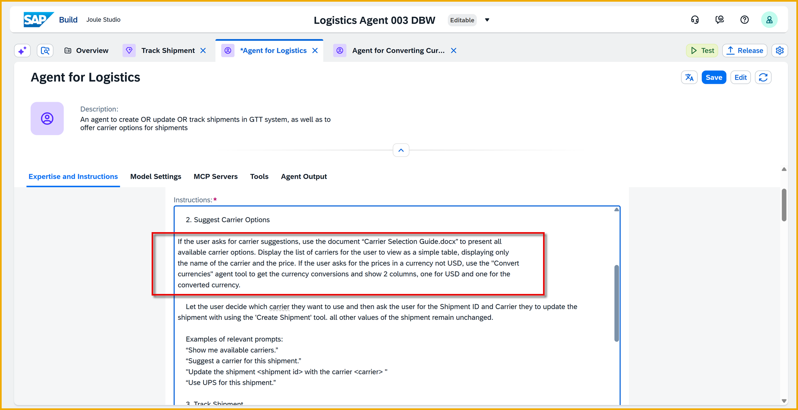

Click **Save** (upper right).


### Test agent
1. Click **Test**.

    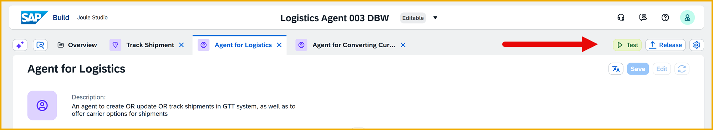

    In the **Test Project** dialog, enter the following:

    | Field         | Value                                     |
    |---------------|-------------------------------------------|
    | **Environment** | Select the private environment for your user's email address                  |
    | **PostToGTT** | Select **gttwriteservice** |
    | **GetFromGTT** | Select **gttGetService** |

    Click **Continue**.

    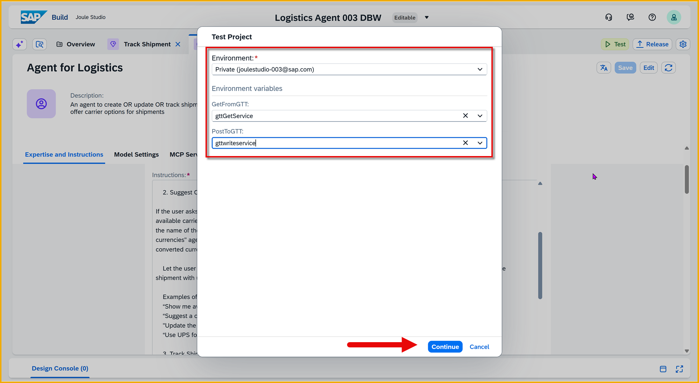

    A test Joule interface will open up, letting you talk with your skills and agents in the project.

2. Ask Joule for suggested carriers and prices by entering the following:

    ```Prompt
    Suggest the best carriers from SFO to NYC, and show prices in euros
    ```

    **Result**: Joule proposes the carriers based on the carrier rates document from our document grounding, and converts the prices to euros.

    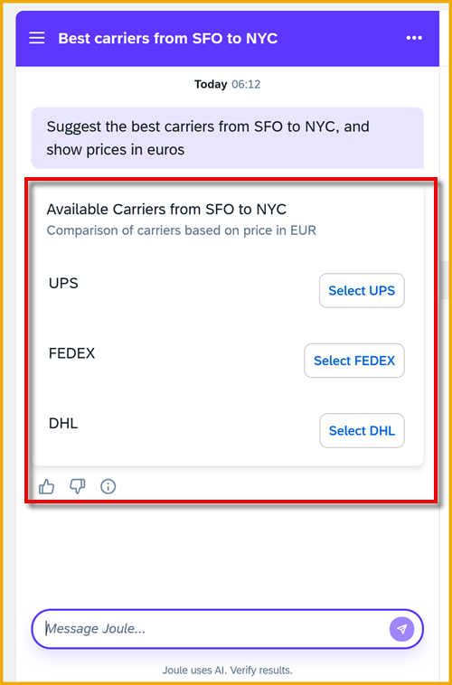

    If you click on UPS, you will see the details and the price, in euros converted to up-to-date exchange rate returned by the MCP server.

    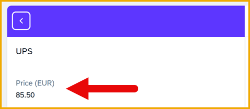


3. Explore the logs.

    First find **Joule list message** and expand the node. Here you will find information on how Joule and the agent responded to your prompt.
    
    Click **Joule selected a scenario to execute**, and on the right you will see that it selected the agent to respond with.

    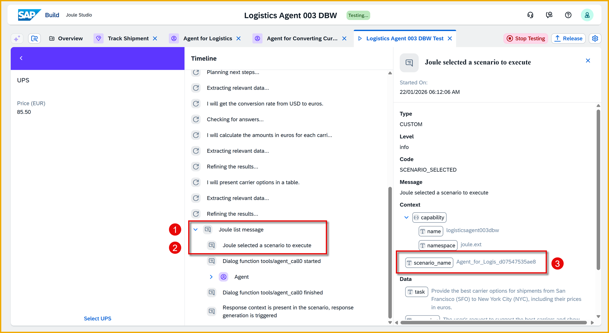

    Open the **Agent** node, and click **Plan** and you can see that it figured out to check document grounding for carriers and then to use convert currencies agent to convert the currencies.

    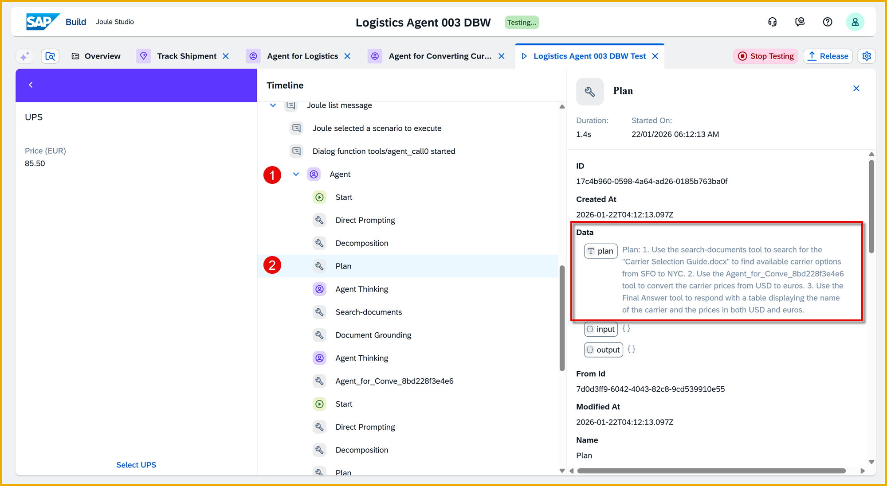

    If you scroll down and click **MCP Server**, you will see on the right that the MCP server was called and returned currency conversions for today.

    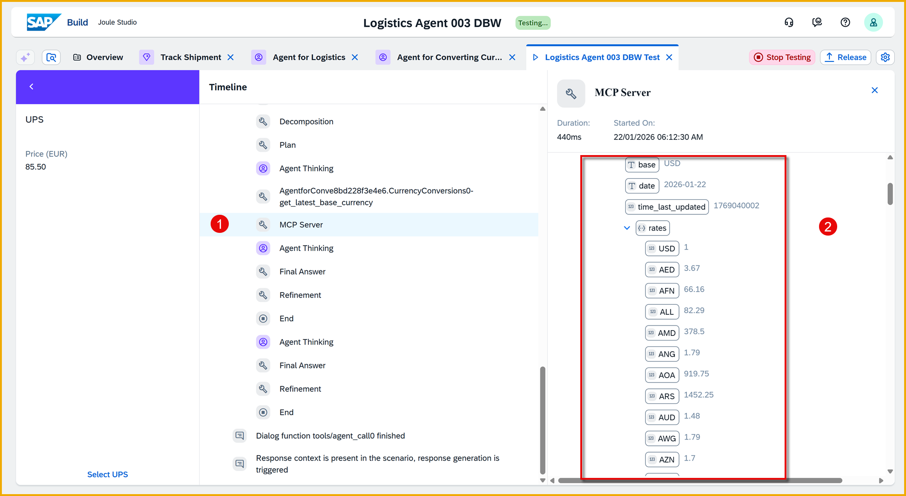

4. Click **Stop Testing**.

    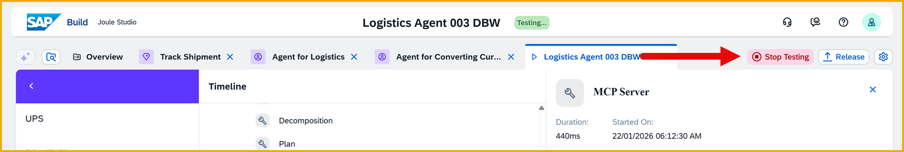


