  
# 9 - Release and Deploy to Shared Environment
<!-- description --> Create a release version of your project and deploy to your shared environment, where you can perform more testing or send to production.
 
## You will learn
- How to create a release version of a Joule Studio project
- How to deploy a Joule Studio project
- How to test your Joule Studio project in your shared environment

## Prerequisites
- You have completed the previous tutorial in the Joule Studio CodeJam Mission, [Add Subagent to Convert Currency Using MCP Server](joule-studio-codejam-8-subagent-mcp).

## Intro
In this tutorial, you will deploy your project to your shared environment.

In a production setting, you would create two shared environments, one for testing one for production. The one for production you would change the settings so any projects deployed to it are exposed in the production Joule.

### Release project
1. Open your project, and make sure it is saved.

2. Click **Release** in the upper right.

    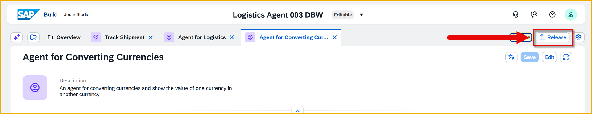

    Since this is your first release, the dialog will show the version as 1.0.0. You can add a release note if you want.

    Click **Release**.

    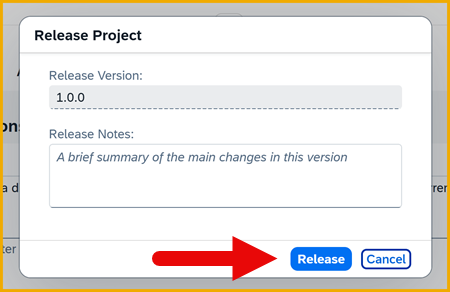

    After the project is released, you will see a success message at the top of the screen.

    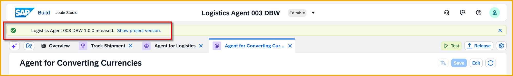

### Deploy project
1. Navigate to the released version by clicking **Show project version**.

    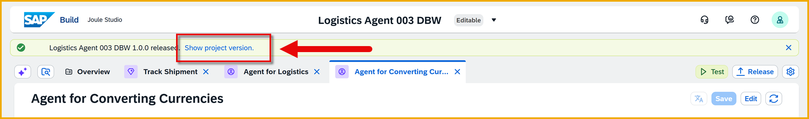

    You will now see a button to deploy the project.

    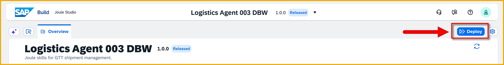

2. Click **Deploy**.

3. In the **Choose an Environment** dialog, select your shared environment you created at the start of the CodeJam.

    Click **Deploy**.

    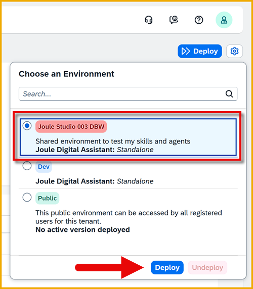

4. Select the environment variables, the same as when you did tested, just you do not have to select a private environment.

    | Field         | Value                                     |
    |---------------|-------------------------------------------|
    | **GetFromGTT**        | Select **gttGetService** destination                  |
    | **PostToGTT** | Select **gttwriteservice** destination |   

    Click **Deploy**.

    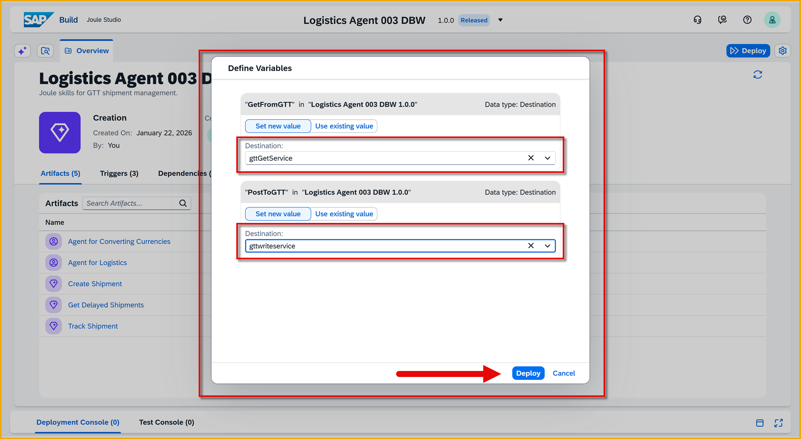

    When complete, you will see a success message at the bottom and new deployment at the top.

    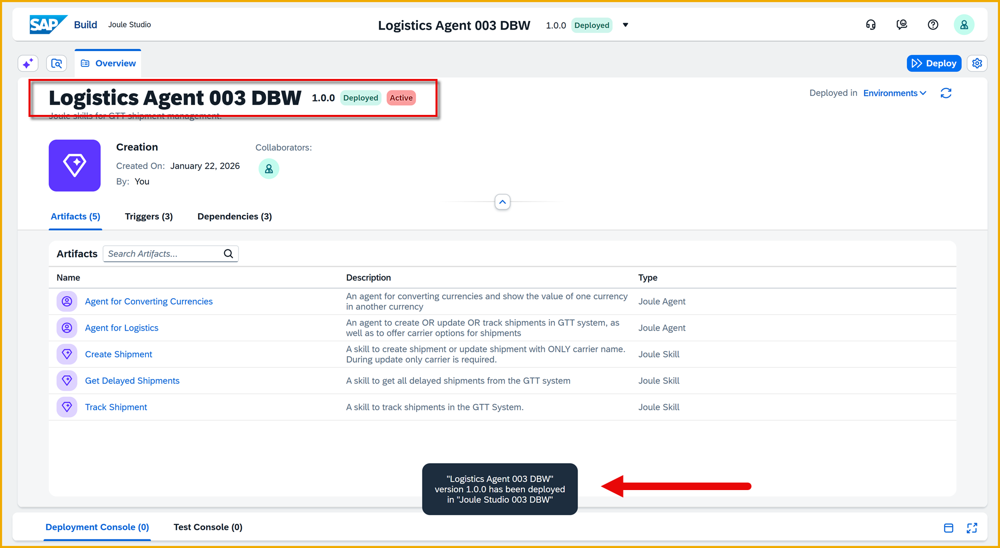

### Test in shared environment
1. In the SAP Build Lobby, go to **Control Tower > Environments**.

    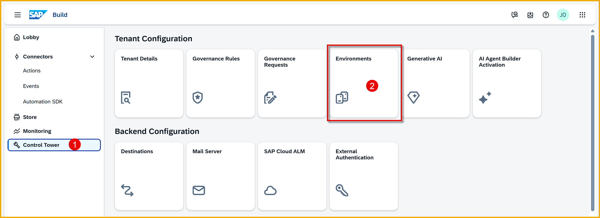

2. Open your shared environment by clicking it (not the private environment).

    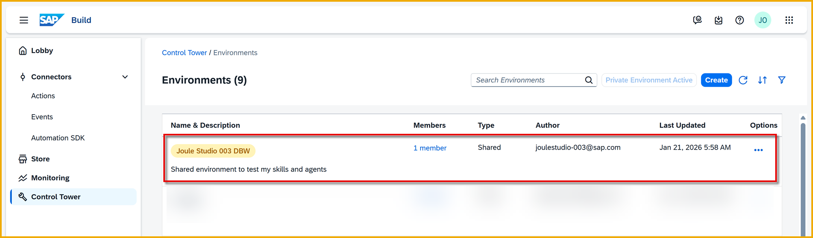

3. In the **Projects** tab, which should be selected automatically, you will see the projects deployed to this environment.

    You should see the project you just deployed.

    

4. Since this is a Joule-related project, open the **Joule** tab.

    >The **Joule** tab may be hidden under the **More** button.
    >
    >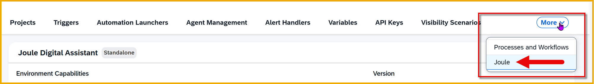

    Here you will see all the Joule Studio projects deployed to this environment.

    >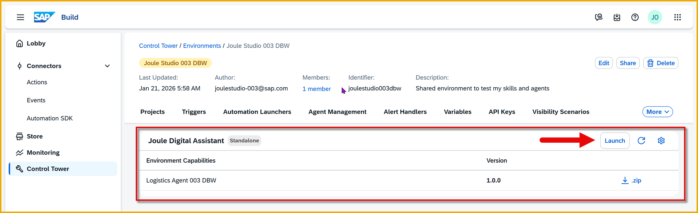

5. Click **Launch**.

    This launches in a new browser tab Joule for this environment, meaning you can prompt for all the projects in this environment.

    >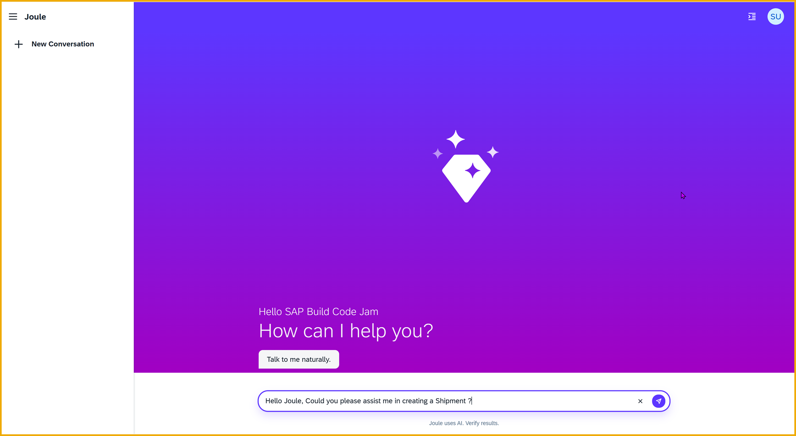

Go ahead and test again the prompts for the your logistics agent.   

### Explore how to send to production
We will not deploy to the shared Joule for this project, but still you should know how that would be done.

Inside your environment, there is a setting to tell Joule Studio to send your skills and agents to Joule. If you enable the switch, all projects in the environment are made available in production to people with permission to this environment.

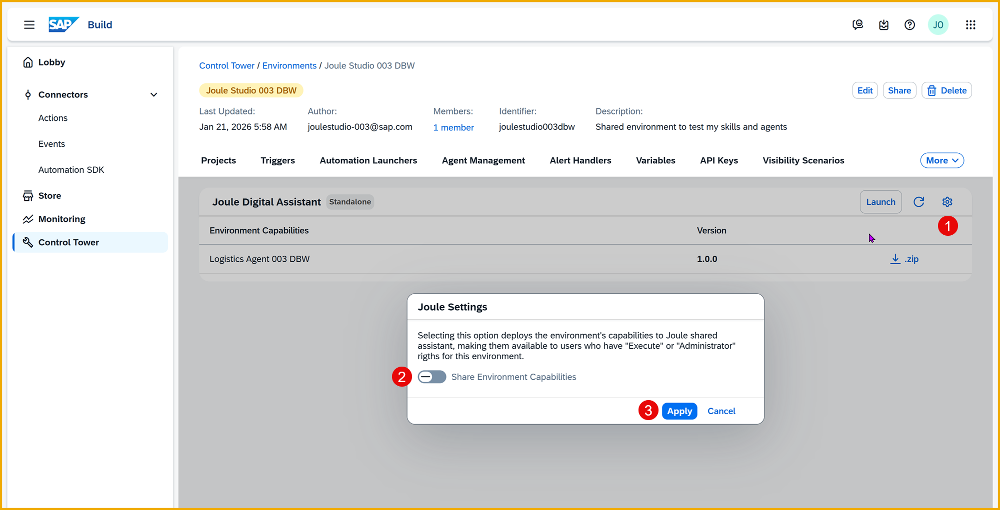

In a production setting, you would create:

- A test shared environment, whose projects would not be sent to Joule (toggle off).

- A production shared environment, whose projects would be sent to Joule (toggle on).

>**IMPORTANT:** Please do not turn this setting on.
>
>

