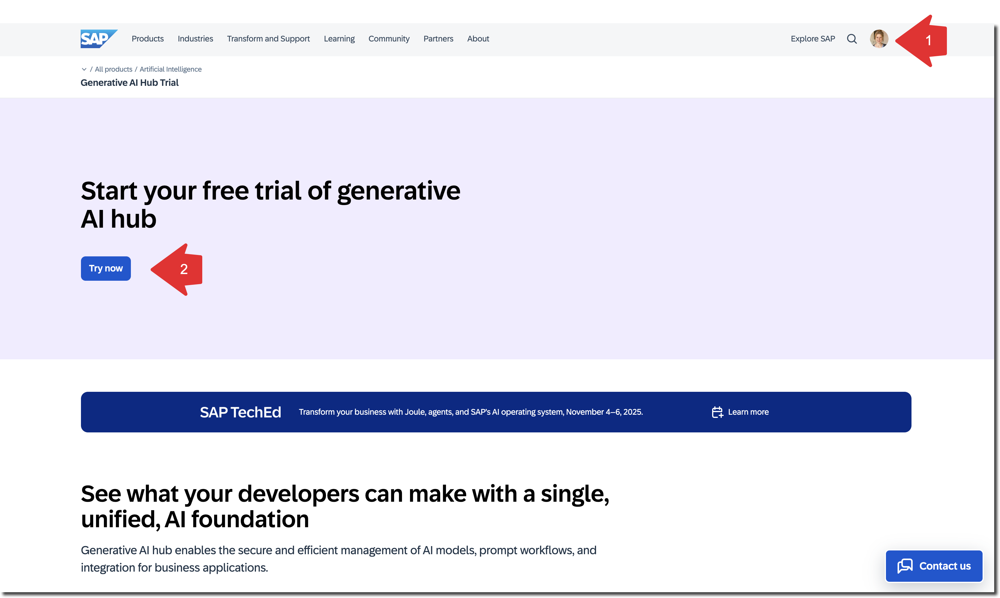
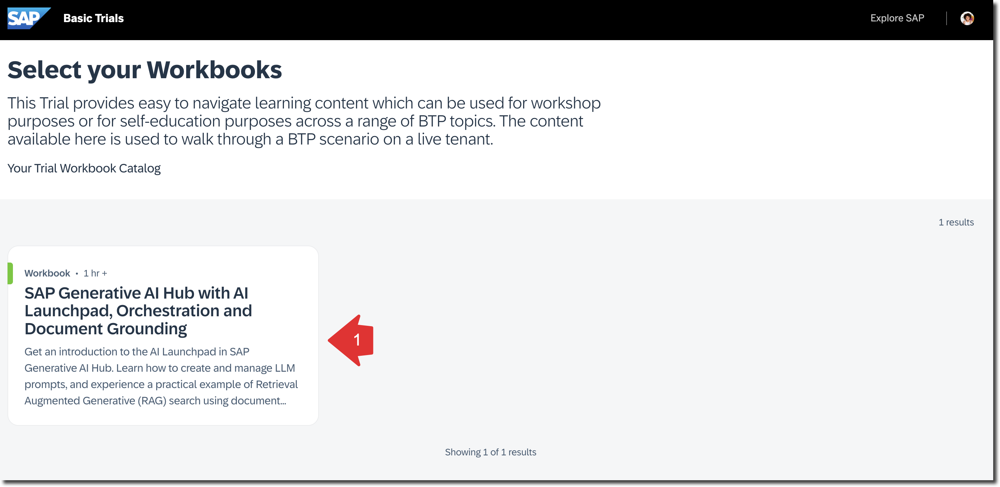
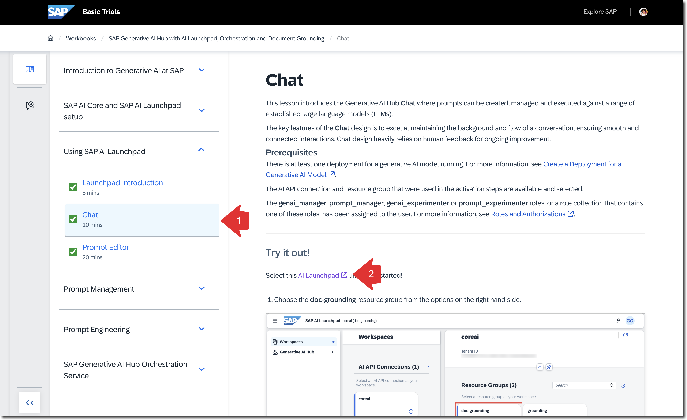

 
# Setup Generative AI Hub Basic Trial

<!-- description -->You will learn how to access your Generative AI Hub Basic Trial environment.

## Prerequisites

- An SAP account - If you don't have one, [sign up for a free account](https://www.sap.com)

## You will learn

- How to access the Generative AI Hub Basic Trial
- How to navigate to SAP AI Launchpad and use Generative AI Hub
- Where to find your trial environment

## Description

This tutorial will guide you through the steps to access your Generative AI Hub Basic Trial environment. The trial provides a hands-on experience with Generative AI Hub and SAP AI Launchpad.

### Register for a Generative AI Hub instance

Register for the Generative AI Hub Trial at: https://www.sap.com/products/artificial-intelligence/generative-ai-hub-trial.html

At the end of the registration process, you should receive a username and password to use in the following exercises.

You should also receive an email with the same information.

### Start Your Basic Trial and Access the Workbook

Click **Start your basic trial!**

On the login page, use the username and password you received.

Upon successful login, you should see a workbook titled **SAP Generative AI Hub with AI Launchpad, Orchestration and Document Grounding**.

Click it to open the workbook.

Click **Start Workbook**.

This workbook includes multiple exercises feel free to do them all. To finish this tutorial you need to do the exercises **Using SAP AI Launchpad** and **SAP Generative AI Hub Orchestration Service**.

> Good news: You have access to this user account and workbook for 30 days from the registration date. You can complete the other exercises after finishing this tutorial.

### Knowledge Check

Congratulations! You have explored Generative AI Hub and SAP AI Launchpad.

Answer the validation question, and remember you can keep working on other exercises during the 30 days following registration for the Generative AI Hub basic trial.