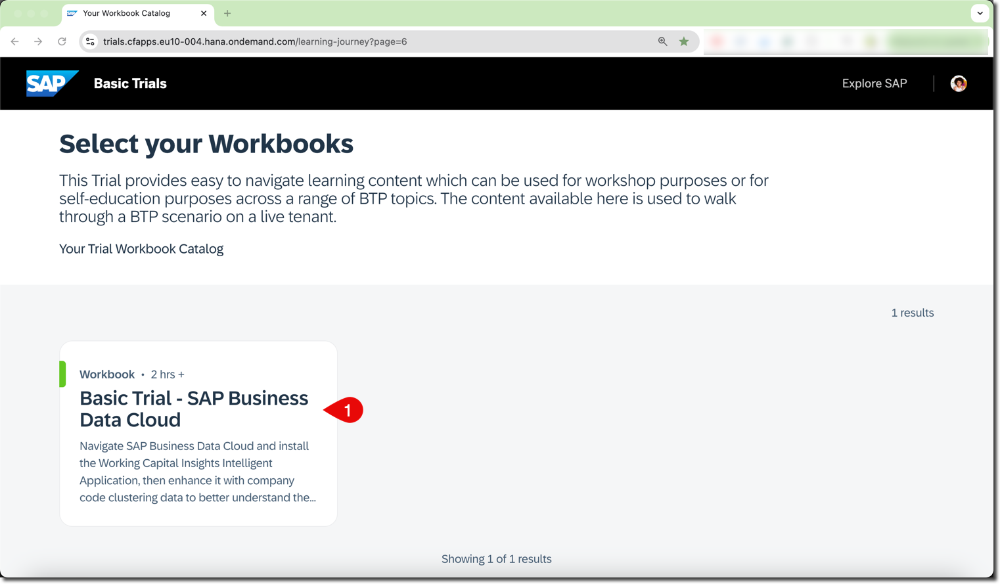
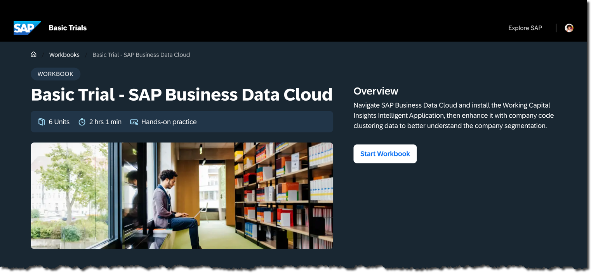
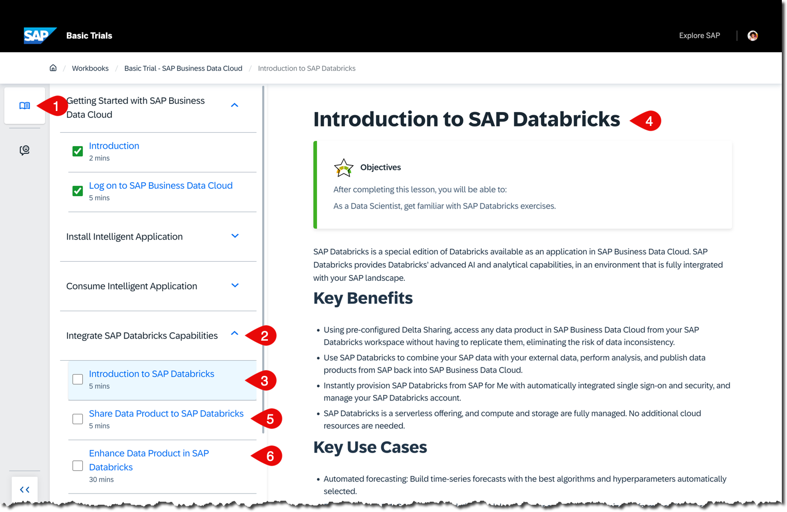

# Introduction to SAP Databricks in SAP Business Data Cloud
<!-- description --> In this tutorial, you’ll learn how to leverage some of SAP Databricks features within SAP Business Data Cloud. You’ll explore these capabilities using both the SAP Databricks UI and Python in a Jupyter notebook.

## Prerequisites
- An SAP account. If you don't have one, [sign up for a free account](https://www.sap.com/dashboard/trials.gate.html) 

## You will learn
- How to work with SAP Datasphere in SAP Business Data Cloud.

### Register for an SAP Business Data Cloud Instance

Register for the SAP Business Data Cloud basic trial at: https://www.sap.com/products/data-cloud/trial.html

At the end of the registration process, you should receive a username and password to use in the following exercises.

You should also receive an email with the same information.

### Start Your Basic Trial and Access the Workbook

Click **Start your basic trial!**

On the login page, use the username and password you received.

Upon successful login, you should see a workbook titled **Basic Trial - SAP Business Data Cloud**.

Click it to open the workbook.

Click **Start Workbook**.

This workbook includes multiple exercises, but in this tutorial, you will focus on **Integrate SAP Databricks Capabilities**.

> Good news: You have access to this user account and workbook for 30 days from the registration date. You can complete the other exercises after finishing this tutorial.

### Getting Started with SAP Business Data Cloud

With the **Basic Trial - SAP Business Data Cloud** workbook open, ensure you are in the (1) Learning Content view. Then (2) expand **Getting Started and Introduction** and (3) click **Log on to SAP Business Data Cloud**.

Complete (4) the **Log on to SAP Business Data Cloud** exercise.

After completing this exercise, answer the validation question and then proceed directly to the "**Integrate SAP Databricks Capabilities**" exercise.

### Enhance Data Product(s) in SAP Databricks

With the **Basic Trial - SAP Business Data Cloud** workbook open, ensure you are in the (1) Learning Content view. Then (2) expand **Integrate SAP Databricks Capabilities** and (3) click **Introduction to SAP Databricks**.

Complete:

- (4) the **Introduction to SAP Databricks** overview,
- (5) the guided tour **Share Data Product to SAP Databricks**,
- (6) hands-on exercises **Enhance Data Product in SAP Databricks**.

### Knowledge Check

Congratulations! You have explored some SAP Databricks capabilities in SAP Business Data Cloud.

Answer the last validation question, and remember you can keep working on other exercises during the 30 days following registration for the SAP Business Data Cloud basic trial.