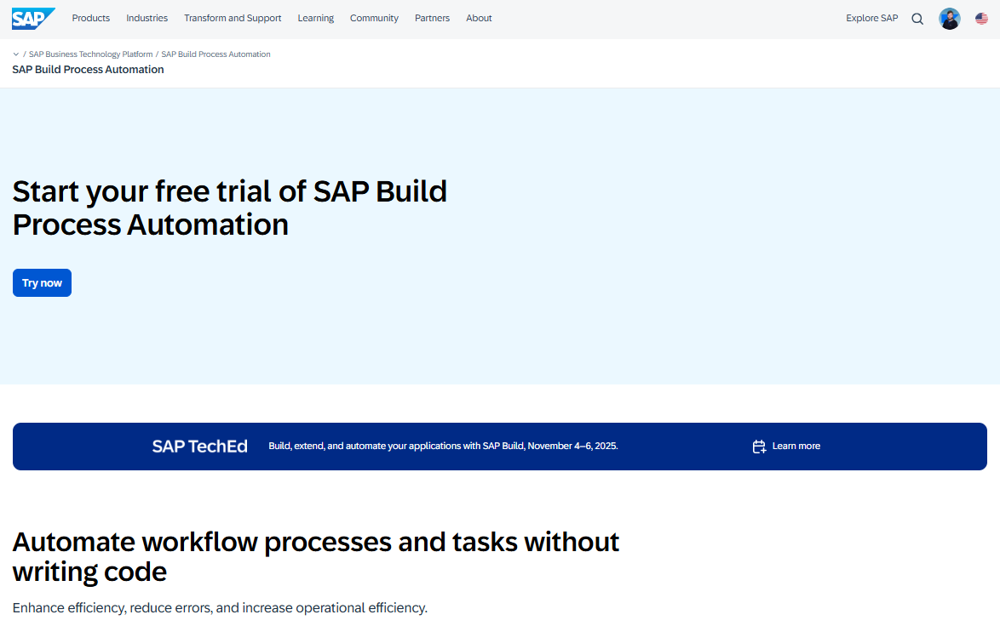
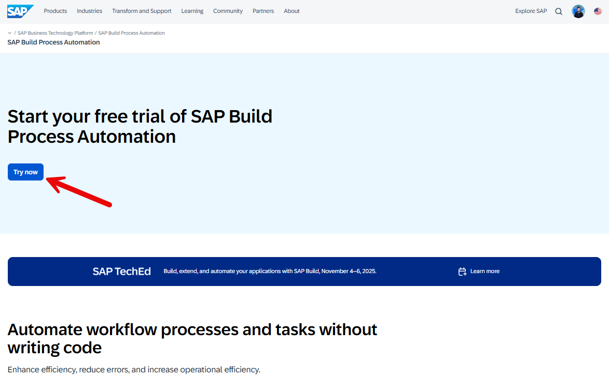
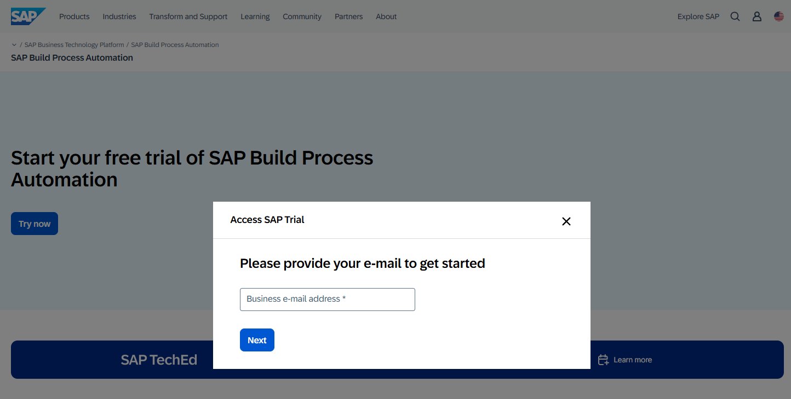
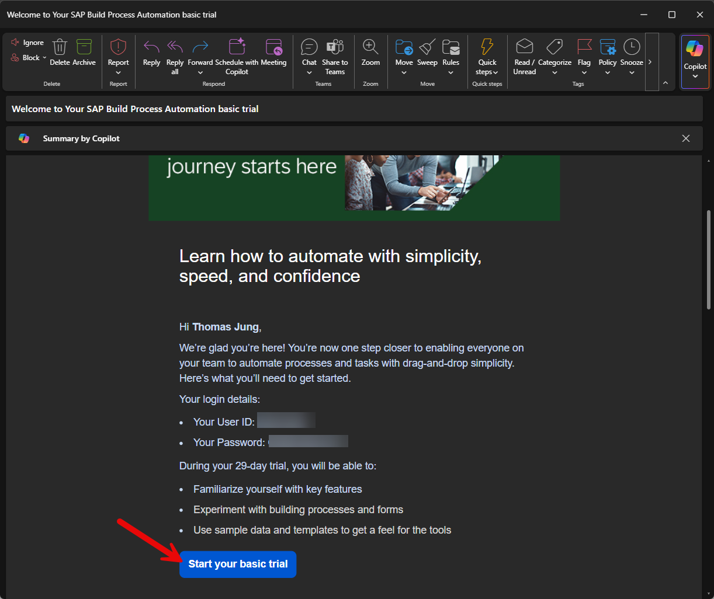
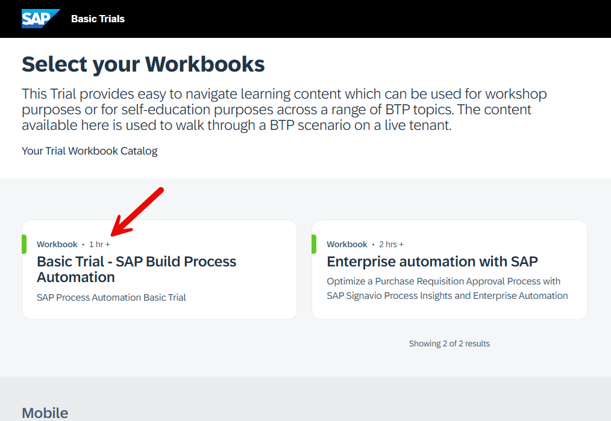
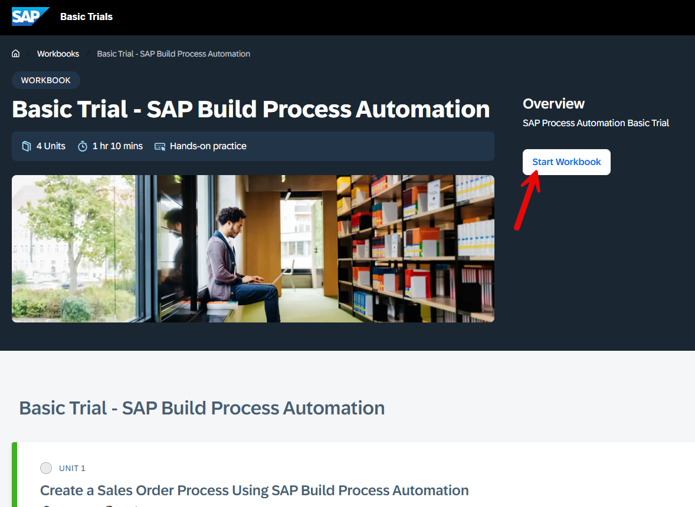
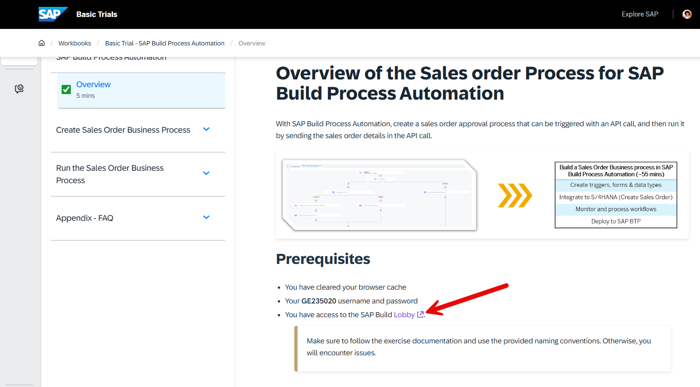
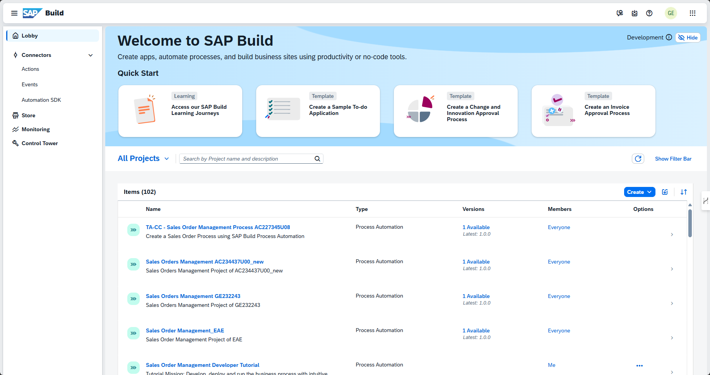

# Setup SAP Build Process Automation Basic Trial

<!-- description -->You will learn how to access your SAP Build Process Automation Basic Trial environment.

## Prerequisites

- An SAP account - If you don't have one, [sign up for a free account](https://www.sap.com/)

## You will learn

- How to access the SAP Build Process Automation Basic Trial
- How to navigate to the Build Lobby
- Where to find your trial environment

## Description

This tutorial will guide you through the steps to access your SAP Build Process Automation Basic Trial environment. The trial provides a hands-on experience with SAP Build Process Automation's capabilities.

### Access the trial page

1. Navigate to the [SAP Build Process Automation Trial page](https://www.sap.com/products/technology-platform/process-automation/trial.html)

    

2. Click the **Try now** button.

    

    >If you're not already logged in, you'll be prompted to log in with your SAP account.

    

3. You'll be redirected to the SAP BTP Cockpit.

### Verify Trial Access

1. In a few minutes you will receive an email confirmation with your credentials to access the basic trial. Click on "Start your basic trial" in the email.

    

### Navigate to Build Lobby

1. Click on the **Process Automation** tile in your BTP Cockpit.

2. This will open the Basic Trials - Select your Workbooks page. Choose the Basic Trial - SAP Build Process Automation option.

    

3. Once in the Workbook, click Start Workbook.
    

4. In the first step of the workbook, you will find a link to the SAP Build Lobby. Click this link. This is the last activity you need to perform in the workbook. You an proceed with other tutorials that use SAP Build Process Automation.

    

5. You will be redirected to the SAP Build Process Automation Build Lobby. Enjoy!

    

### Next Steps

You have now successfully:

- Accessed the SAP Build Process Automation Trial
- Navigated to the Build Lobby

While there is a learning journey available with the Basic Trial, you're not required to complete it at this time. You can proceed to explore the Build Lobby and start creating your own automation projects.
