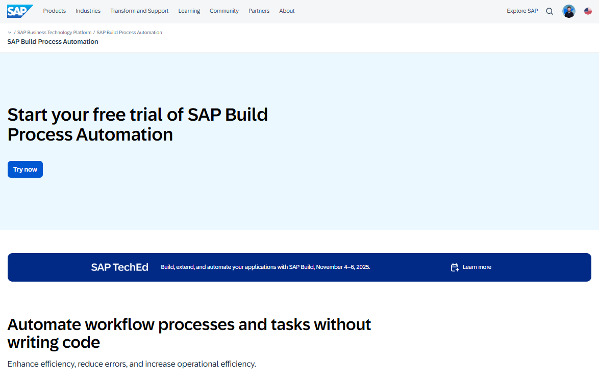
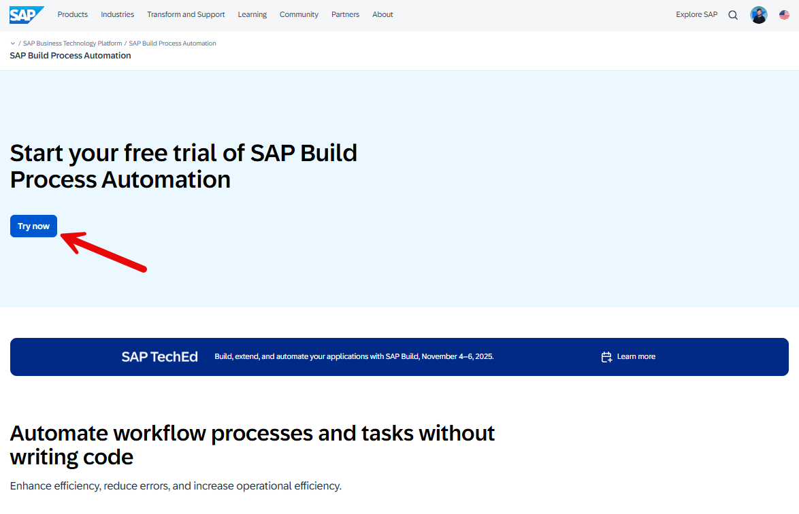
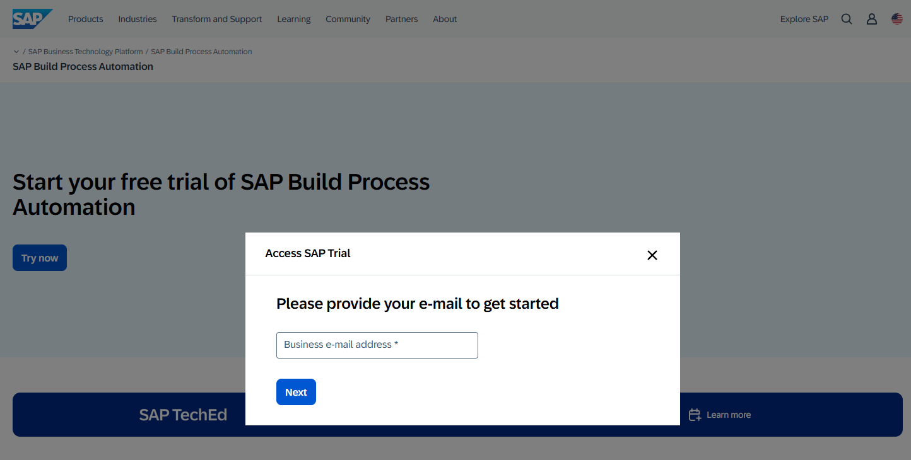
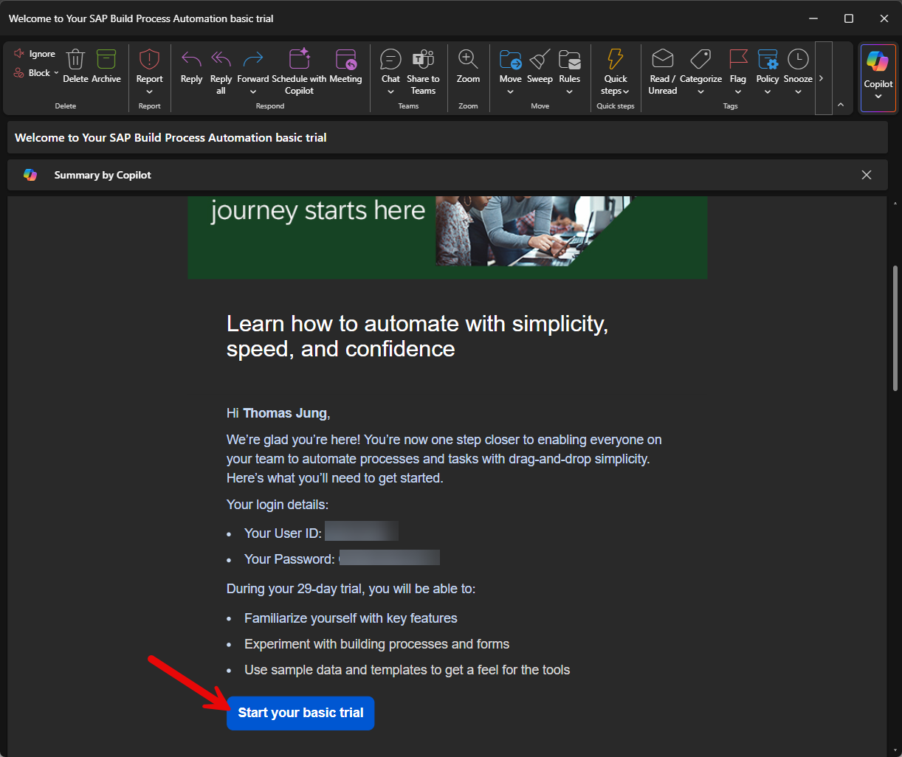
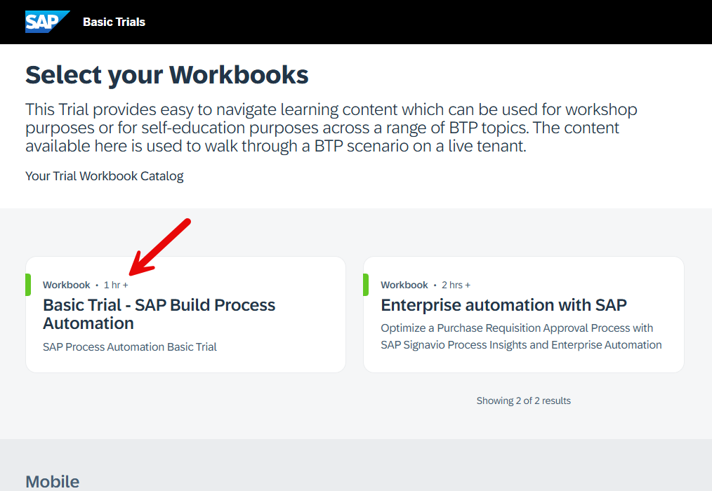
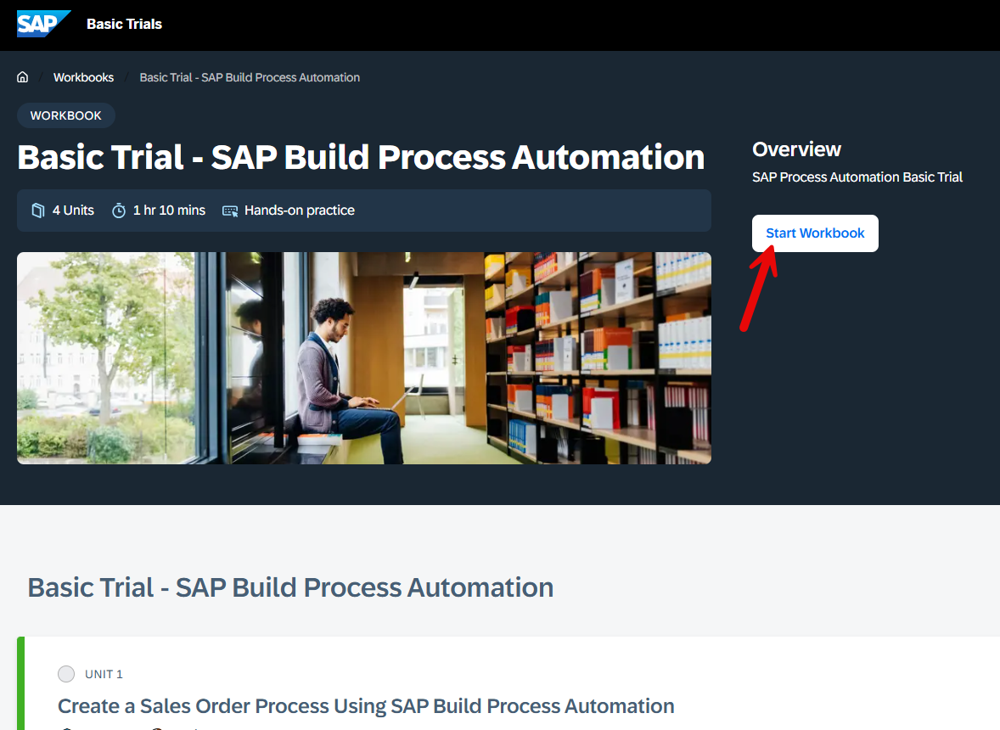
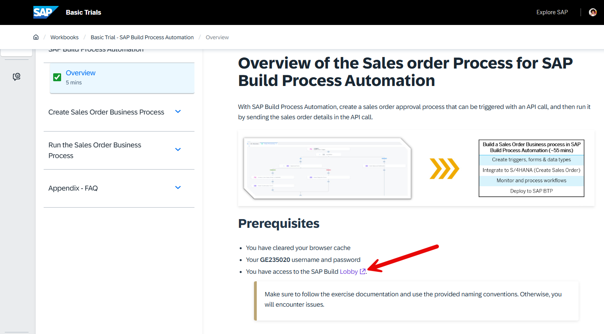
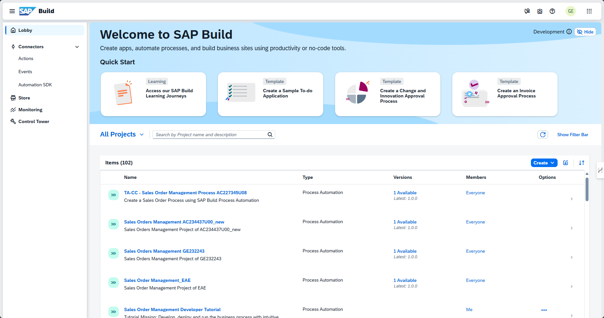

# Setup SAP Build Process Automation Basic Trial

<!-- description -->Set up your free SAP Build Process Automation Basic Trial and reach the Build Lobby to start building automation workflows — no prior experience needed.

## Prerequisites

- An SAP account - If you don't have one, [sign up for a free account](https://www.sap.com/)

## You will learn

- How to access the SAP Build Process Automation Basic Trial
- How to navigate to the Build Lobby
- Where to find your trial environment

## Description

This tutorial will guide you through the steps to access your SAP Build Process Automation Basic Trial environment. The trial provides a hands-on experience with SAP Build Process Automation's capabilities.

### Access the trial page

1. Navigate to the [SAP Build Process Automation Trial page](https://www.sap.com/products/technology-platform/process-automation/trial.html)

    

2. Click the **Try now** button.

    

    >If you're not already logged in, you'll be prompted to log in with your SAP account.

    

3. You'll be redirected to the SAP BTP Cockpit.

    >**What to expect:** Activating the Basic Trial is email-based and can take a few minutes. After you click **Try now**, wait for the confirmation email described in the next step — there's no need to refresh the page.

### Verify Trial Access

1. In a few minutes you will receive an email confirmation with your credentials to access the basic trial. Click on **Start your basic trial** in the email.

    

    >**Don't see the email?** Check your spam or junk folder and allow a few minutes for delivery. Make sure you completed the login in the previous step with the same SAP account.

### Open the Process Automation workbook

1. Click on the **Process Automation** tile in your BTP Cockpit.

2. This will open the **Basic Trials - Select your Workbooks** page. Choose the **Basic Trial - SAP Build Process Automation** option.

    

3. Once in the Workbook, click **Start Workbook**.

    

### Reach the Build Lobby

1. In the first step of the workbook, you will find a link to the SAP Build Lobby. Click this link.

    >**Tip:** This is the last activity you need to perform in the workbook. You don't need to complete the rest of the workbook — you can proceed with other tutorials that use SAP Build Process Automation.

    

2. You will be redirected to the SAP Build Process Automation Build Lobby. Enjoy!

    

### Next Steps

You have now successfully:

- Accessed the SAP Build Process Automation Trial
- Navigated to the Build Lobby

Before moving on, confirm your setup is complete:

- ✅ Your Basic Trial is active
- ✅ The Build Lobby is accessible
- ✅ At least one workbook is visible in the Build Lobby

>**Optional:** A guided learning journey is available with the Basic Trial. You're not required to complete it now — you can return to it later.

Ready to build? Continue with [Devtoberfest 2025 - Coder's Challenge - SAP Build](devtoberfest2025-fun-coding-build-docu), which puts your new SAP Build Process Automation environment to work.
